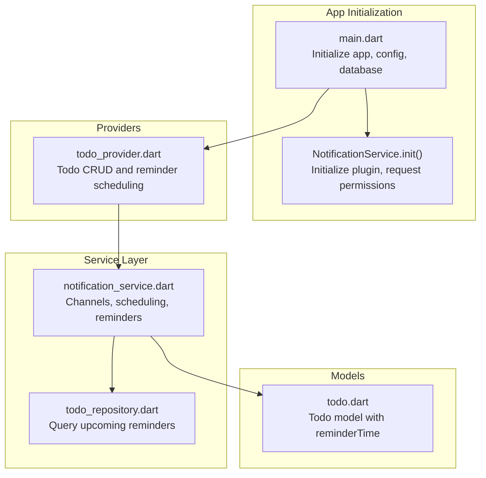
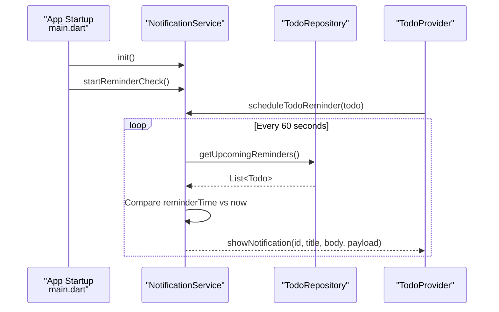
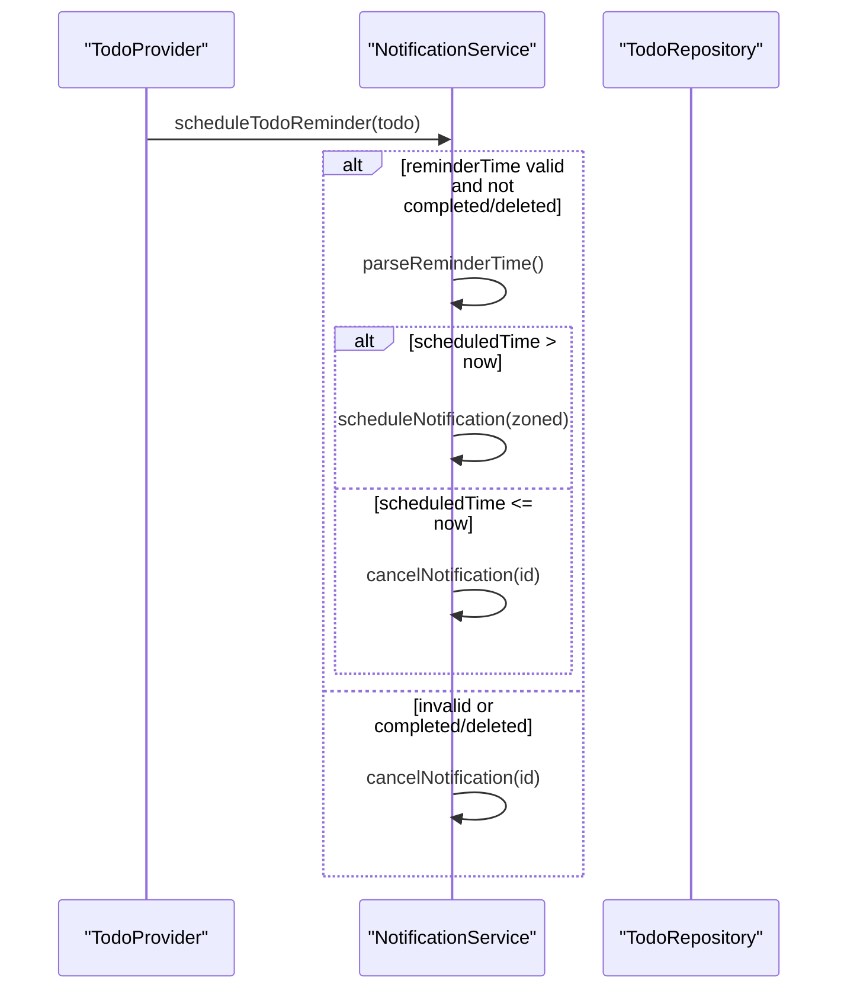
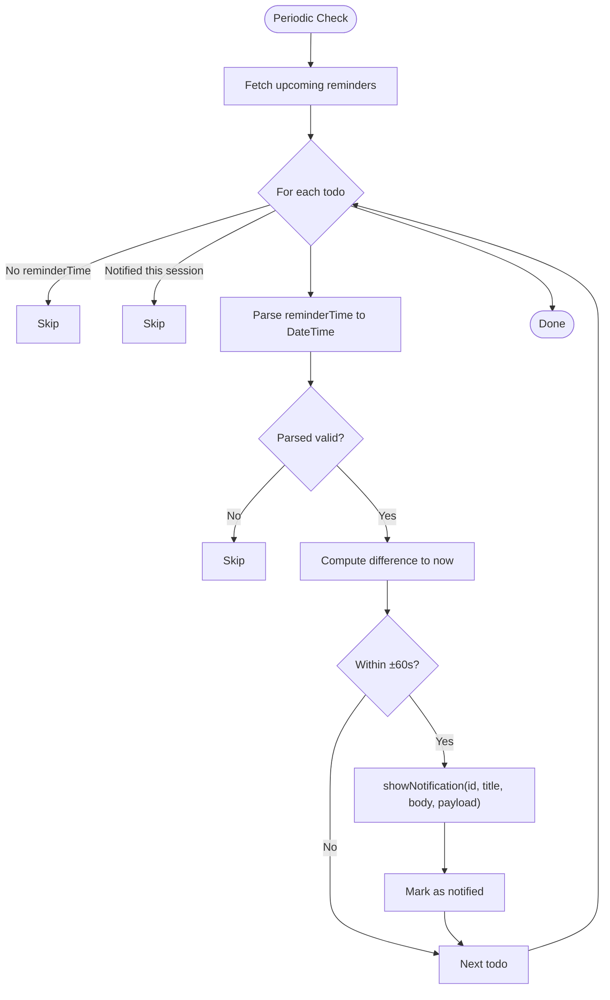
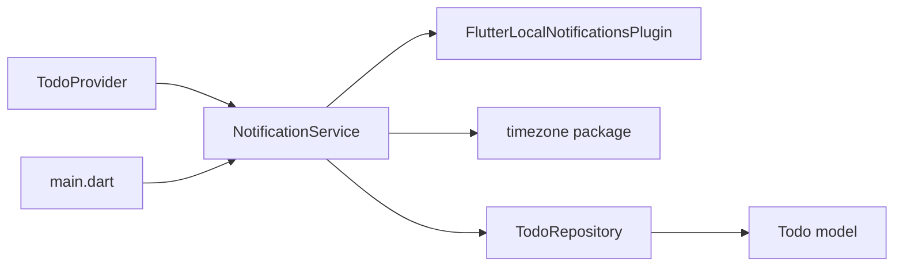

# Notification Services

<cite>
**Referenced Files in This Document**
- [notification_service.dart](file://lib/core/notification/notification_service.dart)
- [main.dart](file://lib/main.dart)
- [todo_provider.dart](file://lib/providers/todo_provider.dart)
- [todo.dart](file://lib/models/todo.dart)
- [todo_repository.dart](file://lib/core/storage/todo_repository.dart)
- [app.dart](file://lib/app.dart)
</cite>

## Table of Contents
1. [Introduction](#introduction)
2. [Project Structure](#project-structure)
3. [Core Components](#core-components)
4. [Architecture Overview](#architecture-overview)
5. [Detailed Component Analysis](#detailed-component-analysis)
6. [Dependency Analysis](#dependency-analysis)
7. [Performance Considerations](#performance-considerations)
8. [Troubleshooting Guide](#troubleshooting-guide)
9. [Conclusion](#conclusion)

## Introduction
This document describes QNote Flutter's notification services for reminder management and user alerts. It covers the notification service implementation for scheduling reminders, managing notification channels, and handling user interactions. It explains notification types (diary reminders, todo completion alerts, and sync notifications), scheduling algorithms, repeat patterns, priority management, user preference handling, permission management, integration with the provider system, background handling, and platform-specific features across Android, iOS, and web.

## Project Structure
The notification system is centered around a single service class that integrates with the application lifecycle and Riverpod providers. The service initializes platform plugins, requests permissions, manages channels, schedules and displays notifications, and periodically checks for due reminders.

**Diagram sources**
- [main.dart:12-31](file://lib/main.dart#L12-L31)
- [notification_service.dart:9-29](file://lib/core/notification/notification_service.dart#L9-L29)
- [todo_provider.dart:94-182](file://lib/providers/todo_provider.dart#L94-L182)
- [todo_repository.dart](file://lib/core/storage/todo_repository.dart)
- [todo.dart](file://lib/models/todo.dart)

**Section sources**
- [main.dart:12-31](file://lib/main.dart#L12-L31)
- [notification_service.dart:9-29](file://lib/core/notification/notification_service.dart#L9-L29)

## Core Components
- NotificationService: Singleton service responsible for initializing the plugin, requesting permissions, creating channels, scheduling and displaying notifications, and periodic reminder checking.
- Providers: Todo provider coordinates reminder scheduling and cancellation based on todo state changes.
- Models and Repositories: Todo model carries reminder metadata; repository supplies upcoming reminders for the reminder checker.

Key responsibilities:
- Initialize platform-specific plugins and set up timezone-aware scheduling.
- Request and manage notification permissions on Android and iOS.
- Create distinct notification channels for regular and scheduled notifications.
- Schedule zoned notifications with tolerance for background/battery optimization.
- Periodically poll for due reminders and show one-time notifications.
- Cancel or reschedule notifications when todo state changes.

**Section sources**
- [notification_service.dart:9-29](file://lib/core/notification/notification_service.dart#L9-L29)
- [notification_service.dart:91-121](file://lib/core/notification/notification_service.dart#L91-L121)
- [notification_service.dart:123-160](file://lib/core/notification/notification_service.dart#L123-L160)
- [notification_service.dart:162-231](file://lib/core/notification/notification_service.dart#L162-L231)
- [todo_provider.dart:94-182](file://lib/providers/todo_provider.dart#L94-L182)

## Architecture Overview
The notification architecture integrates with the app lifecycle and Riverpod providers. The service initializes during app startup, starts a periodic reminder checker, and reacts to todo updates from the provider layer.

**Diagram sources**
- [main.dart:12-31](file://lib/main.dart#L12-L31)
- [notification_service.dart:19-29](file://lib/core/notification/notification_service.dart#L19-L29)
- [notification_service.dart:123-160](file://lib/core/notification/notification_service.dart#L123-L160)
- [todo_provider.dart:94-182](file://lib/providers/todo_provider.dart#L94-L182)
- [todo_repository.dart](file://lib/core/storage/todo_repository.dart)

## Detailed Component Analysis

### NotificationService
Responsibilities:
- Initialization: Initializes the FlutterLocalNotificationsPlugin, sets up local timezone, and stores a singleton instance.
- Permissions and Channels: Requests notification permissions on Android and iOS; creates two channels—general and scheduled—on Android.
- Scheduling: Schedules zoned notifications with AndroidScheduleMode configured for background/battery-friendly scheduling.
- Reminder Checking: Runs a periodic timer to fetch upcoming reminders and trigger notifications within a small time window to account for timer drift.
- One-time Notifications: Displays immediate notifications with optional payload for navigation or actions.
- Lifecycle Controls: Start/stop reminder checker and cancel/clear notifications.

Platform specifics:
- Android: Uses AndroidNotificationChannel and AndroidFlutterLocalNotificationsPlugin for permissions and channels.
- iOS: Uses DarwinNotificationDetails and requests alert/badge/sound permissions.
- Web: No-op for web builds.

Notification types:
- General notifications: Used for ad-hoc alerts and reminders via showNotification.
- Scheduled notifications: Used for future-due reminders via scheduleNotification and specialized helpers.

Priority and importance:
- Default importance and priority are used for both channels.
- Priority can be adjusted by extending the service with new methods.

Extensibility:
- New notification types can be added by introducing dedicated methods mirroring showNotification and scheduleNotification.
- Repeat patterns are not implemented in the current code; they can be added by integrating with platform-specific scheduling APIs and storing recurrence metadata.

**Section sources**
- [notification_service.dart:9-29](file://lib/core/notification/notification_service.dart#L9-L29)
- [notification_service.dart:91-121](file://lib/core/notification/notification_service.dart#L91-L121)
- [notification_service.dart:123-160](file://lib/core/notification/notification_service.dart#L123-L160)
- [notification_service.dart:162-231](file://lib/core/notification/notification_service.dart#L162-L231)
- [notification_service.dart:233-280](file://lib/core/notification/notification_service.dart#L233-L280)

### Integration with Providers
The TodoProvider coordinates reminder scheduling and cancellation based on todo events:
- On creation/update: schedules a reminder if a valid reminder time exists and the todo is not completed/deleted.
- On completion/deletion: cancels the associated reminder.
- On updates: reschedules reminders accordingly.

**Diagram sources**
- [todo_provider.dart:94-182](file://lib/providers/todo_provider.dart#L94-L182)
- [notification_service.dart:261-280](file://lib/core/notification/notification_service.dart#L261-L280)
- [notification_service.dart:282-298](file://lib/core/notification/notification_service.dart#L282-L298)

**Section sources**
- [todo_provider.dart:94-182](file://lib/providers/todo_provider.dart#L94-L182)
- [notification_service.dart:261-280](file://lib/core/notification/notification_service.dart#L261-L280)

### Reminder Scheduling Algorithm
The reminder checker runs every 60 seconds and evaluates upcoming reminders:
- Fetches todos with upcoming reminders from the repository.
- Skips todos without a reminder time or already notified in the current session.
- Parses the reminder time string into a DateTime in the local timezone.
- Compares the parsed time with the current time; if within a ±60-second window, triggers a notification and marks the todo as notified.

**Diagram sources**
- [notification_service.dart:136-160](file://lib/core/notification/notification_service.dart#L136-L160)
- [notification_service.dart:282-298](file://lib/core/notification/notification_service.dart#L282-L298)

**Section sources**
- [notification_service.dart:136-160](file://lib/core/notification/notification_service.dart#L136-L160)
- [notification_service.dart:282-298](file://lib/core/notification/notification_service.dart#L282-L298)

### Notification Types and Payloads
- Todo reminders: Scheduled via scheduleTodoReminder and shown as general notifications when due.
- Diary reminders: Exposed via showDiaryReminder; currently mirrors scheduled notification behavior.
- Sync notifications: Not implemented in the referenced code; can be added similarly to existing helpers.

Payload usage:
- Reminders carry the todo id as payload to enable navigation or actions upon tapping.

**Section sources**
- [notification_service.dart:233-259](file://lib/core/notification/notification_service.dart#L233-L259)
- [notification_service.dart:147-154](file://lib/core/notification/notification_service.dart#L147-L154)

### Permission Management and Channels
- Android: Requests notification permission and creates two channels—general and scheduled—during initialization.
- iOS: Requests alert, badge, and sound permissions.
- Web: No-op to avoid unsupported operations.

Best practices:
- Always call init() early in app startup.
- Start the reminder checker after initialization.
- Respect user preferences by honoring app-level notification settings.

**Section sources**
- [notification_service.dart:19-29](file://lib/core/notification/notification_service.dart#L19-L29)
- [notification_service.dart:91-121](file://lib/core/notification/notification_service.dart#L91-L121)

### Background Handling and Battery Optimization
- Android scheduling uses AndroidScheduleMode inexactAllowWhileIdle to improve compatibility with battery optimizations.
- Zoned scheduling ensures correct interpretation of absolute times in the local timezone.
- The reminder checker tolerates minor drift by checking a short window around the expected time.

Recommendations:
- Prefer zoned scheduling for future notifications.
- Avoid exact alarms when not strictly necessary to prevent permission prompts and failures on newer Android versions.

**Section sources**
- [notification_service.dart:185-217](file://lib/core/notification/notification_service.dart#L185-L217)
- [notification_service.dart:203-213](file://lib/core/notification/notification_service.dart#L203-L213)

## Dependency Analysis
The notification service depends on:
- FlutterLocalNotificationsPlugin for cross-platform notification operations.
- TodoRepository for querying upcoming reminders.
- Todo model for reminder metadata.
- Riverpod providers for orchestrating reminder scheduling and cancellation.

**Diagram sources**
- [notification_service.dart:1-7](file://lib/core/notification/notification_service.dart#L1-L7)
- [todo_provider.dart:94-182](file://lib/providers/todo_provider.dart#L94-L182)
- [main.dart:12-31](file://lib/main.dart#L12-L31)

**Section sources**
- [notification_service.dart:1-7](file://lib/core/notification/notification_service.dart#L1-L7)
- [todo_provider.dart:94-182](file://lib/providers/todo_provider.dart#L94-L182)
- [main.dart:12-31](file://lib/main.dart#L12-L31)

## Performance Considerations
- Polling interval: 60 seconds strikes a balance between responsiveness and battery usage.
- Timezone handling: Local timezone is set at startup to minimize scheduling errors.
- Error resilience: Try-catch blocks protect initialization and scheduling from platform-specific failures.
- Background scheduling: AndroidScheduleMode inexactAllowWhileIdle reduces wake-ups and improves battery life.

## Troubleshooting Guide
Common issues and resolutions:
- Notifications not appearing on Android:
  - Ensure permissions were requested and granted.
  - Verify channels exist and importance/priority are acceptable.
- Exact alarm failures on Android 13+:
  - The service catches exceptions during scheduling; fallback behavior is in place.
- Reminders not firing:
  - Confirm reminderTime parsing succeeds and the time is in the future.
  - Check that the reminder checker is started after initialization.
- Web platform limitations:
  - All notification operations are no-ops on web; expect no behavior.

Operational checks:
- Initialization order: init() must be called before starting the reminder checker.
- Provider updates: Ensure todo updates trigger scheduleTodoReminder appropriately.

**Section sources**
- [notification_service.dart:19-29](file://lib/core/notification/notification_service.dart#L19-L29)
- [notification_service.dart:123-160](file://lib/core/notification/notification_service.dart#L123-L160)
- [notification_service.dart:185-217](file://lib/core/notification/notification_service.dart#L185-L217)
- [notification_service.dart:282-298](file://lib/core/notification/notification_service.dart#L282-L298)

## Conclusion
QNote’s notification service provides a robust foundation for reminder management across Android, iOS, and web. It initializes permissions and channels, schedules zoned notifications, and periodically checks for due reminders while being resilient to platform constraints. Extensibility is straightforward: add new notification types by introducing dedicated methods and integrate with providers to keep scheduling synchronized with todo state changes. For advanced needs like recurring reminders, integrate platform-specific scheduling APIs and extend the service with recurrence handling.