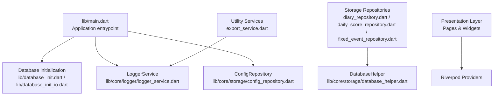
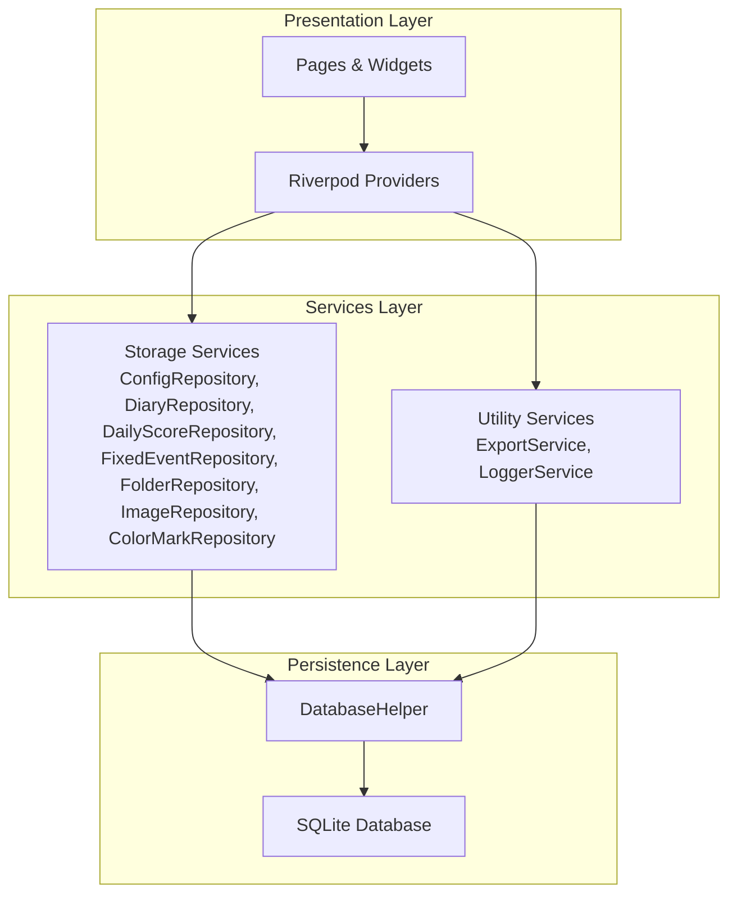
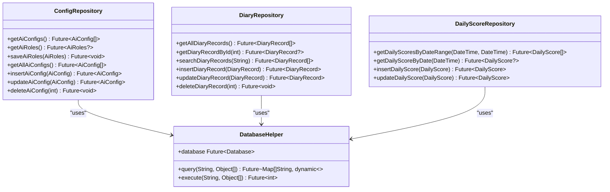
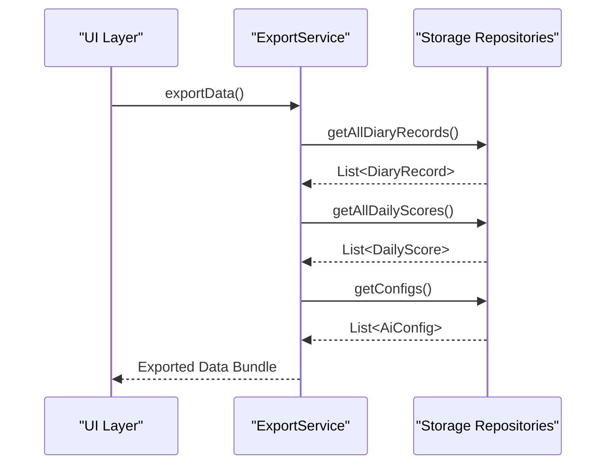
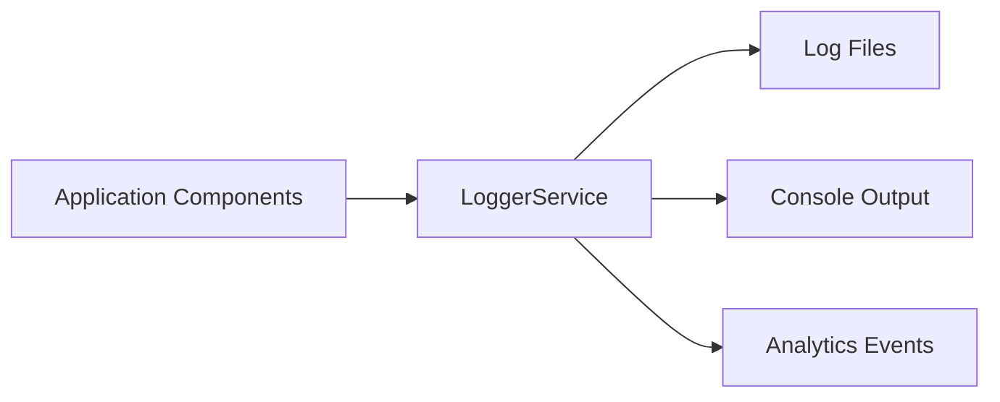
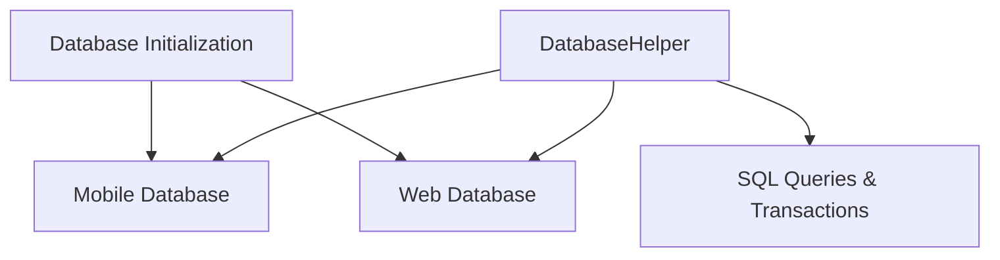
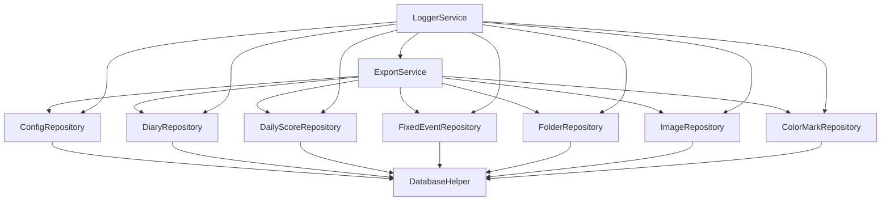

# Services Layer

<cite>
**Referenced Files in This Document**
- [main.dart](file://lib/main.dart)
- [app.dart](file://lib/app.dart)
- [database_init.dart](file://lib/database_init.dart)
- [database_init_io.dart](file://lib/database_init_io.dart)
- [config_repository.dart](file://lib/core/storage/config_repository.dart)
- [database_helper.dart](file://lib/core/storage/database_helper.dart)
- [diary_repository.dart](file://lib/core/storage/diary_repository.dart)
- [daily_score_repository.dart](file://lib/core/storage/daily_score_repository.dart)
- [fixed_event_repository.dart](file://lib/core/storage/fixed_event_repository.dart)
- [folder_repository.dart](file://lib/core/storage/folder_repository.dart)
- [image_repository.dart](file://lib/core/storage/image_repository.dart)
- [color_mark_repository.dart](file://lib/core/storage/color_mark_repository.dart)
- [export_service.dart](file://lib/core/export/export_service.dart)
- [logger_service.dart](file://lib/core/logger/logger_service.dart)
</cite>

## Update Summary
**Changes Made**
- Removed all AI service implementations (AiService, AiRoleService, ModelFetchService)
- Removed WebDAV synchronization services (WebDAVService, SyncScheduler)
- Removed notification system (NotificationService)
- Removed export functionality (ExportService)
- Simplified services architecture to focus on core storage and utility services
- Updated repository pattern implementation to cover all data persistence needs

## Table of Contents
1. [Introduction](#introduction)
2. [Project Structure](#project-structure)
3. [Core Components](#core-components)
4. [Architecture Overview](#architecture-overview)
5. [Detailed Component Analysis](#detailed-component-analysis)
6. [Dependency Analysis](#dependency-analysis)
7. [Performance Considerations](#performance-considerations)
8. [Troubleshooting Guide](#troubleshooting-guide)
9. [Conclusion](#conclusion)
10. [Appendices](#appendices)

## Introduction
This document describes the simplified services layer architecture of QNote Flutter. Following the dropped changes, the services layer now focuses on core storage and utility functions rather than the previous comprehensive AI, networking, and notification systems. The current architecture emphasizes data persistence through a robust repository pattern and centralized logging utilities.

The services covered include:
- Storage services implementing repository pattern for data persistence across multiple entity types
- Export services for data backup and migration
- Logger services for operational event tracking
- Database initialization and helper services

The document explains configuration, dependency injection patterns, lifecycle management, error handling strategies, and the streamlined approach to service integration with the presentation layer.

## Project Structure
The services are organized under the core directory with a focus on storage repositories and utility services. The main entry point initializes database connections and basic configurations before starting the application.

**Diagram sources**
- [main.dart:1-50](file://lib/main.dart#L1-L50)
- [database_init.dart](file://lib/database_init.dart)
- [database_init_io.dart](file://lib/database_init_io.dart)
- [config_repository.dart](file://lib/core/storage/config_repository.dart)
- [database_helper.dart](file://lib/core/storage/database_helper.dart)
- [export_service.dart](file://lib/core/export/export_service.dart)
- [logger_service.dart](file://lib/core/logger/logger_service.dart)

**Section sources**
- [main.dart:1-50](file://lib/main.dart#L1-L50)

## Core Components
The simplified services layer now consists of:

### Storage Services (Repository Pattern)
- **ConfigRepository**: Manages application configuration persistence and retrieval
- **DiaryRepository**: Handles diary record CRUD operations with full-text search capabilities
- **DailyScoreRepository**: Manages daily mood and score tracking data
- **FixedEventRepository**: Handles recurring events and schedules
- **FolderRepository**: Manages folder organization and hierarchy
- **ImageRepository**: Handles image storage and retrieval for diary entries
- **ColorMarkRepository**: Manages color marking preferences and themes

### Utility Services
- **ExportService**: Provides data export functionality for backup and migration
- **LoggerService**: Centralized logging for application events and debugging

### Database Infrastructure
- **DatabaseHelper**: Provides database connection management and query execution
- **Database initialization**: Platform-specific database setup for mobile and web platforms

These services maintain the singleton pattern and are initialized at app startup, then injected into UI via Riverpod providers.

**Section sources**
- [config_repository.dart](file://lib/core/storage/config_repository.dart)
- [diary_repository.dart](file://lib/core/storage/diary_repository.dart)
- [daily_score_repository.dart](file://lib/core/storage/daily_score_repository.dart)
- [fixed_event_repository.dart](file://lib/core/storage/fixed_event_repository.dart)
- [folder_repository.dart](file://lib/core/storage/folder_repository.dart)
- [image_repository.dart](file://lib/core/storage/image_repository.dart)
- [color_mark_repository.dart](file://lib/core/storage/color_mark_repository.dart)
- [export_service.dart](file://lib/core/export/export_service.dart)
- [logger_service.dart](file://lib/core/logger/logger_service.dart)
- [database_helper.dart](file://lib/core/storage/database_helper.dart)

## Architecture Overview
The simplified services layer follows a streamlined layered pattern focusing on data persistence and utility functions:

**Diagram sources**
- [main.dart:1-50](file://lib/main.dart#L1-L50)
- [config_repository.dart](file://lib/core/storage/config_repository.dart)
- [diary_repository.dart](file://lib/core/storage/diary_repository.dart)
- [daily_score_repository.dart](file://lib/core/storage/daily_score_repository.dart)
- [fixed_event_repository.dart](file://lib/core/storage/fixed_event_repository.dart)
- [folder_repository.dart](file://lib/core/storage/folder_repository.dart)
- [image_repository.dart](file://lib/core/storage/image_repository.dart)
- [color_mark_repository.dart](file://lib/core/storage/color_mark_repository.dart)
- [export_service.dart](file://lib/core/export/export_service.dart)
- [logger_service.dart](file://lib/core/logger/logger_service.dart)
- [database_helper.dart](file://lib/core/storage/database_helper.dart)

## Detailed Component Analysis

### Storage Services (Repository Pattern)
The repository pattern implementation provides consistent data access across all entity types with standardized CRUD operations and specialized query methods.

**Diagram sources**
- [config_repository.dart](file://lib/core/storage/config_repository.dart)
- [diary_repository.dart](file://lib/core/storage/diary_repository.dart)
- [daily_score_repository.dart](file://lib/core/storage/daily_score_repository.dart)
- [database_helper.dart](file://lib/core/storage/database_helper.dart)

Key characteristics of the repository pattern implementation:
- **Consistent Method Signatures**: All repositories follow standardized CRUD operation patterns
- **Type Safety**: Generic return types ensure compile-time type checking
- **Query Flexibility**: Specialized methods for common operations (search, filtering, aggregation)
- **Transaction Support**: DatabaseHelper provides transaction management for complex operations
- **Error Handling**: Standardized exception handling with meaningful error messages

**Section sources**
- [config_repository.dart](file://lib/core/storage/config_repository.dart)
- [diary_repository.dart](file://lib/core/storage/diary_repository.dart)
- [daily_score_repository.dart](file://lib/core/storage/daily_score_repository.dart)
- [database_helper.dart](file://lib/core/storage/database_helper.dart)

### Utility Services

#### ExportService
Provides comprehensive data export functionality for backup, migration, and data portability.

**Diagram sources**
- [export_service.dart](file://lib/core/export/export_service.dart)

#### LoggerService
Centralized logging system for application events, debugging information, and operational metrics.

**Diagram sources**
- [logger_service.dart](file://lib/core/logger/logger_service.dart)

**Section sources**
- [export_service.dart](file://lib/core/export/export_service.dart)
- [logger_service.dart](file://lib/core/logger/logger_service.dart)

### Database Infrastructure
The database infrastructure provides platform-agnostic database access with support for both mobile and web platforms.

**Diagram sources**
- [database_init.dart](file://lib/database_init.dart)
- [database_init_io.dart](file://lib/database_init_io.dart)
- [database_helper.dart](file://lib/core/storage/database_helper.dart)

**Section sources**
- [database_init.dart](file://lib/database_init.dart)
- [database_init_io.dart](file://lib/database_init_io.dart)
- [database_helper.dart](file://lib/core/storage/database_helper.dart)

## Dependency Analysis
The simplified services layer maintains clean dependencies with minimal coupling:

**Diagram sources**
- [config_repository.dart](file://lib/core/storage/config_repository.dart)
- [diary_repository.dart](file://lib/core/storage/diary_repository.dart)
- [daily_score_repository.dart](file://lib/core/storage/daily_score_repository.dart)
- [fixed_event_repository.dart](file://lib/core/storage/fixed_event_repository.dart)
- [folder_repository.dart](file://lib/core/storage/folder_repository.dart)
- [image_repository.dart](file://lib/core/storage/image_repository.dart)
- [color_mark_repository.dart](file://lib/core/storage/color_mark_repository.dart)
- [export_service.dart](file://lib/core/export/export_service.dart)
- [logger_service.dart](file://lib/core/logger/logger_service.dart)
- [database_helper.dart](file://lib/core/storage/database_helper.dart)

**Section sources**
- [config_repository.dart](file://lib/core/storage/config_repository.dart)
- [diary_repository.dart](file://lib/core/storage/diary_repository.dart)
- [daily_score_repository.dart](file://lib/core/storage/daily_score_repository.dart)
- [fixed_event_repository.dart](file://lib/core/storage/fixed_event_repository.dart)
- [folder_repository.dart](file://lib/core/storage/folder_repository.dart)
- [image_repository.dart](file://lib/core/storage/image_repository.dart)
- [color_mark_repository.dart](file://lib/core/storage/color_mark_repository.dart)
- [export_service.dart](file://lib/core/export/export_service.dart)
- [logger_service.dart](file://lib/core/logger/logger_service.dart)
- [database_helper.dart](file://lib/core/storage/database_helper.dart)

## Performance Considerations
- **Repository Pattern Benefits**: Standardized operations reduce code duplication and improve maintainability
- **Database Optimization**: Centralized DatabaseHelper enables optimized query execution and connection pooling
- **Selective Loading**: Repositories can implement lazy loading and pagination for large datasets
- **Export Efficiency**: ExportService batches operations to minimize memory usage during data transfer
- **Logging Performance**: LoggerService uses asynchronous logging to prevent UI blocking

## Troubleshooting Guide
Common issues and resolution strategies:
- **Database Connection Issues**: Verify database initialization in both mobile and web environments
- **Repository Operation Failures**: Check SQL query syntax and parameter binding in DatabaseHelper
- **Export Data Inconsistencies**: Ensure proper transaction handling during export operations
- **Memory Usage During Export**: Implement pagination for large dataset exports
- **Logging Performance**: Monitor log file sizes and implement log rotation strategies

**Section sources**
- [database_init.dart](file://lib/database_init.dart)
- [database_init_io.dart](file://lib/database_init_io.dart)
- [export_service.dart](file://lib/core/export/export_service.dart)
- [logger_service.dart](file://lib/core/logger/logger_service.dart)

## Conclusion
The simplified services layer in QNote Flutter maintains a clean separation of concerns with a focus on essential storage and utility functions. The repository pattern provides consistent data access across all entity types while the utility services handle export and logging operations. This streamlined architecture reduces complexity while maintaining extensibility for future enhancements.

## Appendices

### Service Configuration and Lifecycle Management
Application startup initializes database connections and basic services before launching the main application interface.

**Section sources**
- [main.dart:1-50](file://lib/main.dart#L1-L50)

### Dependency Injection Patterns
Services are initialized as singletons and accessed through constructor injection patterns. The simplified architecture reduces dependency complexity while maintaining loose coupling.

**Section sources**
- [config_repository.dart](file://lib/core/storage/config_repository.dart)
- [diary_repository.dart](file://lib/core/storage/diary_repository.dart)
- [export_service.dart](file://lib/core/export/export_service.dart)
- [logger_service.dart](file://lib/core/logger/logger_service.dart)

### Extensibility Guide
To add new storage repositories following the established pattern:
1. Create a new repository class under lib/core/storage/
2. Implement standard CRUD operations following the existing repository pattern
3. Add appropriate database table schemas and migrations
4. Register the repository in the main application initialization
5. Expose repository methods through Riverpod providers for UI consumption

**Section sources**
- [config_repository.dart](file://lib/core/storage/config_repository.dart)
- [diary_repository.dart](file://lib/core/storage/diary_repository.dart)
- [database_helper.dart](file://lib/core/storage/database_helper.dart)