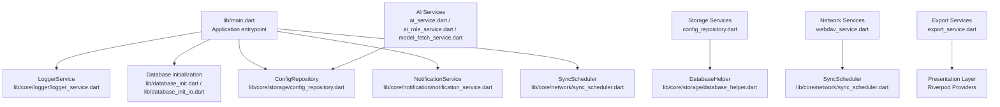
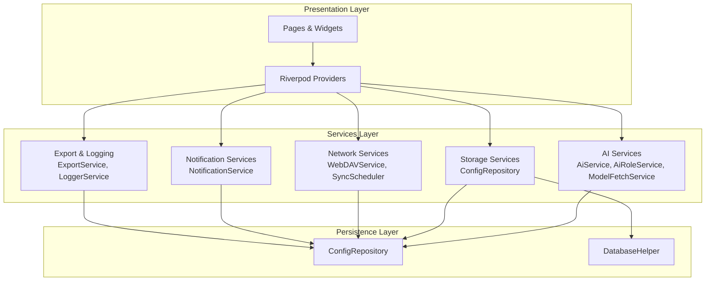
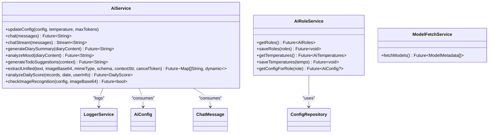
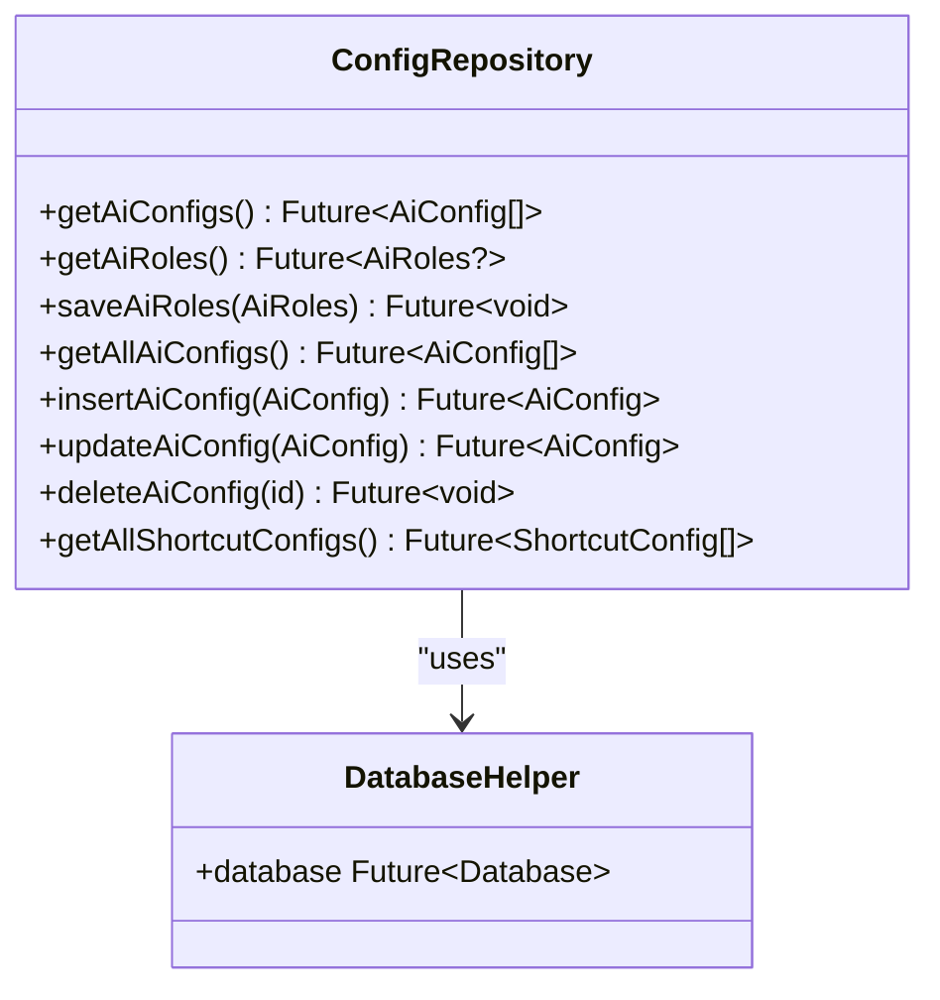
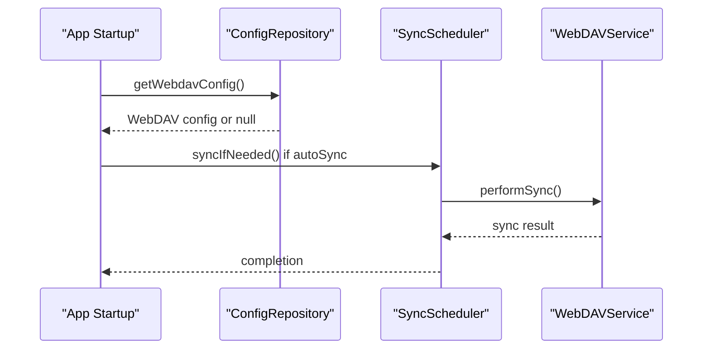
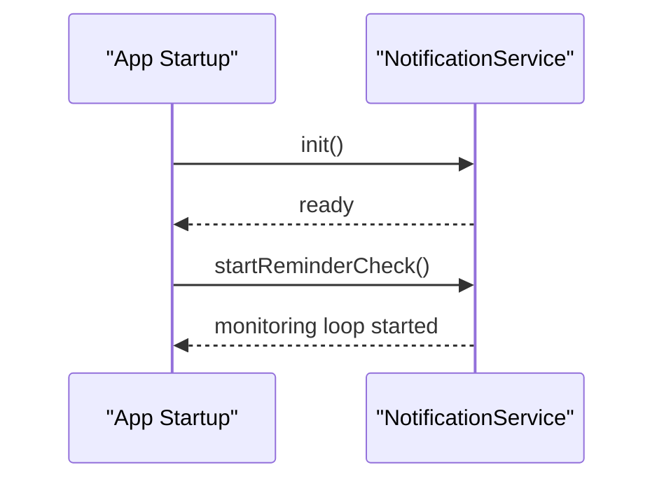
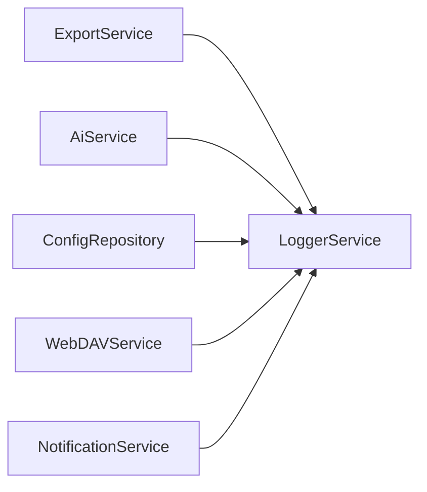
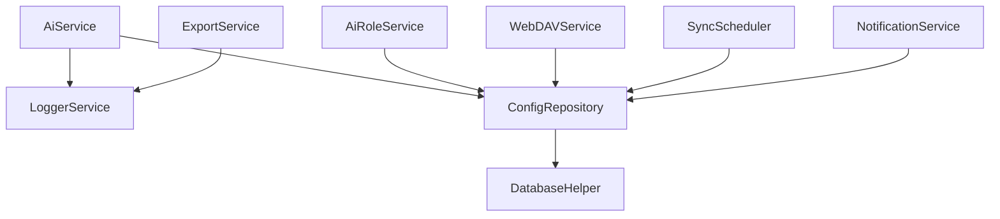

# Services Layer

<cite>
**Referenced Files in This Document**
- [main.dart](file://lib/main.dart)
- [ai_service.dart](file://lib/core/ai/ai_service.dart)
- [ai_role_service.dart](file://lib/core/ai/ai_role_service.dart)
- [model_fetch_service.dart](file://lib/core/ai/model_fetch_service.dart)
- [webdav_service.dart](file://lib/core/network/webdav_service.dart)
- [notification_service.dart](file://lib/core/notification/notification_service.dart)
- [config_repository.dart](file://lib/core/storage/config_repository.dart)
- [database_helper.dart](file://lib/core/storage/database_helper.dart)
- [sync_scheduler.dart](file://lib/core/network/sync_scheduler.dart)
- [logger_service.dart](file://lib/core/logger/logger_service.dart)
- [export_service.dart](file://lib/core/export/export_service.dart)
</cite>

## Table of Contents
1. [Introduction](#introduction)
2. [Project Structure](#project-structure)
3. [Core Components](#core-components)
4. [Architecture Overview](#architecture-overview)
5. [Detailed Component Analysis](#detailed-component-analysis)
6. [Dependency Analysis](#dependency-analysis)
7. [Performance Considerations](#performance-considerations)
8. [Troubleshooting Guide](#troubleshooting-guide)
9. [Conclusion](#conclusion)
10. [Appendices](#appendices)

## Introduction
This document describes the services layer architecture of QNote Flutter. It focuses on how business logic and external integrations are encapsulated behind cohesive service abstractions, and how these services interact with the presentation layer via Riverpod providers. The services covered include:
- AI services for content processing and generation
- Storage services implementing a repository pattern for data persistence
- Network services for WebDAV synchronization
- Notification services for reminders
- Export and logging utilities

The document explains configuration, dependency injection patterns, lifecycle management, error handling strategies, extensibility, and separation of concerns across service types.

## Project Structure
The services reside under the core directory and integrate with the application entrypoint and providers. The main entry initializes logging, date formatting, database factory, and default configurations, then starts background tasks such as notifications and optional WebDAV sync scheduling.

**Diagram sources**
- [main.dart:12-30](file://lib/main.dart#L12-L30)
- [config_repository.dart:73-119](file://lib/core/storage/config_repository.dart#L73-L119)
- [database_helper.dart](file://lib/core/storage/database_helper.dart)
- [webdav_service.dart](file://lib/core/network/webdav_service.dart)
- [notification_service.dart](file://lib/core/notification/notification_service.dart)
- [sync_scheduler.dart](file://lib/core/network/sync_scheduler.dart)
- [logger_service.dart](file://lib/core/logger/logger_service.dart)
- [export_service.dart](file://lib/core/export/export_service.dart)

**Section sources**
- [main.dart:12-30](file://lib/main.dart#L12-L30)

## Core Components
- AI Services
  - AiService: Encapsulates provider-agnostic chat and multimodal extraction, streaming and non-streaming, with robust request/response sanitization and structured JSON parsing.
  - AiRoleService: Manages AI role and temperature configurations backed by ConfigRepository.
  - ModelFetchService: Handles model metadata fetching and caching.
- Storage Services
  - ConfigRepository: Implements repository pattern for configuration persistence, ensuring write operations are logged for synchronization.
  - DatabaseHelper: Provides database connection and access for repositories.
- Network Services
  - WebDAVService: Performs WebDAV synchronization operations.
  - SyncScheduler: Schedules and triggers synchronization tasks based on configuration.
- Notification Services
  - NotificationService: Initializes and manages reminder checks.
- Export and Logging
  - ExportService: Provides export capabilities.
  - LoggerService: Centralized logging for AI requests/responses and operational events.

These services are designed to be singletons and are initialized at app startup, then injected into UI via Riverpod providers.

**Section sources**
- [ai_service.dart:22-80](file://lib/core/ai/ai_service.dart#L22-L80)
- [ai_role_service.dart:5-46](file://lib/core/ai/ai_role_service.dart#L5-L46)
- [model_fetch_service.dart](file://lib/core/ai/model_fetch_service.dart)
- [config_repository.dart:73-119](file://lib/core/storage/config_repository.dart#L73-L119)
- [database_helper.dart](file://lib/core/storage/database_helper.dart)
- [webdav_service.dart](file://lib/core/network/webdav_service.dart)
- [sync_scheduler.dart](file://lib/core/network/sync_scheduler.dart)
- [notification_service.dart](file://lib/core/notification/notification_service.dart)
- [export_service.dart](file://lib/core/export/export_service.dart)
- [logger_service.dart](file://lib/core/logger/logger_service.dart)

## Architecture Overview
The services layer follows a layered pattern:
- Presentation Layer: UI widgets and pages consume services via Riverpod providers.
- Services Layer: Business logic and external integrations are encapsulated in services.
- Persistence Layer: Repositories and helpers manage data access and change logging.
- External Integrations: AI APIs, WebDAV, and device notifications.

**Diagram sources**
- [main.dart:12-30](file://lib/main.dart#L12-L30)
- [ai_service.dart:22-80](file://lib/core/ai/ai_service.dart#L22-L80)
- [ai_role_service.dart:5-46](file://lib/core/ai/ai_role_service.dart#L5-L46)
- [model_fetch_service.dart](file://lib/core/ai/model_fetch_service.dart)
- [config_repository.dart:73-119](file://lib/core/storage/config_repository.dart#L73-L119)
- [database_helper.dart](file://lib/core/storage/database_helper.dart)
- [webdav_service.dart](file://lib/core/network/webdav_service.dart)
- [sync_scheduler.dart](file://lib/core/network/sync_scheduler.dart)
- [notification_service.dart](file://lib/core/notification/notification_service.dart)
- [export_service.dart](file://lib/core/export/export_service.dart)
- [logger_service.dart](file://lib/core/logger/logger_service.dart)

## Detailed Component Analysis

### AI Services
AiService encapsulates:
- Provider-aware chat and multimodal extraction
- Streaming and non-streaming responses
- Request/response sanitization and structured JSON parsing
- Temperature and token limits management
- Endpoint selection per provider and model family

**Diagram sources**
- [ai_service.dart:22-1189](file://lib/core/ai/ai_service.dart#L22-L1189)
- [ai_role_service.dart:5-46](file://lib/core/ai/ai_role_service.dart#L5-L46)
- [model_fetch_service.dart](file://lib/core/ai/model_fetch_service.dart)

Key behaviors:
- Validation and normalization of AI configuration (base URL, API key, provider-specific headers).
- Provider-specific request construction for OpenAI-compatible and Gemini endpoints.
- Robust JSON parsing with fallback strategies for malformed or markdown-wrapped JSON.
- Streaming response handling with SSE-like chunking and delta accumulation.

Usage patterns:
- Initialize AiService with a selected AiConfig and optional temperature/maxTokens.
- Call chat or chatStream for conversational flows.
- Use extractUnified for multimodal extraction with schema-driven JSON outputs.
- Use analyzeDailyScore for aggregated scoring and suggestions.

Error handling:
- Throws descriptive exceptions for invalid configuration or insufficient data.
- Logs request/response diagnostics and rethrows upstream errors after capturing stack traces.

**Section sources**
- [ai_service.dart:22-80](file://lib/core/ai/ai_service.dart#L22-L80)
- [ai_service.dart:88-217](file://lib/core/ai/ai_service.dart#L88-L217)
- [ai_service.dart:219-370](file://lib/core/ai/ai_service.dart#L219-L370)
- [ai_service.dart:393-445](file://lib/core/ai/ai_service.dart#L393-L445)
- [ai_service.dart:518-699](file://lib/core/ai/ai_service.dart#L518-L699)
- [ai_service.dart:788-880](file://lib/core/ai/ai_service.dart#L788-L880)
- [ai_service.dart:881-976](file://lib/core/ai/ai_service.dart#L881-L976)
- [ai_service.dart:978-1109](file://lib/core/ai/ai_service.dart#L978-L1109)
- [ai_service.dart:1111-1187](file://lib/core/ai/ai_service.dart#L1111-L1187)
- [ai_role_service.dart:5-46](file://lib/core/ai/ai_role_service.dart#L5-L46)

### Storage Services (Repository Pattern)
ConfigRepository implements CRUD operations for configuration entities and ensures all writes are logged for synchronization. DatabaseHelper provides database access.

**Diagram sources**
- [config_repository.dart:73-119](file://lib/core/storage/config_repository.dart#L73-L119)
- [database_helper.dart](file://lib/core/storage/database_helper.dart)

Operational characteristics:
- Unified method signatures for repository operations.
- Write operations log changes for downstream sync.
- Read operations filter soft-deleted records by default.

**Section sources**
- [config_repository.dart:73-119](file://lib/core/storage/config_repository.dart#L73-L119)
- [database_helper.dart](file://lib/core/storage/database_helper.dart)

### Network Services (WebDAV Synchronization)
WebDAVService performs synchronization operations against a configured WebDAV endpoint. SyncScheduler orchestrates periodic or on-demand sync tasks based on configuration.

**Diagram sources**
- [main.dart:24-27](file://lib/main.dart#L24-L27)
- [sync_scheduler.dart](file://lib/core/network/sync_scheduler.dart)
- [webdav_service.dart](file://lib/core/network/webdav_service.dart)

Lifecycle:
- Initialization occurs at app startup if WebDAV auto-sync is enabled.
- Scheduler triggers sync based on schedule or manual invocation.

**Section sources**
- [main.dart:24-27](file://lib/main.dart#L24-L27)
- [sync_scheduler.dart](file://lib/core/network/sync_scheduler.dart)
- [webdav_service.dart](file://lib/core/network/webdav_service.dart)

### Notification Services
NotificationService is initialized during app startup and starts background reminder checks.

**Diagram sources**
- [main.dart:18-28](file://lib/main.dart#L18-L28)
- [notification_service.dart](file://lib/core/notification/notification_service.dart)

**Section sources**
- [main.dart:18-28](file://lib/main.dart#L18-L28)
- [notification_service.dart](file://lib/core/notification/notification_service.dart)

### Export and Logging Utilities
ExportService provides export functionality, while LoggerService centralizes logging for AI and operational events.

**Diagram sources**
- [export_service.dart](file://lib/core/export/export_service.dart)
- [logger_service.dart](file://lib/core/logger/logger_service.dart)
- [ai_service.dart:74-79](file://lib/core/ai/ai_service.dart#L74-L79)
- [config_repository.dart:76-82](file://lib/core/storage/config_repository.dart#L76-L82)
- [webdav_service.dart](file://lib/core/network/webdav_service.dart)
- [notification_service.dart](file://lib/core/notification/notification_service.dart)

**Section sources**
- [export_service.dart](file://lib/core/export/export_service.dart)
- [logger_service.dart](file://lib/core/logger/logger_service.dart)

## Dependency Analysis
The services layer exhibits low coupling and high cohesion:
- AiService depends on LoggerService and consumes AI configuration and chat messages.
- AiRoleService depends on ConfigRepository for role and temperature management.
- ConfigRepository depends on DatabaseHelper for persistence and logs changes for sync.
- WebDAVService and SyncScheduler depend on ConfigRepository for configuration.
- NotificationService depends on platform-specific notification APIs and configuration.

**Diagram sources**
- [ai_service.dart:22-80](file://lib/core/ai/ai_service.dart#L22-L80)
- [ai_role_service.dart:5-46](file://lib/core/ai/ai_role_service.dart#L5-L46)
- [config_repository.dart:73-119](file://lib/core/storage/config_repository.dart#L73-L119)
- [database_helper.dart](file://lib/core/storage/database_helper.dart)
- [webdav_service.dart](file://lib/core/network/webdav_service.dart)
- [sync_scheduler.dart](file://lib/core/network/sync_scheduler.dart)
- [notification_service.dart](file://lib/core/notification/notification_service.dart)
- [export_service.dart](file://lib/core/export/export_service.dart)
- [logger_service.dart](file://lib/core/logger/logger_service.dart)

**Section sources**
- [ai_service.dart:22-80](file://lib/core/ai/ai_service.dart#L22-L80)
- [ai_role_service.dart:5-46](file://lib/core/ai/ai_role_service.dart#L5-L46)
- [config_repository.dart:73-119](file://lib/core/storage/config_repository.dart#L73-L119)
- [database_helper.dart](file://lib/core/storage/database_helper.dart)
- [webdav_service.dart](file://lib/core/network/webdav_service.dart)
- [sync_scheduler.dart](file://lib/core/network/sync_scheduler.dart)
- [notification_service.dart](file://lib/core/notification/notification_service.dart)
- [export_service.dart](file://lib/core/export/export_service.dart)
- [logger_service.dart](file://lib/core/logger/logger_service.dart)

## Performance Considerations
- AI request timeouts and streaming: AiService sets connect/send/receive timeouts and supports streaming responses to improve perceived latency.
- Request/response sanitization: Large image payloads are sanitized for logging to avoid verbose logs and reduce overhead.
- Repository write logging: Change logs enable efficient incremental sync but require careful indexing and batch processing.
- Background scheduling: SyncScheduler defers heavy work to background tasks to keep UI responsive.

[No sources needed since this section provides general guidance]

## Troubleshooting Guide
Common issues and strategies:
- AI configuration errors: Validate base URL format and API key presence; ensure provider-specific headers are set.
- JSON parsing failures: AiService attempts multiple strategies including markdown block stripping and bracket-based extraction.
- Network connectivity: WebDAVService and SyncScheduler should handle transient failures with retries and exponential backoff.
- Database write failures: Ensure DatabaseHelper is initialized and ConfigRepository logs are persisted for recovery.
- Notification initialization: Verify platform permissions and initialization order.

**Section sources**
- [ai_service.dart:44-56](file://lib/core/ai/ai_service.dart#L44-L56)
- [ai_service.dart:788-880](file://lib/core/ai/ai_service.dart#L788-L880)
- [ai_service.dart:881-976](file://lib/core/ai/ai_service.dart#L881-L976)
- [config_repository.dart:73-119](file://lib/core/storage/config_repository.dart#L73-L119)
- [main.dart:12-30](file://lib/main.dart#L12-L30)

## Conclusion
The services layer in QNote Flutter cleanly separates business logic, persistence, networking, and notifications. Singleton services are initialized at startup and consumed via Riverpod providers in the presentation layer. The repository pattern ensures consistent data access and change logging, while AI services provide robust provider-agnostic processing with strong error handling and logging. Extensibility is achieved by following existing patterns: implement a service class, register it at startup, and inject it through providers.

[No sources needed since this section summarizes without analyzing specific files]

## Appendices

### Service Configuration and Lifecycle Management
- Application entry initializes logging, date formatting, database factory, and default configurations.
- ConfigRepository ensures defaults for shortcuts and AI configs.
- NotificationService is initialized and reminder checks are started.
- Optional WebDAV auto-sync is triggered based on stored configuration.

**Section sources**
- [main.dart:12-30](file://lib/main.dart#L12-L30)

### Dependency Injection Patterns
- Singletons accessed via instance getters.
- Dependencies injected through constructors (e.g., AiRoleService uses ConfigRepository).
- Providers in the presentation layer consume these services.

**Section sources**
- [ai_role_service.dart:5-46](file://lib/core/ai/ai_role_service.dart#L5-L46)
- [config_repository.dart:73-119](file://lib/core/storage/config_repository.dart#L73-L119)

### Extensibility Guide
To add a new service:
1. Create a new service class under lib/core/<category>/.
2. Add any required dependencies (e.g., repositories, helpers, or third-party clients).
3. Initialize the service in main.dart alongside existing services.
4. Expose the service via a Riverpod provider for consumption in UI.
5. Follow repository patterns for persistence and logging for sync.

**Section sources**
- [main.dart:12-30](file://lib/main.dart#L12-L30)
- [config_repository.dart:73-119](file://lib/core/storage/config_repository.dart#L73-L119)