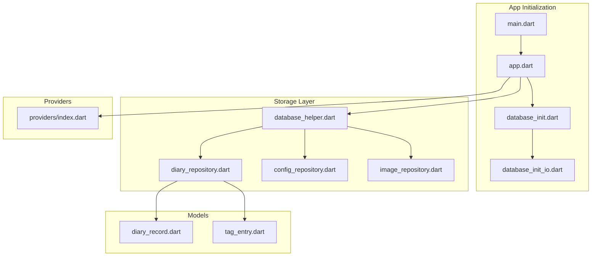
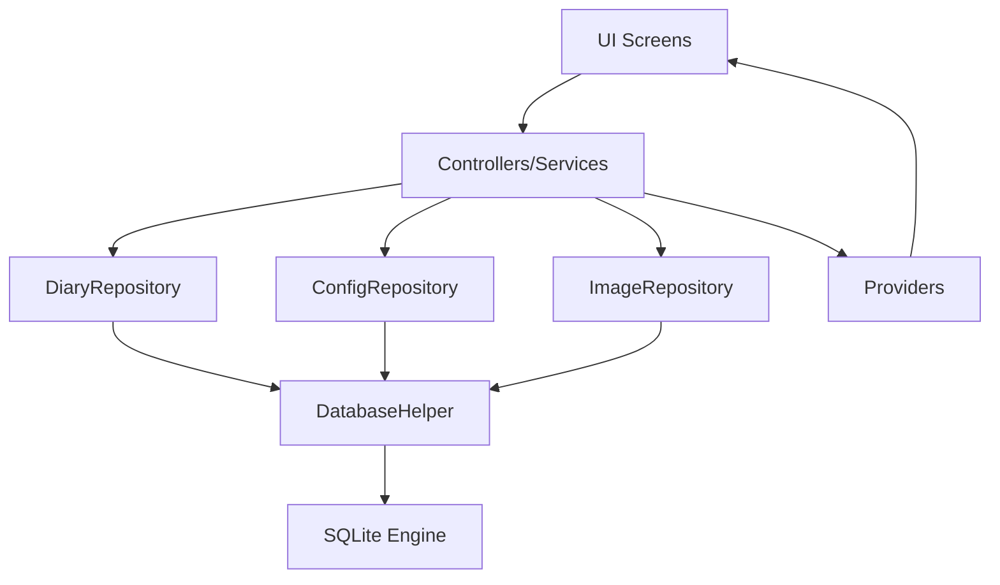
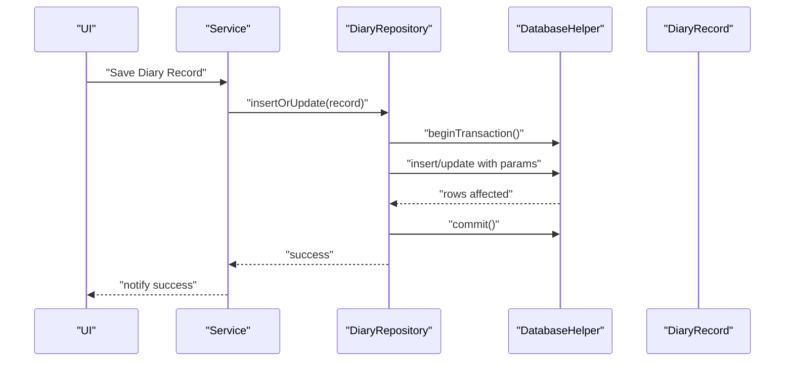
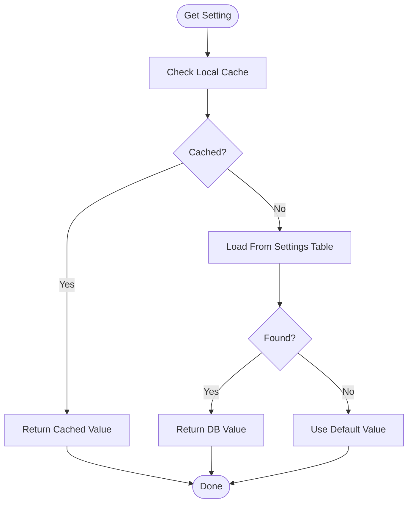
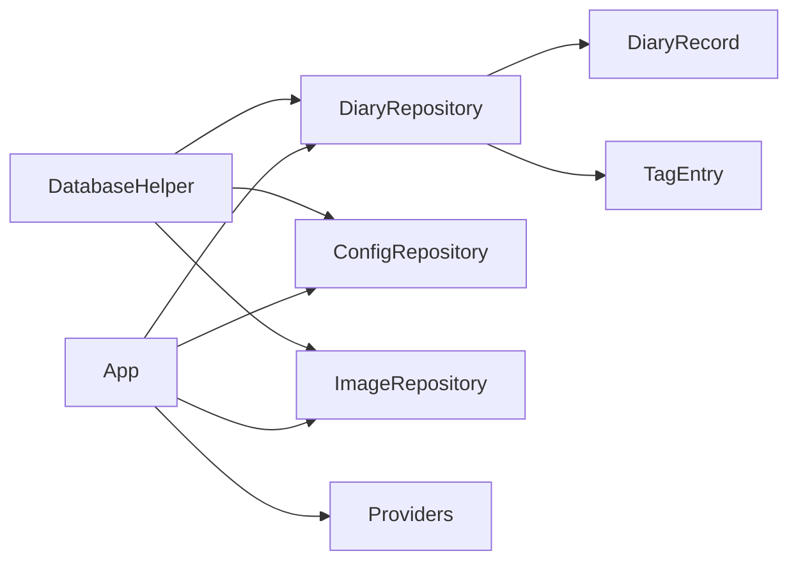

# Storage Services

<cite>
**Referenced Files in This Document**
- [app.dart](file://lib/app.dart)
- [main.dart](file://lib/main.dart)
- [database_init.dart](file://lib/database_init.dart)
- [database_init_io.dart](file://lib/database_init_io.dart)
- [database_helper.dart](file://lib/core/storage/database_helper.dart)
- [diary_repository.dart](file://lib/core/storage/diary_repository.dart)
- [config_repository.dart](file://lib/core/storage/config_repository.dart)
- [image_repository.dart](file://lib/core/storage/image_repository.dart)
- [diary_record.dart](file://lib/models/diary_record.dart)
- [tag_entry.dart](file://lib/models/tag_entry.dart)
- [providers_index.dart](file://lib/providers/index.dart)
</cite>

## Table of Contents
1. [Introduction](#introduction)
2. [Project Structure](#project-structure)
3. [Core Components](#core-components)
4. [Architecture Overview](#architecture-overview)
5. [Detailed Component Analysis](#detailed-component-analysis)
6. [Dependency Analysis](#dependency-analysis)
7. [Performance Considerations](#performance-considerations)
8. [Troubleshooting Guide](#troubleshooting-guide)
9. [Conclusion](#conclusion)

## Introduction
This document describes QNote Flutter's storage services that implement the repository pattern for data persistence across diary, note, todo, and image entities. It explains how repositories abstract database operations, enabling clean separation of concerns, testability via dependency injection, and reactive UI updates through provider integration. The documentation covers database helper operations, CRUD workflows, configuration management, media handling, query optimization, transaction management, schema relationships, indexing strategies, migrations, offline data management, conflict resolution, and extensibility.

## Project Structure
QNote organizes storage-related logic under a dedicated core storage module with clear separation between helpers, repositories, models, and providers. The application initializes the database factory early in startup and wires up repositories and providers for dependency injection.

**Diagram sources**
- [main.dart](file://lib/main.dart)
- [app.dart](file://lib/app.dart)
- [database_init.dart](file://lib/database_init.dart)
- [database_init_io.dart](file://lib/database_init_io.dart)
- [database_helper.dart](file://lib/core/storage/database_helper.dart)
- [diary_repository.dart](file://lib/core/storage/diary_repository.dart)
- [config_repository.dart](file://lib/core/storage/config_repository.dart)
- [image_repository.dart](file://lib/core/storage/image_repository.dart)
- [diary_record.dart](file://lib/models/diary_record.dart)
- [tag_entry.dart](file://lib/models/tag_entry.dart)
- [providers_index.dart](file://lib/providers/index.dart)

**Section sources**
- [main.dart](file://lib/main.dart)
- [app.dart](file://lib/app.dart)
- [database_init.dart](file://lib/database_init.dart)
- [database_init_io.dart](file://lib/database_init_io.dart)

## Core Components
- Database Helper: Centralizes SQLite operations, connection lifecycle, transactions, and raw SQL execution.
- Repositories: Encapsulate entity-specific CRUD and query logic for diary, configuration, and image domains.
- Models: Define entity structures and serialization helpers for persistence.
- Providers: Manage reactive state for UI updates and dependency injection wiring.

Key responsibilities:
- Repository pattern: Each domain has a dedicated repository exposing typed operations and hiding underlying storage details.
- Transaction management: Group related writes to maintain consistency.
- Query optimization: Use indexed columns and selective projections to reduce overhead.
- Offline-first: Persist locally and coordinate synchronization externally.
- Conflict resolution: Implement optimistic concurrency or last-writer-wins strategies as needed.

**Section sources**
- [database_helper.dart](file://lib/core/storage/database_helper.dart)
- [diary_repository.dart](file://lib/core/storage/diary_repository.dart)
- [config_repository.dart](file://lib/core/storage/config_repository.dart)
- [image_repository.dart](file://lib/core/storage/image_repository.dart)
- [diary_record.dart](file://lib/models/diary_record.dart)

## Architecture Overview
The storage architecture follows a layered approach:
- Application layer initializes the database factory and sets up providers.
- Storage layer composes database helper and repositories.
- Domain models encapsulate entity state and JSON serialization.
- Provider layer exposes reactive streams for UI binding.

**Diagram sources**
- [app.dart](file://lib/app.dart)
- [database_helper.dart](file://lib/core/storage/database_helper.dart)
- [diary_repository.dart](file://lib/core/storage/diary_repository.dart)
- [config_repository.dart](file://lib/core/storage/config_repository.dart)
- [image_repository.dart](file://lib/core/storage/image_repository.dart)
- [providers_index.dart](file://lib/providers/index.dart)

## Detailed Component Analysis

### Database Helper
Responsibilities:
- Initialize database factory and open connections.
- Execute raw SQL statements and manage transactions.
- Provide shared database instance across repositories.
- Support batch operations and prepared statements.

Implementation highlights:
- Centralized connection management and transaction APIs.
- Utility methods for insert/update/delete/select with parameter binding.
- Batch execution for improved write performance.

Common operations:
- Open/close database connections.
- Begin/commit/rollback transactions.
- Execute queries with projection lists and WHERE clauses.
- Perform bulk inserts/updates.

**Section sources**
- [database_helper.dart](file://lib/core/storage/database_helper.dart)

### Diary Repository
Domain focus:
- CRUD operations for diary records.
- Query by date range, tags, and folder associations.
- Serialization/deserialization using model helpers.

Key workflows:
- Create: Insert new diary record with metadata and optional media references.
- Read: Fetch single record by ID; paginated queries by date range.
- Update: Partial updates with optimistic concurrency checks.
- Delete: Soft delete with isDeleted flag and cascading cleanup.

Data access patterns:
- Projection queries to minimize payload size.
- Index usage on time, folder_id, and tags for fast filtering.
- Transactions for atomic updates when linking photos/tags.

**Diagram sources**
- [diary_repository.dart](file://lib/core/storage/diary_repository.dart)
- [database_helper.dart](file://lib/core/storage/database_helper.dart)
- [diary_record.dart](file://lib/models/diary_record.dart)

**Section sources**
- [diary_repository.dart](file://lib/core/storage/diary_repository.dart)
- [diary_record.dart](file://lib/models/diary_record.dart)

### Configuration Repository
Domain focus:
- Store and retrieve application settings and preferences.
- Provide defaults and override mechanisms.
- Support reactive updates through providers.

Operations:
- Upsert settings with key-value semantics.
- Retrieve single or all settings with default fallbacks.
- Observe changes for live UI updates.

**Diagram sources**
- [config_repository.dart](file://lib/core/storage/config_repository.dart)

**Section sources**
- [config_repository.dart](file://lib/core/storage/config_repository.dart)

### Image Repository
Domain focus:
- Media management for diary photos and associated assets.
- Store binary data or references depending on strategy.
- Maintain metadata for retrieval and cleanup.

Operations:
- Save image bytes with metadata (timestamp, dimensions, checksum).
- Retrieve image by reference with caching.
- Delete images and update foreign keys atomically.

Indexing and optimization:
- Index on creation timestamps for recent media queries.
- Separate table for metadata to avoid bloating primary records.

**Section sources**
- [image_repository.dart](file://lib/core/storage/image_repository.dart)

### Models and Serialization
Entity models define field mappings and JSON encoding/decoding for complex fields. They also expose copyWith and derived getters for effective date computation.

Patterns:
- toMap/fromMap for ORM-like mapping.
- JSON fields for arrays/lists and nested objects.
- Optional fields with safe defaults.

**Section sources**
- [diary_record.dart](file://lib/models/diary_record.dart)
- [tag_entry.dart](file://lib/models/tag_entry.dart)

### Provider Integration
Providers bind repositories to UI state, enabling reactive updates without tight coupling. Dependencies are injected at application startup.

Integration points:
- Expose streams or change notifications from repositories.
- Wrap provider state with ChangeNotifier or Riverpod selectors.
- Inject repositories via dependency injection container.

**Section sources**
- [providers_index.dart](file://lib/providers/index.dart)
- [app.dart](file://lib/app.dart)

## Dependency Analysis
Repositories depend on the database helper for low-level operations. Models are consumed by repositories for serialization. Providers depend on repositories for data access and expose reactive state to UI.

**Diagram sources**
- [database_helper.dart](file://lib/core/storage/database_helper.dart)
- [diary_repository.dart](file://lib/core/storage/diary_repository.dart)
- [config_repository.dart](file://lib/core/storage/config_repository.dart)
- [image_repository.dart](file://lib/core/storage/image_repository.dart)
- [diary_record.dart](file://lib/models/diary_record.dart)
- [tag_entry.dart](file://lib/models/tag_entry.dart)
- [app.dart](file://lib/app.dart)

**Section sources**
- [database_helper.dart](file://lib/core/storage/database_helper.dart)
- [diary_repository.dart](file://lib/core/storage/diary_repository.dart)
- [config_repository.dart](file://lib/core/storage/config_repository.dart)
- [image_repository.dart](file://lib/core/storage/image_repository.dart)
- [app.dart](file://lib/app.dart)

## Performance Considerations
- Use transactions for batch operations to reduce WAL overhead.
- Index frequently queried columns: time, folder_id, tags, created_at/updated_at.
- Prefer projection queries to limit payload size.
- Cache frequently accessed configuration settings.
- Avoid loading large binary blobs unless necessary; store references instead.
- Use pagination for long lists (e.g., diary entries).
- Minimize JSON parsing by reusing parsed structures when possible.

## Troubleshooting Guide
Common issues and resolutions:
- Database lock contention: Wrap heavy writes in transactions and avoid long-running queries on the UI thread.
- JSON parse errors: Validate serialized fields and handle missing keys gracefully in model factories.
- Memory pressure with images: Load thumbnails and stream large assets; clear caches after deletion.
- Provider not updating: Ensure repository emits change notifications and providers rebuild on state changes.
- Migration failures: Back up data before migrations; test schema changes incrementally.

**Section sources**
- [database_helper.dart](file://lib/core/storage/database_helper.dart)
- [diary_repository.dart](file://lib/core/storage/diary_repository.dart)
- [config_repository.dart](file://lib/core/storage/config_repository.dart)
- [image_repository.dart](file://lib/core/storage/image_repository.dart)

## Conclusion
QNote's storage services implement a robust repository pattern that cleanly separates data access from business logic and UI. Through centralized database helper operations, typed repositories, and provider-driven reactivity, the system supports efficient CRUD workflows, optimized queries, transactional integrity, and scalable extensibility. The design enables offline-first capabilities, conflict-aware updates, and straightforward testing via dependency injection.