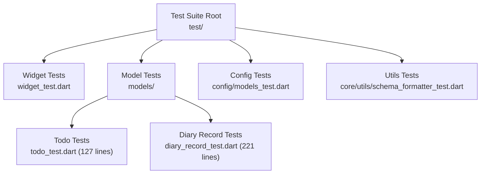
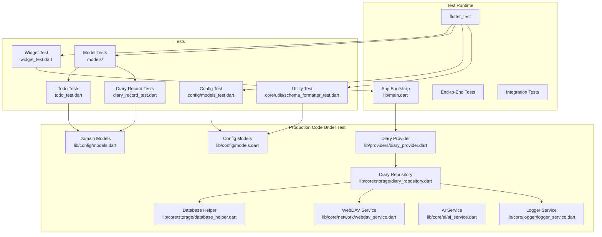
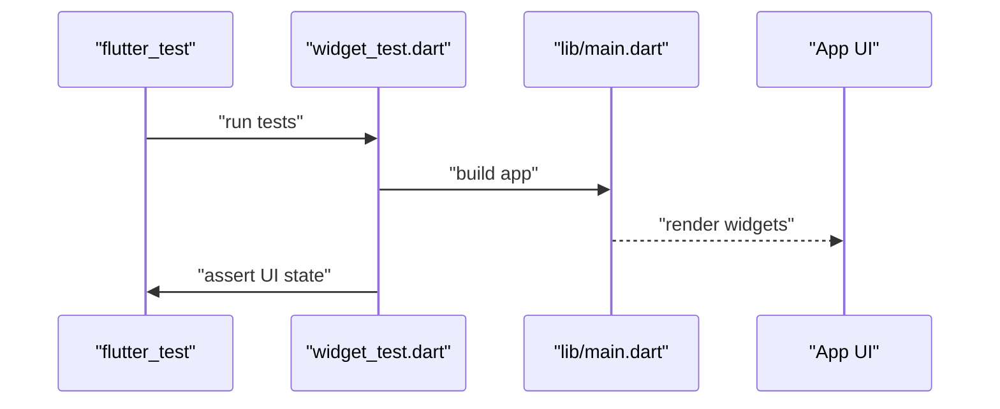
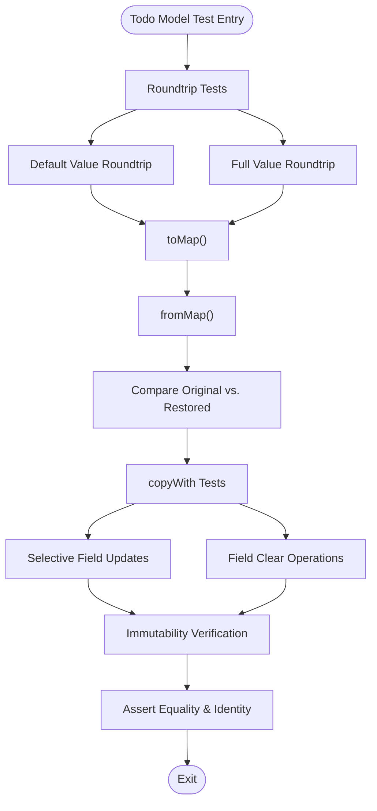
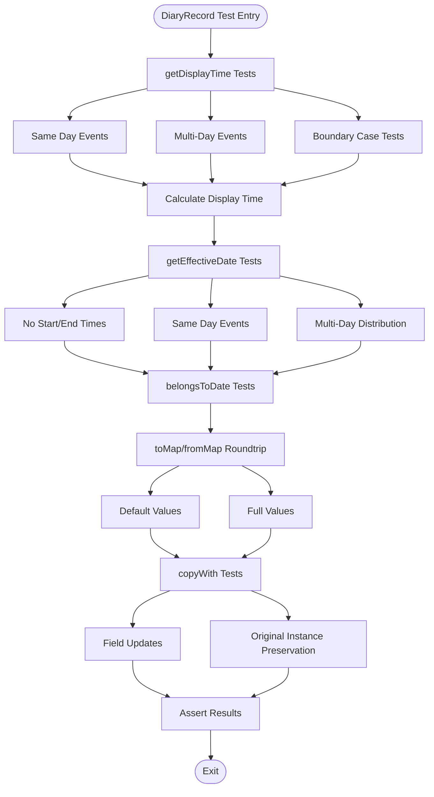
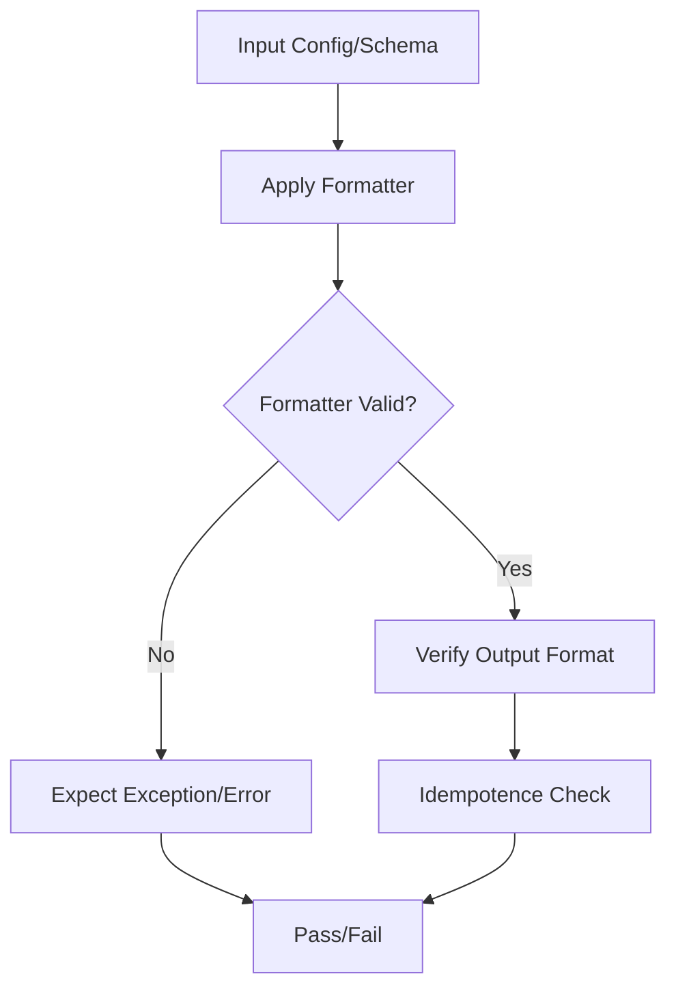
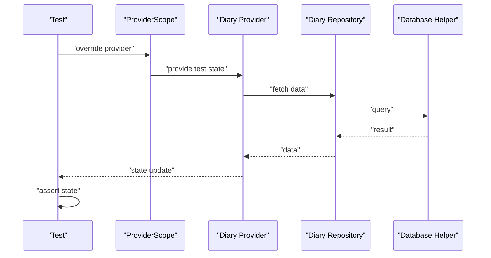
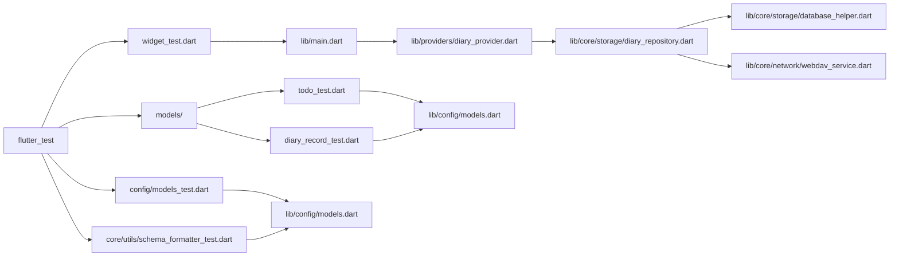

# Testing Strategy

<cite>
**Referenced Files in This Document**
- [pubspec.yaml](file://pubspec.yaml)
- [analysis_options.yaml](file://analysis_options.yaml)
- [README.md](file://README.md)
- [test/widget_test.dart](file://test/widget_test.dart)
- [test/models/todo_test.dart](file://test/models/todo_test.dart)
- [test/models/diary_record_test.dart](file://test/models/diary_record_test.dart)
- [test/config/models_test.dart](file://test/config/models_test.dart)
- [test/core/utils/schema_formatter_test.dart](file://test/core/utils/schema_formatter_test.dart)
- [lib/app.dart](file://lib/app.dart)
- [lib/main.dart](file://lib/main.dart)
- [lib/config/models.dart](file://lib/config/models.dart)
- [lib/core/storage/database_helper.dart](file://lib/core/storage/database_helper.dart)
- [lib/core/storage/diary_repository.dart](file://lib/core/storage/diary_repository.dart)
- [lib/core/network/webdav_service.dart](file://lib/core/network/webdav_service.dart)
- [lib/core/ai/ai_service.dart](file://lib/core/ai/ai_service.dart)
- [lib/core/logger/logger_service.dart](file://lib/core/logger/logger_service.dart)
- [lib/providers/diary_provider.dart](file://lib/providers/diary_provider.dart)
</cite>

## Update Summary
**Changes Made**
- Added comprehensive Todo model testing documentation with 127-line test suite covering serialization, copyWith operations, and field clearing
- Enhanced DiaryRecord model testing documentation with 221-line test suite including display time calculations, effective date handling, and date membership validation
- Updated test structure analysis to reflect expanded model testing infrastructure
- Revised architectural diagrams to include new model test components

## Table of Contents
1. [Introduction](#introduction)
2. [Project Structure](#project-structure)
3. [Core Components](#core-components)
4. [Architecture Overview](#architecture-overview)
5. [Detailed Component Analysis](#detailed-component-analysis)
6. [Dependency Analysis](#dependency-analysis)
7. [Performance Considerations](#performance-considerations)
8. [Troubleshooting Guide](#troubleshooting-guide)
9. [Conclusion](#conclusion)
10. [Appendices](#appendices)

## Introduction
This document describes QNote Flutter's testing strategy and implementation. It covers test organization across unit, widget, and integration domains, the frameworks and setup used, mocking strategies for services and repositories, best practices for Flutter testing (asynchronous operations, widget interactions, state verification), examples of testing Riverpod providers and service logic, coverage and CI considerations, debugging techniques for failing tests, performance testing approaches, and guidelines for maintainable tests and error scenarios.

**Updated** Expanded to include comprehensive Todo and enhanced DiaryRecord model testing capabilities, representing significant growth in domain model validation coverage.

## Project Structure
QNote Flutter currently includes a comprehensive set of tests under the test/ directory:
- Widget tests: a minimal entry point for basic rendering and lifecycle behavior
- Model tests: extensive domain model validation including Todo and DiaryRecord functionality
- Unit tests: configuration model validations and utility-level formatting logic
- Integration coverage: present via widget tests and model tests; explicit integration tests are not yet established

**Diagram sources**
- [test/widget_test.dart:1-7](file://test/widget_test.dart#L1-L7)
- [test/models/todo_test.dart:1-127](file://test/models/todo_test.dart#L1-L127)
- [test/models/diary_record_test.dart:1-221](file://test/models/diary_record_test.dart#L1-L221)
- [test/config/models_test.dart:1-28](file://test/config/models_test.dart#L1-L28)
- [test/core/utils/schema_formatter_test.dart:1-41](file://test/core/utils/schema_formatter_test.dart#L1-L41)

**Section sources**
- [test/widget_test.dart:1-7](file://test/widget_test.dart#L1-L7)
- [test/models/todo_test.dart:1-127](file://test/models/todo_test.dart#L1-L127)
- [test/models/diary_record_test.dart:1-221](file://test/models/diary_record_test.dart#L1-L221)
- [test/config/models_test.dart:1-28](file://test/config/models_test.dart#L1-L28)
- [test/core/utils/schema_formatter_test.dart:1-41](file://test/core/utils/schema_formatter_test.dart#L1-L41)

## Core Components
Key testing components and their roles:
- Flutter Driver/Widgets Test Harness: Provides the foundation for widget and integration-style tests using flutter_test
- Model Tests: Validate domain entity correctness, immutability semantics, and complex business logic
- Config/Schema Tests: Verify configuration models and formatting utilities
- Utility Tests: Validate pure functions and formatting logic
- Application Bootstrap: Ensures the app initializes correctly for tests

Framework and tooling indicators:
- The presence of flutter_test imports in test files confirms the Flutter testing framework is used
- The project uses Dart analyzer rules via analysis_options.yaml for static checks
- Continuous integration and coverage are configured via pubspec.yaml entries for coverage and CI scripts

**Updated** Significantly expanded model testing infrastructure now covers critical domain entities with comprehensive validation scenarios.

**Section sources**
- [pubspec.yaml:1-120](file://pubspec.yaml#L1-L120)
- [analysis_options.yaml:1-200](file://analysis_options.yaml#L1-L200)
- [test/widget_test.dart:1-7](file://test/widget_test.dart#L1-L7)
- [lib/main.dart:1-50](file://lib/main.dart#L1-L50)

## Architecture Overview
The testing architecture centers on flutter_test for widget and unit tests, with substantial expansion toward comprehensive model testing. The current test surface exercises:
- Basic app bootstrapping and widget rendering
- Domain model validation and immutability semantics for Todo and DiaryRecord entities
- Configuration model correctness and AI provider validation
- Utility formatting logic for schema generation

**Diagram sources**
- [test/widget_test.dart:1-7](file://test/widget_test.dart#L1-L7)
- [test/models/todo_test.dart:1-127](file://test/models/todo_test.dart#L1-L127)
- [test/models/diary_record_test.dart:1-221](file://test/models/diary_record_test.dart#L1-L221)
- [test/config/models_test.dart:1-28](file://test/config/models_test.dart#L1-L28)
- [test/core/utils/schema_formatter_test.dart:1-41](file://test/core/utils/schema_formatter_test.dart#L1-L41)
- [lib/main.dart:1-50](file://lib/main.dart#L1-L50)
- [lib/config/models.dart:1-200](file://lib/config/models.dart#L1-L200)
- [lib/core/storage/database_helper.dart:1-200](file://lib/core/storage/database_helper.dart#L1-L200)
- [lib/core/storage/diary_repository.dart:1-200](file://lib/core/storage/diary_repository.dart#L1-L200)
- [lib/core/network/webdav_service.dart:1-200](file://lib/core/network/webdav_service.dart#L1-L200)
- [lib/core/ai/ai_service.dart:1-200](file://lib/core/ai/ai_service.dart#L1-L200)
- [lib/core/logger/logger_service.dart:1-200](file://lib/core/logger/logger_service.dart#L1-L200)
- [lib/providers/diary_provider.dart:1-200](file://lib/providers/diary_provider.dart#L1-L200)

## Detailed Component Analysis

### Widget Tests
Purpose:
- Validate basic app initialization and widget rendering
- Ensure the app tree builds without exceptions

Recommended practices:
- Use TestWidgetsFlutterBinding to initialize the test binding
- Wrap widget assertions with tester.pumpAndSettle() to handle async rendering
- Prefer focused tests on key screens or providers to avoid brittle tests

**Diagram sources**
- [test/widget_test.dart:1-7](file://test/widget_test.dart#L1-L7)
- [lib/main.dart:1-50](file://lib/main.dart#L1-L50)

**Section sources**
- [test/widget_test.dart:1-7](file://test/widget_test.dart#L1-L7)
- [lib/main.dart:1-50](file://lib/main.dart#L1-L50)

### Model Tests

#### Todo Model Testing
Purpose:
- Validate Todo domain model correctness, serialization/deserialization, and immutable operations
- Test copyWith functionality with field clearing capabilities

Coverage areas:
- Roundtrip serialization using toMap/fromMap with default and full value scenarios
- Immutable copyWith operations with selective field updates
- Field clearing operations (clearFolderId, clearReminderTime)
- Default value handling for optional fields

Best practices:
- Test both minimal and comprehensive field configurations
- Verify immutability by ensuring original instances remain unchanged
- Include boundary conditions for optional fields and default values

**Diagram sources**
- [test/models/todo_test.dart:1-127](file://test/models/todo_test.dart#L1-L127)

**Section sources**
- [test/models/todo_test.dart:1-127](file://test/models/todo_test.dart#L1-L127)

#### DiaryRecord Model Testing
Purpose:
- Validate complex diary record business logic including time calculations and date handling
- Test serialization, immutability, and specialized date/time operations

Coverage areas:
- Display time calculation logic for events spanning multiple days
- Effective date determination based on time distribution across days
- Date membership validation for calendar navigation
- Roundtrip serialization with comprehensive field coverage
- Immutable copyWith operations with field preservation

Complex business logic validated:
- getDisplayTime(): Determines appropriate display time based on event timing and day boundaries
- getEffectiveDate(): Calculates effective date when events span multiple days
- belongsToDate(): Validates date membership for calendar filtering
- toMap/fromMap: Comprehensive serialization with default value handling
- copyWith: Immutable field updates with original instance preservation

**Diagram sources**
- [test/models/diary_record_test.dart:1-221](file://test/models/diary_record_test.dart#L1-L221)

**Section sources**
- [test/models/diary_record_test.dart:1-221](file://test/models/diary_record_test.dart#L1-L221)

### Configuration and Schema Tests
Purpose:
- Validate configuration models and schema formatting utilities
- Test AI provider configuration and schema compression functionality

Coverage:
- AI provider configuration validation with unique ID enforcement
- Schema formatter behavior for shortcut configurations
- Compressed schema generation with proper formatting

Best practices:
- Parameterize tests for multiple input formats
- Include negative cases for invalid inputs
- Verify idempotent behavior where applicable

**Diagram sources**
- [test/config/models_test.dart:1-28](file://test/config/models_test.dart#L1-L28)
- [test/core/utils/schema_formatter_test.dart:1-41](file://test/core/utils/schema_formatter_test.dart#L1-L41)

**Section sources**
- [test/config/models_test.dart:1-28](file://test/config/models_test.dart#L1-L28)
- [test/core/utils/schema_formatter_test.dart:1-41](file://test/core/utils/schema_formatter_test.dart#L1-L41)

### Mocking Services and Repositories
Guidelines for isolating components during testing:
- Use interfaces or abstract base classes for services and repositories
- Provide fake implementations for network services (e.g., WebDAV) and storage helpers
- Replace real repositories with in-memory mocks that track calls and return controlled data
- For stateful components, inject mock providers or use provider overrides in tests

Common patterns:
- Fake repositories that throw controlled exceptions for error scenarios
- Stub services returning fixed responses for success paths
- Track invocations to verify interactions without relying on external systems

### Asynchronous Testing and State Verification
Asynchronous testing:
- Use pump(), pumpAndSettle(), and advanceBy() to drive time and rendering
- Wrap Future-based operations with tester.runAsync() when necessary
- For Riverpod provider tests, use ProviderScope and override providers with test values

State verification:
- Assert widget states after user interactions
- For providers, read state from the test scope and assert expected values
- Verify side effects (e.g., navigation, logging) through mocks

### Testing Riverpod Providers
Approach:
- Wrap tests with ProviderScope to control provider values
- Override providers with test doubles (mocks/fakes)
- Read provider state from the test scope and assert outcomes
- Simulate loading, success, and error states by controlling underlying repositories/services

**Diagram sources**
- [lib/providers/diary_provider.dart:1-200](file://lib/providers/diary_provider.dart#L1-L200)
- [lib/core/storage/diary_repository.dart:1-200](file://lib/core/storage/diary_repository.dart#L1-L200)
- [lib/core/storage/database_helper.dart:1-200](file://lib/core/storage/database_helper.dart#L1-L200)

**Section sources**
- [lib/providers/diary_provider.dart:1-200](file://lib/providers/diary_provider.dart#L1-L200)
- [lib/core/storage/diary_repository.dart:1-200](file://lib/core/storage/diary_repository.dart#L1-L200)
- [lib/core/storage/database_helper.dart:1-200](file://lib/core/storage/database_helper.dart#L1-L200)

### Testing Business Logic in Services
Approach:
- Isolate service logic by injecting mock repositories and services
- Test success paths with valid inputs and verify outputs
- Test error paths by simulating failures (network errors, parsing errors)
- Verify side effects such as logging and notifications

## Dependency Analysis
Current test dependencies and their relationships:
- flutter_test is the primary testing framework
- Tests depend on production code under lib/
- Model tests exercise complex domain logic with specialized business rules
- Some tests exercise providers and repositories that in turn depend on storage helpers and network services

**Updated** Significantly expanded dependency graph with comprehensive model testing infrastructure.

**Diagram sources**
- [test/widget_test.dart:1-7](file://test/widget_test.dart#L1-L7)
- [test/models/todo_test.dart:1-127](file://test/models/todo_test.dart#L1-L127)
- [test/models/diary_record_test.dart:1-221](file://test/models/diary_record_test.dart#L1-L221)
- [test/config/models_test.dart:1-28](file://test/config/models_test.dart#L1-L28)
- [test/core/utils/schema_formatter_test.dart:1-41](file://test/core/utils/schema_formatter_test.dart#L1-L41)
- [lib/main.dart:1-50](file://lib/main.dart#L1-L50)
- [lib/providers/diary_provider.dart:1-200](file://lib/providers/diary_provider.dart#L1-L200)
- [lib/core/storage/diary_repository.dart:1-200](file://lib/core/storage/diary_repository.dart#L1-L200)
- [lib/core/storage/database_helper.dart:1-200](file://lib/core/storage/database_helper.dart#L1-L200)
- [lib/core/network/webdav_service.dart:1-200](file://lib/core/network/webdav_service.dart#L1-L200)
- [lib/config/models.dart:1-200](file://lib/config/models.dart#L1-L200)

**Section sources**
- [pubspec.yaml:1-120](file://pubspec.yaml#L1-L120)
- [test/widget_test.dart:1-7](file://test/widget_test.dart#L1-L7)
- [test/models/todo_test.dart:1-127](file://test/models/todo_test.dart#L1-L127)
- [test/models/diary_record_test.dart:1-221](file://test/models/diary_record_test.dart#L1-L221)
- [lib/providers/diary_provider.dart:1-200](file://lib/providers/diary_provider.dart#L1-L200)
- [lib/core/storage/diary_repository.dart:1-200](file://lib/core/storage/diary_repository.dart#L1-L200)
- [lib/core/storage/database_helper.dart:1-200](file://lib/core/storage/database_helper.dart#L1-L200)
- [lib/core/network/webdav_service.dart:1-200](file://lib/core/network/webdav_service.dart#L1-L200)
- [lib/config/models.dart:1-200](file://lib/config/models.dart#L1-L200)

## Performance Considerations
- Keep widget tests focused and fast; avoid unnecessary pumps and delays
- Use in-memory mocks to eliminate I/O overhead
- For provider tests, minimize real repository/service calls by injecting lightweight fakes
- Profile test runs to identify slow tests and refactor heavy fixtures
- Model tests with complex business logic should be optimized for deterministic execution

**Updated** Enhanced performance considerations for expanded model testing infrastructure.

## Troubleshooting Guide
Common issues and resolutions:
- Widget tests fail to render: ensure TestWidgetsFlutterBinding is initialized and use pumpAndSettle()
- Provider state not updating: verify ProviderScope overrides and that the provider rebuilds after state changes
- Network-dependent tests flake: replace real services with mocks and stub responses
- Coverage gaps: add targeted unit tests for uncovered branches and error paths
- Complex model test failures: break down multi-step model operations into smaller, isolated test cases
- Business logic test edge cases: add boundary condition tests for date/time calculations and field validation

**Updated** Added troubleshooting guidance for expanded model testing scenarios.

## Conclusion
QNote Flutter currently employs a comprehensive testing approach using flutter_test for widget, model, and unit tests, with substantial expansion in domain model validation. The recent addition of Todo and enhanced DiaryRecord testing represents significant maturation of the test infrastructure. To further strengthen the suite:
- Expand integration tests for end-to-end flows
- Increase coverage for error scenarios and edge cases in complex business logic
- Formalize mocking strategies for services and repositories
- Adopt structured patterns for asynchronous and provider-state testing
- Continue expanding model testing to cover additional domain entities

**Updated** Significantly enhanced conclusion reflecting expanded testing infrastructure with comprehensive model validation.

## Appendices

### Test Coverage and Continuous Integration
- Coverage: Configure coverage collection and reporting via pubspec.yaml and CI scripts
- CI: Integrate test execution and coverage reporting in CI pipelines to enforce quality gates
- Test maintenance: Regularly review and update model tests as domain logic evolves

**Section sources**
- [pubspec.yaml:1-120](file://pubspec.yaml#L1-L120)
- [README.md:1-200](file://README.md#L1-L200)

### Writing Maintainable Tests
- Keep tests small, focused, and readable
- Use descriptive test names and group related assertions
- Avoid testing implementation details; focus on observable behavior
- Refactor shared setup into helper methods or fixtures
- Document complex business logic test cases with clear rationale
- Maintain comprehensive test documentation alongside evolving model logic

**Updated** Enhanced guidance for maintaining expanded model testing infrastructure.