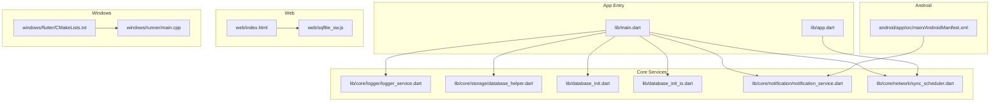
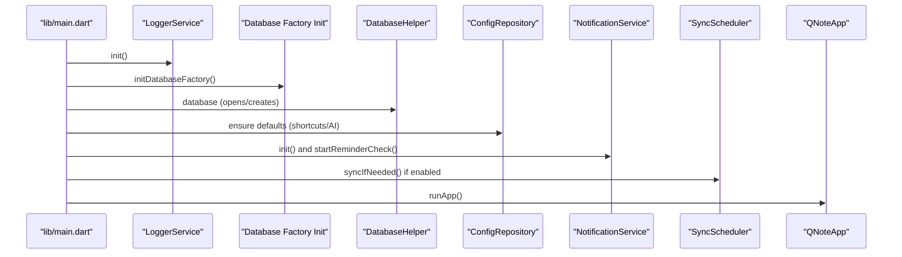
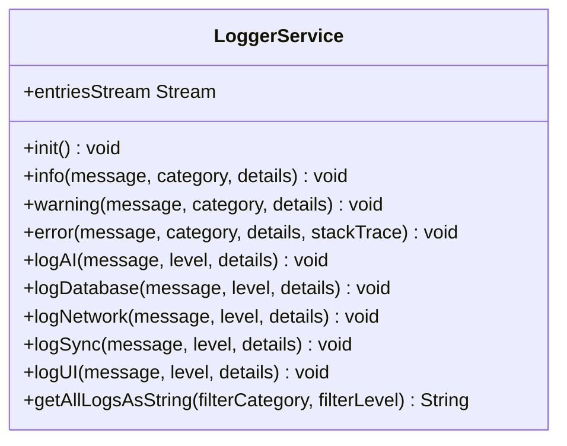
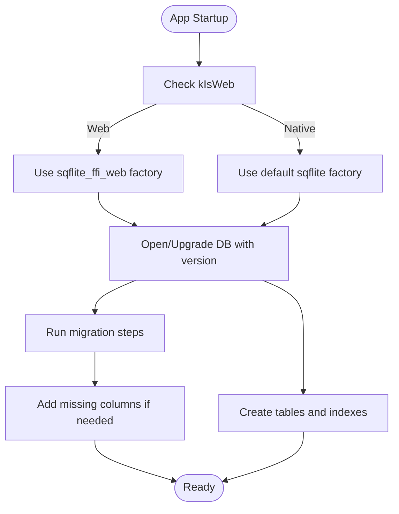
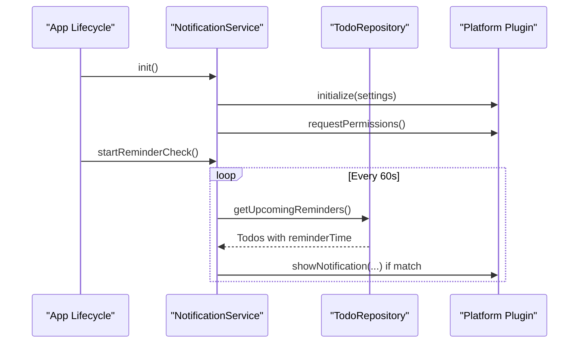
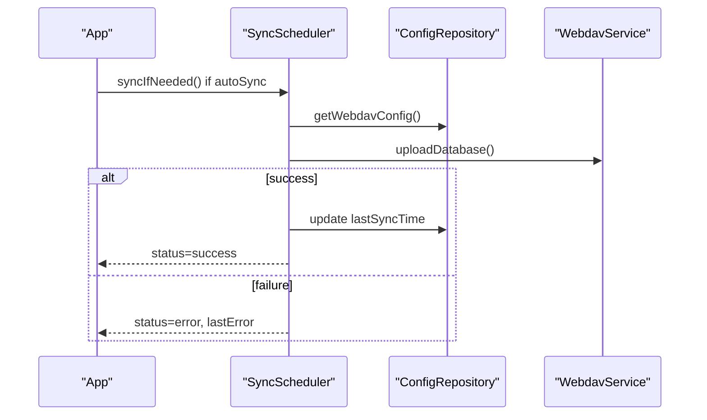
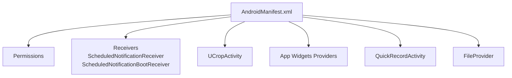
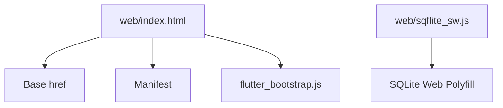
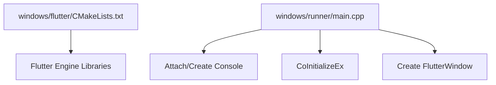
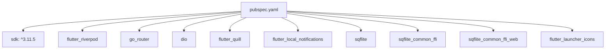

# Troubleshooting and FAQ

<cite>
**Referenced Files in This Document**
- [pubspec.yaml](file://pubspec.yaml)
- [main.dart](file://lib/main.dart)
- [app.dart](file://lib/app.dart)
- [logger_service.dart](file://lib/core/logger/logger_service.dart)
- [database_helper.dart](file://lib/core/storage/database_helper.dart)
- [database_init.dart](file://lib/database_init.dart)
- [database_init_io.dart](file://lib/database_init_io.dart)
- [notification_service.dart](file://lib/core/notification/notification_service.dart)
- [sync_scheduler.dart](file://lib/core/network/sync_scheduler.dart)
- [AndroidManifest.xml](file://android/app/src/main/AndroidManifest.xml)
- [index.html](file://web/index.html)
- [CMakeLists.txt](file://windows/flutter/CMakeLists.txt)
- [main.cpp](file://windows/runner/main.cpp)
- [sqflite_sw.js](file://web/sqflite_sw.js)
</cite>

## Table of Contents
1. [Introduction](#introduction)
2. [Project Structure](#project-structure)
3. [Core Components](#core-components)
4. [Architecture Overview](#architecture-overview)
5. [Detailed Component Analysis](#detailed-component-analysis)
6. [Dependency Analysis](#dependency-analysis)
7. [Performance Considerations](#performance-considerations)
8. [Troubleshooting Guide](#troubleshooting-guide)
9. [Conclusion](#conclusion)
10. [Appendices](#appendices)

## Introduction
This document provides comprehensive troubleshooting guidance and frequently asked questions for QNote Flutter across development, building, and deployment on Android, iOS, Web, and Windows Desktop. It focuses on Flutter-specific issues, Android/iOS integration, web platform compatibility, Windows desktop deployment, performance optimization, memory management, debugging strategies, and common configuration pitfalls. It also documents error scenarios and their resolutions, including database issues, network connectivity problems, and UI rendering issues.

## Project Structure
QNote Flutter follows a modular structure with platform-specific entry points and cross-platform libraries. The application initializes logging, database factories, and platform services before launching the UI. Platform integrations include Android widgets, local notifications, WebDAV synchronization, and web SQLite polyfills.

**Diagram sources**
- [main.dart:12-30](file://lib/main.dart#L12-L30)
- [app.dart:78-121](file://lib/app.dart#L78-L121)
- [logger_service.dart:63-109](file://lib/core/logger/logger_service.dart#L63-L109)
- [database_helper.dart:17-35](file://lib/core/storage/database_helper.dart#L17-L35)
- [database_init.dart:4-6](file://lib/database_init.dart#L4-L6)
- [database_init_io.dart:1-2](file://lib/database_init_io.dart#L1-L2)
- [notification_service.dart:19-29](file://lib/core/notification/notification_service.dart#L19-L29)
- [sync_scheduler.dart:47-59](file://lib/core/network/sync_scheduler.dart#L47-L59)
- [AndroidManifest.xml:13-96](file://android/app/src/main/AndroidManifest.xml#L13-L96)
- [index.html:17](file://web/index.html#L17)
- [sqflite_sw.js](file://web/sqflite_sw.js)
- [CMakeLists.txt:18-40](file://windows/flutter/CMakeLists.txt#L18-L40)
- [main.cpp:8-42](file://windows/runner/main.cpp#L8-L42)

**Section sources**
- [main.dart:12-30](file://lib/main.dart#L12-L30)
- [app.dart:78-121](file://lib/app.dart#L78-L121)
- [AndroidManifest.xml:13-96](file://android/app/src/main/AndroidManifest.xml#L13-L96)
- [index.html:17](file://web/index.html#L17)
- [CMakeLists.txt:18-40](file://windows/flutter/CMakeLists.txt#L18-L40)
- [main.cpp:8-42](file://windows/runner/main.cpp#L8-L42)

## Core Components
- Application bootstrap initializes logging, date formatting, database factory selection, database connection, default configurations, notification service, and optional WebDAV sync scheduling.
- LoggerService centralizes structured logging with categories and persistence to SharedPreferences.
- DatabaseHelper manages platform-aware database creation, migrations, and indexes.
- NotificationService handles platform-specific permissions, channels, and reminders.
- SyncScheduler orchestrates periodic and manual WebDAV synchronization with progress and error reporting.

**Section sources**
- [main.dart:12-30](file://lib/main.dart#L12-L30)
- [logger_service.dart:44-70](file://lib/core/logger/logger_service.dart#L44-L70)
- [database_helper.dart:5-15](file://lib/core/storage/database_helper.dart#L5-L15)
- [notification_service.dart:9-29](file://lib/core/notification/notification_service.dart#L9-L29)
- [sync_scheduler.dart:8-45](file://lib/core/network/sync_scheduler.dart#L8-L45)

## Architecture Overview
The app initializes platform services early, then launches a Material Router-based UI. Cross-cutting concerns like logging, database, notifications, and synchronization are wired in the entry point and consumed by providers and pages.

**Diagram sources**
- [main.dart:12-30](file://lib/main.dart#L12-L30)
- [logger_service.dart:63-70](file://lib/core/logger/logger_service.dart#L63-L70)
- [database_init.dart:4-6](file://lib/database_init.dart#L4-L6)
- [database_helper.dart:17-35](file://lib/core/storage/database_helper.dart#L17-L35)
- [notification_service.dart:19-29](file://lib/core/notification/notification_service.dart#L19-L29)
- [sync_scheduler.dart:25-28](file://lib/core/network/sync_scheduler.dart#L25-L28)
- [app.dart:78-121](file://lib/app.dart#L78-L121)

## Detailed Component Analysis

### Logging and Diagnostics
- LoggerService intercepts debug prints, Flutter errors, and platform errors, categorizing logs and persisting them to SharedPreferences.
- Provides streams and filtering by category/level for diagnostics.

**Diagram sources**
- [logger_service.dart:44-372](file://lib/core/logger/logger_service.dart#L44-L372)

**Section sources**
- [logger_service.dart:63-109](file://lib/core/logger/logger_service.dart#L63-L109)
- [logger_service.dart:229-277](file://lib/core/logger/logger_service.dart#L229-L277)
- [logger_service.dart:297-317](file://lib/core/logger/logger_service.dart#L297-L317)

### Database Initialization and Migration
- Web uses FFI-based SQLite polyfill; native platforms use sqflite.
- DatabaseHelper creates tables, indexes, and performs incremental migrations.
- OnOpen checks and adds missing columns safely.

**Diagram sources**
- [database_init.dart:4-6](file://lib/database_init.dart#L4-L6)
- [database_init_io.dart:1-2](file://lib/database_init_io.dart#L1-L2)
- [database_helper.dart:17-35](file://lib/core/storage/database_helper.dart#L17-L35)
- [database_helper.dart:358-454](file://lib/core/storage/database_helper.dart#L358-L454)
- [database_helper.dart:37-97](file://lib/core/storage/database_helper.dart#L37-L97)

**Section sources**
- [database_init.dart:4-6](file://lib/database_init.dart#L4-L6)
- [database_init_io.dart:1-2](file://lib/database_init_io.dart#L1-L2)
- [database_helper.dart:17-35](file://lib/core/storage/database_helper.dart#L17-L35)
- [database_helper.dart:358-454](file://lib/core/storage/database_helper.dart#L358-L454)

### Notifications and Reminders
- Initializes platform-specific notification plugins, requests permissions, sets up channels, and runs periodic reminder checks.
- Safeguards against permission failures and platform limitations.

**Diagram sources**
- [notification_service.dart:19-29](file://lib/core/notification/notification_service.dart#L19-L29)
- [notification_service.dart:123-160](file://lib/core/notification/notification_service.dart#L123-L160)
- [notification_service.dart:162-183](file://lib/core/notification/notification_service.dart#L162-L183)

**Section sources**
- [notification_service.dart:19-29](file://lib/core/notification/notification_service.dart#L19-L29)
- [notification_service.dart:123-160](file://lib/core/notification/notification_service.dart#L123-L160)
- [notification_service.dart:162-183](file://lib/core/notification/notification_service.dart#L162-L183)

### WebDAV Synchronization Scheduler
- Orchestrates automatic and manual sync, tracks status, and reports progress and errors.
- Supports full sync, image sync, and backup cleanup.

**Diagram sources**
- [sync_scheduler.dart:47-117](file://lib/core/network/sync_scheduler.dart#L47-L117)
- [sync_scheduler.dart:119-164](file://lib/core/network/sync_scheduler.dart#L119-L164)
- [sync_scheduler.dart:200-219](file://lib/core/network/sync_scheduler.dart#L200-L219)

**Section sources**
- [sync_scheduler.dart:47-117](file://lib/core/network/sync_scheduler.dart#L47-L117)
- [sync_scheduler.dart:119-164](file://lib/core/network/sync_scheduler.dart#L119-L164)
- [sync_scheduler.dart:200-219](file://lib/core/network/sync_scheduler.dart#L200-L219)

### Android Integration
- Declares required permissions and receivers for notifications, boot events, camera, cropping, and FileProvider.
- Includes app widgets and quick record dialog.

**Diagram sources**
- [AndroidManifest.xml:1-112](file://android/app/src/main/AndroidManifest.xml#L1-L112)

**Section sources**
- [AndroidManifest.xml:13-96](file://android/app/src/main/AndroidManifest.xml#L13-L96)

### Web Platform Compatibility
- Base href and manifest are configured in index.html.
- Web SQLite relies on sqflite_sw.js polyfill.

**Diagram sources**
- [index.html:17](file://web/index.html#L17)
- [sqflite_sw.js](file://web/sqflite_sw.js)

**Section sources**
- [index.html:17](file://web/index.html#L17)
- [sqflite_sw.js](file://web/sqflite_sw.js)

### Windows Desktop Deployment
- Flutter engine and wrapper libraries are built via CMake.
- Runner initializes console, COM, and creates the main window.

**Diagram sources**
- [CMakeLists.txt:18-40](file://windows/flutter/CMakeLists.txt#L18-L40)
- [main.cpp:8-42](file://windows/runner/main.cpp#L8-L42)

**Section sources**
- [CMakeLists.txt:18-40](file://windows/flutter/CMakeLists.txt#L18-L40)
- [main.cpp:8-42](file://windows/runner/main.cpp#L8-L42)

## Dependency Analysis
- SDK and package versions are declared in pubspec.yaml.
- Platform-specific dependencies include sqflite for native and sqflite_common_ffi_web for web.
- Launcher icons configured for Android.

**Diagram sources**
- [pubspec.yaml:6-48](file://pubspec.yaml#L6-L48)

**Section sources**
- [pubspec.yaml:6-48](file://pubspec.yaml#L6-L48)

## Performance Considerations
- Database indexes are created to optimize frequent queries on diary, notes, todos, folders, and sync logs.
- LoggerService debounces persistence to reduce IO overhead.
- Notification reminders poll periodically; consider adjusting intervals for battery life.
- Web synchronization streams progress updates; avoid blocking UI on long-running tasks.

[No sources needed since this section provides general guidance]

## Troubleshooting Guide

### General Development Issues
- App fails to start or shows blank screen:
  - Verify LoggerService initialization and ensure logs are persisted.
  - Confirm database factory initialization for the target platform.
  - Check that database opens without errors and migrations succeed.

- Build fails on Windows:
  - Ensure Flutter tool backend builds the engine and wrapper libraries.
  - Verify runner main.cpp creates the window and message loop runs.

- Web app does not load database:
  - Confirm base href is set and service worker polyfill is included.
  - Check browser console for SQLite-related errors.

**Section sources**
- [logger_service.dart:63-70](file://lib/core/logger/logger_service.dart#L63-L70)
- [database_init.dart:4-6](file://lib/database_init.dart#L4-L6)
- [database_helper.dart:17-35](file://lib/core/storage/database_helper.dart#L17-L35)
- [CMakeLists.txt:92-109](file://windows/flutter/CMakeLists.txt#L92-L109)
- [main.cpp:29-42](file://windows/runner/main.cpp#L29-L42)
- [index.html:17](file://web/index.html#L17)
- [sqflite_sw.js](file://web/sqflite_sw.js)

### Android Integration Problems
- Notifications not appearing:
  - Ensure POST_NOTIFICATIONS permission and notification channels are created.
  - Verify boot receiver registration for scheduled notifications.

- Camera or cropping issues:
  - Confirm UCropActivity is declared and FileProvider paths are configured.

- Widgets not updating:
  - Validate widget providers and metadata XML references.

**Section sources**
- [AndroidManifest.xml:36-96](file://android/app/src/main/AndroidManifest.xml#L36-L96)

### Web Platform Compatibility
- Blank page or missing assets:
  - Validate base href and manifest path.
  - Ensure flutter_bootstrap.js is loaded.

- Database errors on Safari/Chrome:
  - Confirm sqflite_sw.js is present and initialized.
  - Check IndexedDB availability and quotas.

**Section sources**
- [index.html:17](file://web/index.html#L17)
- [sqflite_sw.js](file://web/sqflite_sw.js)

### Windows Desktop Deployment
- Application exits immediately:
  - Check console attach and window creation in main.cpp.
  - Ensure COM is initialized and message loop runs.

- Missing Flutter engine:
  - Rebuild with CMake; verify generated files exist.

**Section sources**
- [main.cpp:8-42](file://windows/runner/main.cpp#L8-L42)
- [CMakeLists.txt:18-40](file://windows/flutter/CMakeLists.txt#L18-L40)

### Database Issues
- Migration failures or missing columns:
  - Review onOpen and upgrade handlers; ensure safe ALTER TABLE operations.
  - Check for existing columns before adding.

- Index creation errors:
  - Wrap index creation in try/catch; log failures only in debug mode.

- Database locked or corrupted:
  - Close connections properly and avoid concurrent writes.
  - Clear database cache on persistent corruption.

**Section sources**
- [database_helper.dart:37-97](file://lib/core/storage/database_helper.dart#L37-L97)
- [database_helper.dart:358-454](file://lib/core/storage/database_helper.dart#L358-L454)
- [database_helper.dart:323-356](file://lib/core/storage/database_helper.dart#L323-L356)

### Network Connectivity Problems
- WebDAV sync fails:
  - Verify server URL, credentials, and remote path.
  - Check SyncScheduler status stream and lastError.

- Image sync issues:
  - Enable image sync option and monitor progress callbacks.

**Section sources**
- [sync_scheduler.dart:47-117](file://lib/core/network/sync_scheduler.dart#L47-L117)
- [sync_scheduler.dart:166-198](file://lib/core/network/sync_scheduler.dart#L166-L198)

### UI Rendering and Navigation Issues
- Navigation not working after widget channel:
  - Ensure MethodChannel handler is registered and pending route retrieval succeeds.

- Lifecycle state refresh:
  - Providers refresh on resume; verify no exceptions are swallowed silently.

**Section sources**
- [app.dart:49-75](file://lib/app.dart#L49-L75)
- [app.dart:36-47](file://lib/app.dart#L36-L47)

### Memory Management and Performance
- Excessive logging:
  - Limit log volume; rely on category filtering and debounce thresholds.

- Frequent database writes:
  - Batch operations and avoid unnecessary migrations on startup.

- Notification timers:
  - Periodic timers are lightweight; adjust interval if battery usage is a concern.

**Section sources**
- [logger_service.dart:262-277](file://lib/core/logger/logger_service.dart#L262-L277)
- [notification_service.dart:123-129](file://lib/core/notification/notification_service.dart#L123-L129)

### Debugging Tools and Techniques
- Use LoggerService.getAllLogsAsString with category/level filters for targeted diagnostics.
- Inspect entriesStream for real-time log updates.
- On Android, check system logs via adb logcat.
- On Web, inspect browser DevTools console and Network panel.
- On Windows, enable console and review initialization logs.

**Section sources**
- [logger_service.dart:319-347](file://lib/core/logger/logger_service.dart#L319-L347)
- [logger_service.dart:58-59](file://lib/core/logger/logger_service.dart#L58-L59)

### Common Configuration Mistakes and Fixes
- Incorrect SDK version:
  - Align Dart SDK constraint with pubspec.yaml.

- Missing launcher icons:
  - Configure flutter_launcher_icons with proper image path and min_sdk.

- Web base href misconfiguration:
  - Set base href in index.html to match hosting path.

- Android permissions missing:
  - Add INTERNET, POST_NOTIFICATIONS, READ/WRITE storage, CAMERA, and SCHEDULE_EXACT_ALARM as needed.

**Section sources**
- [pubspec.yaml:6-48](file://pubspec.yaml#L6-L48)
- [index.html:17](file://web/index.html#L17)
- [AndroidManifest.xml:1-11](file://android/app/src/main/AndroidManifest.xml#L1-L11)

### Performance Profiling Guidance
- Profile UI and navigation latency using framework profiler.
- Monitor database query performance with EXPLAIN QUERY PLAN (web) or SQLite PRAGMAs (native).
- Track network sync durations and error rates via SyncScheduler status and logs.

[No sources needed since this section provides general guidance]

## Conclusion
This guide consolidates troubleshooting approaches and FAQs for QNote Flutter across platforms. By leveraging structured logging, platform-aware initialization, robust database migrations, and careful synchronization orchestration, most issues can be diagnosed and resolved efficiently. Use the provided sections to quickly locate relevant diagnostics and fixes tailored to your environment.

## Appendices

### Quick Reference: Platform-Specific Checks
- Android: Permissions, receivers, FileProvider, widgets.
- Web: Base href, manifest, service worker polyfill.
- Windows: CMake build, console attach, COM initialization.
- Database: Indexes, migrations, column checks.
- Network: Credentials, intervals, progress monitoring.

[No sources needed since this section provides general guidance]