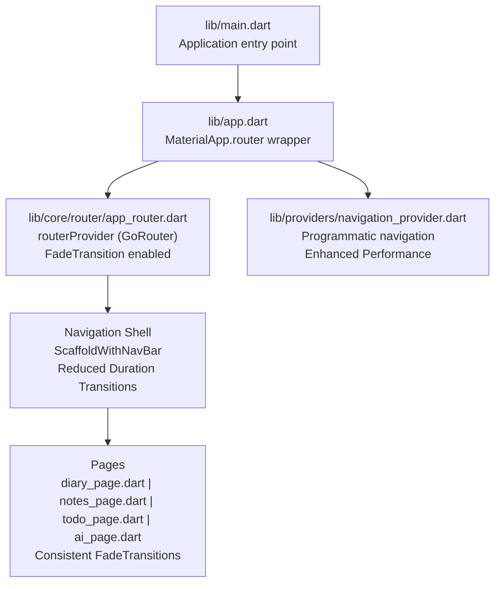
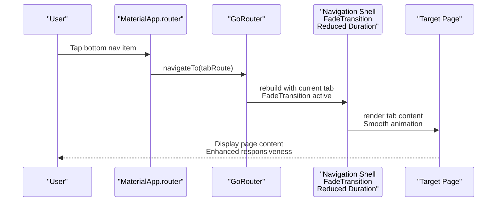
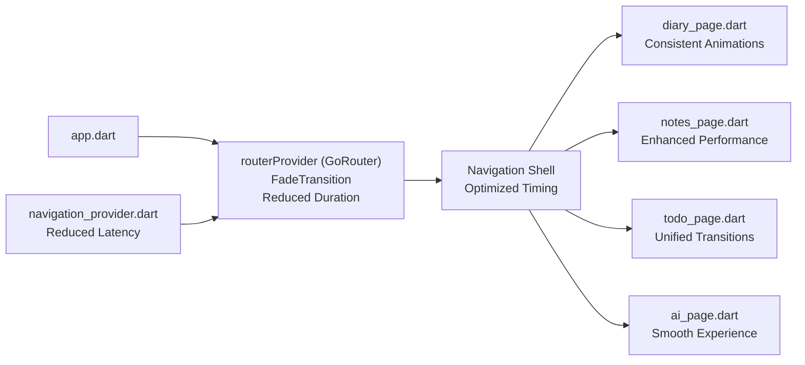

# Page Architecture and Navigation

<cite>
**Referenced Files in This Document**
- [app.dart](file://lib/app.dart)
- [main.dart](file://lib/main.dart)
- [app_router.dart](file://lib/core/router/app_router.dart)
- [diary_page.dart](file://lib/pages/diary_page.dart)
- [notes_page.dart](file://lib/pages/notes_page.dart)
- [todo_page.dart](file://lib/pages/todo_page.dart)
- [ai_page.dart](file://lib/pages/ai_page.dart)
- [navigation_provider.dart](file://lib/providers/navigation_provider.dart)
</cite>

## Update Summary
**Changes Made**
- Updated transition system documentation to reflect the overhaul from SharedAxisTransition to FadeTransition
- Modified performance considerations to address reduced transition duration
- Updated page transition examples and navigation consistency improvements
- Revised architectural diagrams to show the new transition mechanism

## Table of Contents
1. [Introduction](#introduction)
2. [Project Structure](#project-structure)
3. [Core Components](#core-components)
4. [Architecture Overview](#architecture-overview)
5. [Detailed Component Analysis](#detailed-component-analysis)
6. [Dependency Analysis](#dependency-analysis)
7. [Performance Considerations](#performance-considerations)
8. [Troubleshooting Guide](#troubleshooting-guide)
9. [Conclusion](#conclusion)

## Introduction
This document explains QNote Flutter's page architecture and navigation system built on GoRouter. It covers route definitions, navigation patterns, page organization, navigation state management, and practical guidance for extending the navigation structure. The focus areas include the diary, notes, todo, AI, and settings screens, along with programmatic navigation, deep linking, and route guards. The navigation system now features an improved transition mechanism using FadeTransition with reduced duration for enhanced navigation consistency.

## Project Structure
QNote organizes navigation under a dedicated router module and exposes pages via a shell-based bottom navigation pattern. The application bootstraps through the main entry point and delegates routing to a provider-managed GoRouter instance. The transition system has been optimized to use FadeTransition for smoother, faster page transitions across all routing pages.

**Diagram sources**
- [main.dart](file://lib/main.dart)
- [app.dart](file://lib/app.dart)
- [app_router.dart](file://lib/core/router/app_router.dart)
- [diary_page.dart](file://lib/pages/diary_page.dart)
- [notes_page.dart](file://lib/pages/notes_page.dart)
- [todo_page.dart](file://lib/pages/todo_page.dart)
- [ai_page.dart](file://lib/pages/ai_page.dart)
- [navigation_provider.dart](file://lib/providers/navigation_provider.dart)

**Section sources**
- [main.dart](file://lib/main.dart)
- [app.dart](file://lib/app.dart)
- [app_router.dart](file://lib/core/router/app_router.dart)

## Core Components
- GoRouter instance managed by a Riverpod provider for centralized navigation control with optimized FadeTransition animations.
- Navigation shell that hosts bottom navigation and page shells with reduced transition duration for improved responsiveness.
- Individual pages for diary, notes, todo, and AI, integrated into the shell with consistent fade animations.
- Programmatic navigation utilities via a dedicated provider with enhanced performance characteristics.

Key responsibilities:
- Define routes and navigation behavior with optimized transition animations.
- Manage navigation state and smooth page transitions using FadeTransition.
- Provide helpers for programmatic navigation with reduced latency.

**Section sources**
- [app_router.dart](file://lib/core/router/app_router.dart)
- [app.dart](file://lib/app.dart)
- [navigation_provider.dart](file://lib/providers/navigation_provider.dart)

## Architecture Overview
The navigation architecture follows a shell-and-tabs model with enhanced transition performance:
- A top-level navigation shell wraps the entire app UI with optimized animation timing.
- Bottom navigation controls which tab shell is visible with instant response transitions.
- Each tab corresponds to a page shell hosting a specific screen with consistent fade animations.
- GoRouter manages route parsing, transitions, and state restoration with reduced duration.

**Diagram sources**
- [app.dart](file://lib/app.dart)
- [app_router.dart](file://lib/core/router/app_router.dart)

## Detailed Component Analysis

### GoRouter Implementation and Route Definitions
The router is instantiated as a Riverpod provider and configured with a navigation shell featuring FadeTransition animations. The shell builds a scaffold with a bottom navigation bar and hosts page shells per tab. Routes are defined to target specific tabs and pages, enabling programmatic navigation and stateful transitions with optimized performance.

- Provider-based router creation ensures single-instance management and easy access across the app.
- Navigation shell integrates bottom navigation and page shells for tabbed navigation with reduced transition duration.
- Route definitions enable direct navigation to tabs and nested pages with consistent fade animations.

Practical usage patterns:
- Programmatic navigation via the router provider with enhanced performance.
- Back navigation using the router delegate with smooth transitions.
- Transition handling through the shell with optimized FadeTransition timing.

**Updated** The transition system now uses FadeTransition with reduced duration for improved navigation consistency and responsiveness across all routing pages.

**Section sources**
- [app_router.dart](file://lib/core/router/app_router.dart)
- [app.dart](file://lib/app.dart)

### Diary Screen
The diary screen is integrated into the navigation shell and supports programmatic navigation via the shared router provider. It participates in the tabbed interface and responds to navigation events with optimized fade transitions.

- Imports the GoRouter package for navigation support.
- Uses the shared router provider for navigation actions with enhanced performance.
- Benefits from reduced transition duration for instant page switching.

Navigation patterns:
- Accessible via bottom navigation with smooth fade animations.
- Supports push/pop navigation within the tab shell with consistent timing.
- Responsive to navigation events with optimized transition performance.

**Section sources**
- [diary_page.dart](file://lib/pages/diary_page.dart)
- [app_router.dart](file://lib/core/router/app_router.dart)

### Notes Screen
The notes screen is structured as a separate page within the app shell. It leverages the router provider for programmatic navigation and integrates with the bottom navigation flow using optimized fade transitions.

- Built as a standalone page within the shell with enhanced animation performance.
- Uses the router provider for navigation operations with reduced latency.
- Participates in the overall navigation consistency improvements.

**Section sources**
- [notes_page.dart](file://lib/pages/notes_page.dart)
- [app_router.dart](file://lib/core/router/app_router.dart)

### Todo Screen
The todo screen follows the same shell-based pattern, participating in bottom navigation and supporting programmatic navigation through the router provider with optimized transition performance.

- Integrated into the navigation shell with consistent fade animations.
- Navigable via bottom navigation and programmatic calls with reduced duration.
- Benefits from unified transition system across all pages.

**Section sources**
- [todo_page.dart](file://lib/pages/todo_page.dart)
- [app_router.dart](file://lib/core/router/app_router.dart)

### AI Screen
The AI screen is implemented as a page within the app shell and uses the navigation provider for programmatic navigation. It aligns with the shell-based navigation architecture and benefits from the improved transition system.

- Implemented as a page inside the shell with optimized fade transitions.
- Uses the navigation provider for navigation actions with enhanced performance.
- Consistent with the overall navigation consistency improvements.

**Section sources**
- [ai_page.dart](file://lib/pages/ai_page.dart)
- [navigation_provider.dart](file://lib/providers/navigation_provider.dart)

### Programmatic Navigation Utilities
A dedicated navigation provider centralizes navigation operations, enabling consistent navigation across the app with enhanced performance. It exposes methods to navigate to specific routes and manage back navigation using the optimized transition system.

- Provides programmatic navigation APIs with reduced latency.
- Integrates with the router provider for stateful navigation using FadeTransition.
- Benefits from unified transition timing across all navigation operations.

**Section sources**
- [navigation_provider.dart](file://lib/providers/navigation_provider.dart)
- [app.dart](file://lib/app.dart)

### Navigation State Management and Route Guards
- State management: The router provider holds the GoRouter instance with optimized transition configuration, ensuring consistent navigation state across the app.
- Route guards: Conditional navigation can be implemented by extending the GoRouter configuration with redirect handlers or custom middlewares in the future.
- Performance optimization: Transition system improvements provide better state management responsiveness.

Recommendations:
- Add guard logic in the GoRouter configuration for protected routes.
- Centralize route conditions in the router provider for maintainability.
- Leverage the improved transition system for enhanced user experience.

**Section sources**
- [app_router.dart](file://lib/core/router/app_router.dart)

### Page Transitions and Deep Linking
- Transitions: The shell-based architecture now uses FadeTransition with reduced duration for smooth, fast page switching across all routing pages.
- Deep linking: Configure GoRouter to parse external URIs and navigate to specific routes using the optimized transition system.
- Animation consistency: All deep linking operations benefit from the unified FadeTransition approach.

Implementation guidance:
- Define named routes for deep linking targets with consistent animation timing.
- Register a deep link handler in the GoRouter configuration using the enhanced transition system.
- Ensure all new routes inherit the optimized transition behavior.

**Updated** The transition system overhaul affects all routing pages with FadeTransition and reduced duration, improving navigation consistency and user experience.

**Section sources**
- [app_router.dart](file://lib/core/router/app_router.dart)

### Adding New Pages and Maintaining Consistency
Steps to add a new page:
1. Create the page file within the pages directory.
2. Register the page route in the GoRouter configuration with FadeTransition support.
3. Integrate the page into the appropriate tab shell or define a new tab if needed.
4. Use the router provider for programmatic navigation to the new page with optimized performance.
5. Ensure consistent navigation patterns and state management using the improved transition system.

Best practices:
- Keep route definitions centralized in the router provider with transition configuration.
- Use the navigation provider for programmatic navigation with reduced latency.
- Maintain consistent bottom navigation and shell integration with FadeTransition.
- Leverage the unified transition system for enhanced user experience.

**Updated** New pages automatically inherit the FadeTransition with reduced duration for consistent navigation behavior.

**Section sources**
- [app_router.dart](file://lib/core/router/app_router.dart)
- [navigation_provider.dart](file://lib/providers/navigation_provider.dart)

## Dependency Analysis
The navigation system exhibits low coupling and high cohesion with enhanced transition performance:
- The router provider encapsulates navigation logic with optimized transition configuration.
- Pages depend on the router provider for navigation operations with improved performance.
- The app delegates routing to the router provider with FadeTransition support.
- Transition system improvements benefit all components uniformly.

**Diagram sources**
- [app_router.dart](file://lib/core/router/app_router.dart)
- [app.dart](file://lib/app.dart)
- [diary_page.dart](file://lib/pages/diary_page.dart)
- [notes_page.dart](file://lib/pages/notes_page.dart)
- [todo_page.dart](file://lib/pages/todo_page.dart)
- [ai_page.dart](file://lib/pages/ai_page.dart)
- [navigation_provider.dart](file://lib/providers/navigation_provider.dart)

**Section sources**
- [app_router.dart](file://lib/core/router/app_router.dart)
- [app.dart](file://lib/app.dart)
- [navigation_provider.dart](file://lib/providers/navigation_provider.dart)

## Performance Considerations
- Prefer shallow navigation for tab switches to minimize rebuild overhead with optimized transition timing.
- Use the router provider to avoid recreating the GoRouter instance with enhanced performance characteristics.
- Defer heavy initialization in pages until after navigation to reduce perceived latency with FadeTransition benefits.
- Transition system improvements provide instant page switching with reduced duration for better user experience.
- FadeTransition animations offer smoother performance compared to previous SharedAxisTransition implementation.

**Updated** Performance improvements include reduced transition duration and enhanced animation smoothness across all routing pages.

## Troubleshooting Guide
Common issues and resolutions:
- Navigation not working: Verify the router provider is initialized and passed to the MaterialApp.router configuration with proper transition setup.
- Tab switching anomalies: Ensure the navigation shell is correctly configured with FadeTransition and each tab has a distinct route.
- Programmatic navigation failures: Confirm the navigation provider is accessing the router provider correctly and routes are registered with optimized transition timing.
- Transition performance issues: Check that FadeTransition is properly configured and transition duration is set appropriately.
- Animation inconsistencies: Verify all pages use the unified transition system for consistent user experience.

**Updated** Troubleshooting now includes transition system validation and FadeTransition configuration verification.

**Section sources**
- [app.dart](file://lib/app.dart)
- [app_router.dart](file://lib/core/router/app_router.dart)
- [navigation_provider.dart](file://lib/providers/navigation_provider.dart)

## Conclusion
QNote Flutter employs a robust, provider-backed GoRouter configuration with a navigation shell and bottom navigation featuring an optimized transition system. The architecture cleanly separates routing concerns, supports programmatic navigation with enhanced performance, and provides a foundation for adding new pages and implementing advanced navigation features like route guards and deep linking. The transition system overhaul to FadeTransition with reduced duration significantly improves navigation consistency and user experience across all routing pages. Following the outlined patterns ensures consistency and maintainability as the application evolves with the improved transition system.