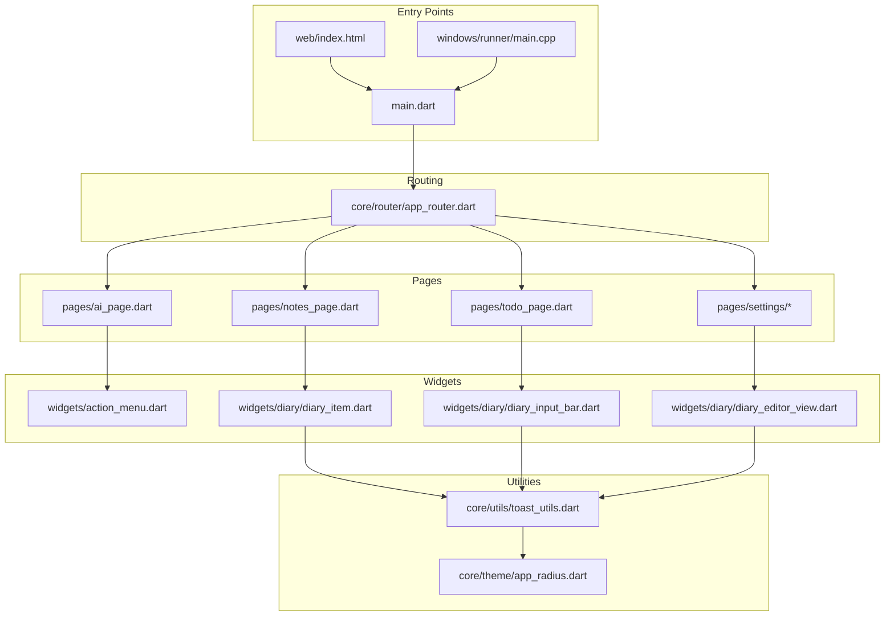
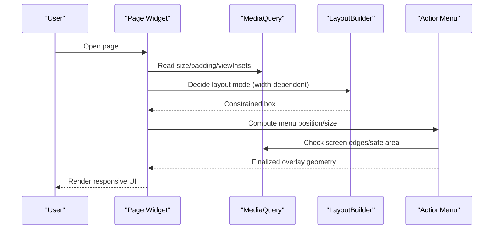
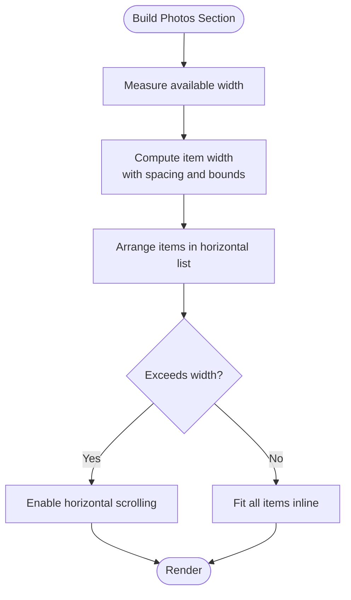
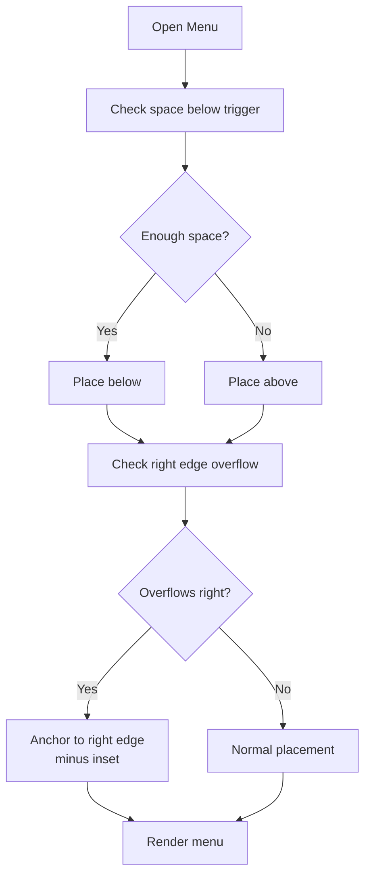
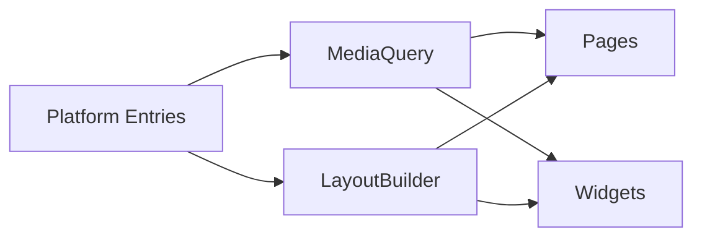

# Responsive Design and Layout

<cite>
**Referenced Files in This Document**
- [app.dart](file://lib/app.dart)
- [main.dart](file://lib/main.dart)
- [app_router.dart](file://lib/core/router/app_router.dart)
- [toast_utils.dart](file://lib/core/utils/toast_utils.dart)
- [action_menu.dart](file://lib/widgets/action_menu.dart)
- [diary_item.dart](file://lib/widgets/diary/diary_item.dart)
- [diary_input_bar.dart](file://lib/widgets/diary/diary_input_bar.dart)
- [diary_editor_view.dart](file://lib/widgets/diary/diary_editor_view.dart)
- [ai_page.dart](file://lib/pages/ai_page.dart)
- [notes_page.dart](file://lib/pages/notes_page.dart)
- [todo_page.dart](file://lib/pages/todo_page.dart)
- [ai_config_page.dart](file://lib/pages/settings/ai_config_page.dart)
- [shortcuts_page.dart](file://lib/pages/settings/shortcuts_page.dart)
- [user_profile_page.dart](file://lib/pages/settings/user_profile_page.dart)
- [fixed_events_page.dart](file://lib/pages/settings/fixed_events_page.dart)
- [diary_batch_manage_view.dart](file://lib/widgets/diary/diary_batch_manage_view.dart)
- [diary_input_bar.dart (shared)](file://lib/widgets/diary/diary_input_bar.dart)
- [app_radius.dart](file://lib/core/theme/app_radius.dart)
- [index.html](file://web/index.html)
- [manifest.json](file://web/manifest.json)
- [CMakeLists.txt](file://windows/runner/CMakeLists.txt)
- [main.cpp](file://windows/runner/main.cpp)
</cite>

## Table of Contents
1. [Introduction](#introduction)
2. [Project Structure](#project-structure)
3. [Core Components](#core-components)
4. [Architecture Overview](#architecture-overview)
5. [Detailed Component Analysis](#detailed-component-analysis)
6. [Dependency Analysis](#dependency-analysis)
7. [Performance Considerations](#performance-considerations)
8. [Troubleshooting Guide](#troubleshooting-guide)
9. [Conclusion](#conclusion)
10. [Appendices](#appendices)

## Introduction
This document explains how QNote Flutter adapts its user interface across devices and screen configurations. It covers responsive sizing, adaptive layouts, breakpoint-like patterns, and platform-specific optimizations for mobile, tablet, desktop, and web targets. The focus is on practical patterns used in the codebase, including dynamic sizing via MediaQuery, flexible grids, and LayoutBuilder-driven layouts.

## Project Structure
QNote Flutter organizes responsive logic primarily within:
- Pages: Application screens that apply responsive sizing and layout constraints.
- Widgets: Reusable components that adapt to available space using LayoutBuilder and MediaQuery.
- Core utilities: Helpers that compute responsive paddings, widths, and heights.
- Platform entry points: Web and Windows entries define viewport and window behavior.

**Diagram sources**
- [main.dart](file://lib/main.dart)
- [app_router.dart](file://lib/core/router/app_router.dart)
- [ai_page.dart](file://lib/pages/ai_page.dart)
- [notes_page.dart](file://lib/pages/notes_page.dart)
- [todo_page.dart](file://lib/pages/todo_page.dart)
- [ai_config_page.dart](file://lib/pages/settings/ai_config_page.dart)
- [shortcuts_page.dart](file://lib/pages/settings/shortcuts_page.dart)
- [user_profile_page.dart](file://lib/pages/settings/user_profile_page.dart)
- [fixed_events_page.dart](file://lib/pages/settings/fixed_events_page.dart)
- [action_menu.dart](file://lib/widgets/action_menu.dart)
- [diary_item.dart](file://lib/widgets/diary/diary_item.dart)
- [diary_input_bar.dart](file://lib/widgets/diary/diary_input_bar.dart)
- [diary_editor_view.dart](file://lib/widgets/diary/diary_editor_view.dart)
- [toast_utils.dart](file://lib/core/utils/toast_utils.dart)
- [app_radius.dart](file://lib/core/theme/app_radius.dart)
- [index.html](file://web/index.html)
- [main.cpp](file://windows/runner/main.cpp)

**Section sources**
- [main.dart](file://lib/main.dart)
- [app_router.dart](file://lib/core/router/app_router.dart)

## Core Components
- Responsive sizing via MediaQuery: Many pages and widgets compute widths and heights relative to the current screen size.
- Flexible grids and wrapping: Components use Wrap and horizontal ListView to adapt content density.
- Adaptive dialogs and overlays: Dialogs and menus adjust position and size based on available space and keyboard insets.
- LayoutBuilder-driven layouts: Some pages switch between column/row arrangements depending on available width.
- Platform entry points: Web and Windows configure viewport/window behavior to support responsive layouts.

Key implementation patterns:
- Dynamic width constraints using MediaQuery.size.width.
- Dynamic max-height constraints using MediaQuery.size.height.
- Safe area-aware positioning using MediaQuery.padding and MediaQuery.viewInsets.
- Grid-like arrangements using Wrap with clamped item sizes.

**Section sources**
- [toast_utils.dart](file://lib/core/utils/toast_utils.dart)
- [action_menu.dart](file://lib/widgets/action_menu.dart)
- [diary_item.dart](file://lib/widgets/diary/diary_item.dart)
- [diary_input_bar.dart](file://lib/widgets/diary/diary_input_bar.dart)
- [diary_editor_view.dart](file://lib/widgets/diary/diary_editor_view.dart)
- [ai_page.dart](file://lib/pages/ai_page.dart)
- [notes_page.dart](file://lib/pages/notes_page.dart)
- [todo_page.dart](file://lib/pages/todo_page.dart)
- [ai_config_page.dart](file://lib/pages/settings/ai_config_page.dart)
- [shortcuts_page.dart](file://lib/pages/settings/shortcuts_page.dart)
- [user_profile_page.dart](file://lib/pages/settings/user_profile_page.dart)
- [fixed_events_page.dart](file://lib/pages/settings/fixed_events_page.dart)
- [diary_batch_manage_view.dart](file://lib/widgets/diary/diary_batch_manage_view.dart)

## Architecture Overview
The responsive architecture centers on three pillars:
- Measurement: MediaQuery provides current screen metrics and safe areas.
- Adaptation: LayoutBuilder and conditional widgets switch arrangement and density.
- Constraints: Fixed and proportional sizing combine to keep content readable and usable.

**Diagram sources**
- [action_menu.dart](file://lib/widgets/action_menu.dart)
- [toast_utils.dart](file://lib/core/utils/toast_utils.dart)

## Detailed Component Analysis

### Responsive Sizing with MediaQuery
- Pages and dialogs compute widths as a fraction of the screen width to maintain readability and avoid overflow.
- Max-height constraints are derived from screen height to fit within visible viewport.
- Safe-area-aware positioning accounts for notches, soft home indicators, and keyboard appearance.

Examples of usage:
- Dialog widths: [ai_page.dart](file://lib/pages/ai_page.dart), [ai_config_page.dart](file://lib/pages/settings/ai_config_page.dart), [todo_page.dart](file://lib/pages/todo_page.dart), [diary_batch_manage_view.dart](file://lib/widgets/diary/diary_batch_manage_view.dart)
- Content widths: [notes_page.dart](file://lib/pages/notes_page.dart)
- Keyboard-aware bottom offsets: [ai_config_page.dart](file://lib/pages/settings/ai_config_page.dart)
- Toast sizing and padding: [toast_utils.dart](file://lib/core/utils/toast_utils.dart)

**Section sources**
- [ai_page.dart](file://lib/pages/ai_page.dart)
- [ai_config_page.dart](file://lib/pages/settings/ai_config_page.dart)
- [todo_page.dart](file://lib/pages/todo_page.dart)
- [diary_batch_manage_view.dart](file://lib/widgets/diary/diary_batch_manage_view.dart)
- [notes_page.dart](file://lib/pages/notes_page.dart)
- [toast_utils.dart](file://lib/core/utils/toast_utils.dart)

### Adaptive Grids and Wrapping
- Photo galleries and image strips use horizontal scrolling lists with fixed item sizes and spacing.
- Grid items are sized proportionally but clamped to reasonable min/max bounds to prevent excessive scaling on very wide screens.
- Wrap widgets arrange content with configurable spacing, adapting to available width.

Examples:
- Horizontal photo strip with clamped item size: [diary_item.dart](file://lib/widgets/diary/diary_item.dart)
- Horizontal photo strip with fixed item dimensions: [diary_input_bar.dart](file://lib/widgets/diary/diary_input_bar.dart)
- Horizontal gallery with add buttons: [diary_editor_view.dart](file://lib/widgets/diary/diary_editor_view.dart)

**Diagram sources**
- [diary_item.dart](file://lib/widgets/diary/diary_item.dart)
- [diary_input_bar.dart](file://lib/widgets/diary/diary_input_bar.dart)
- [diary_editor_view.dart](file://lib/widgets/diary/diary_editor_view.dart)

**Section sources**
- [diary_item.dart](file://lib/widgets/diary/diary_item.dart)
- [diary_input_bar.dart](file://lib/widgets/diary/diary_input_bar.dart)
- [diary_editor_view.dart](file://lib/widgets/diary/diary_editor_view.dart)

### Adaptive Menus and Overlays
- Action menus compute whether to render above or below the trigger based on available vertical space.
- Right-edge overflow is handled by anchoring to the right margin minus a small inset.
- Bottom overlays adjust for keyboard visibility using viewInsets.

Example:
- Menu placement and overflow handling: [action_menu.dart](file://lib/widgets/action_menu.dart)
- Keyboard-aware bottom insets: [ai_config_page.dart](file://lib/pages/settings/ai_config_page.dart)

**Diagram sources**
- [action_menu.dart](file://lib/widgets/action_menu.dart)

**Section sources**
- [action_menu.dart](file://lib/widgets/action_menu.dart)
- [ai_config_page.dart](file://lib/pages/settings/ai_config_page.dart)

### LayoutBuilder-Based Responsive Layouts
- Some pages use LayoutBuilder to choose between single-column and multi-column arrangements based on available width.
- This pattern enables compact mobile layouts and expanded desktop/tablet experiences.

Example:
- Width-dependent layout switching: [user_profile_page.dart](file://lib/pages/settings/user_profile_page.dart)

**Section sources**
- [user_profile_page.dart](file://lib/pages/settings/user_profile_page.dart)

### Platform-Specific Optimizations
- Web: The HTML entry defines viewport settings suitable for responsive layouts.
- Windows: The runner configures window sizing and fullscreen behavior appropriate for desktop.

References:
- Web viewport and manifest: [index.html](file://web/index.html), [manifest.json](file://web/manifest.json)
- Windows runner: [main.cpp](file://windows/runner/main.cpp), [CMakeLists.txt](file://windows/runner/CMakeLists.txt)

**Section sources**
- [index.html](file://web/index.html)
- [manifest.json](file://web/manifest.json)
- [main.cpp](file://windows/runner/main.cpp)
- [CMakeLists.txt](file://windows/runner/CMakeLists.txt)

## Dependency Analysis
Responsive behavior depends on:
- MediaQuery for absolute measurements and safe-area insets.
- LayoutBuilder for relative width/height decisions.
- Platform entry points for viewport/window configuration.

[No sources needed since this diagram shows conceptual relationships]

## Performance Considerations
- Prefer proportional sizing with clamps to avoid expensive recomputations on every frame.
- Use horizontal scrolling lists for dense content to limit repeated reflows.
- Minimize nested LayoutBuilder to reduce rebuild scope.
- Avoid hard-coded pixel sizes; favor theme-driven spacing constants.
- Keep dialog sizes proportional to screen size to reduce layout thrash during orientation changes.

[No sources needed since this section provides general guidance]

## Troubleshooting Guide
Common issues and remedies:
- Content cutoff near the keyboard: Ensure bottom insets are considered when positioning overlays. See [ai_config_page.dart](file://lib/pages/settings/ai_config_page.dart).
- Menu renders off-screen on the right: Adjust anchor logic to respect screen width minus a small inset. See [action_menu.dart](file://lib/widgets/action_menu.dart).
- Excessively large or small grid items: Clamp computed item sizes to a reasonable range. See [diary_item.dart](file://lib/widgets/diary/diary_item.dart).
- Toasts too wide on large screens: Limit max-width to a percentage of screen width. See [toast_utils.dart](file://lib/core/utils/toast_utils.dart).

**Section sources**
- [ai_config_page.dart](file://lib/pages/settings/ai_config_page.dart)
- [action_menu.dart](file://lib/widgets/action_menu.dart)
- [diary_item.dart](file://lib/widgets/diary/diary_item.dart)
- [toast_utils.dart](file://lib/core/utils/toast_utils.dart)

## Conclusion
QNote Flutter’s responsive design relies on a combination of proportional sizing, adaptive grids, and platform-aware positioning. By leveraging MediaQuery and LayoutBuilder, the app maintains usability across phones, tablets, and desktops while keeping performance predictable. Following the patterns documented here ensures consistent, accessible layouts across all supported platforms.

## Appendices

### Guidelines for Implementing Responsive Features
- Use proportional widths (percentages of screen width) for dialogs and content containers.
- Clamp item sizes in grids to prevent extreme scaling on ultra-wide displays.
- Account for safe areas and keyboard insets when placing overlays.
- Employ LayoutBuilder to switch between single-column and multi-column layouts at specific breakpoints.
- Favor theme-driven spacing constants for consistent margins and radii.

[No sources needed since this section provides general guidance]

### Testing Layout Adaptability
- Test on multiple screen sizes and densities.
- Rotate between portrait and landscape to verify orientation handling.
- Simulate keyboard appearance/disappearance to validate bottom insets.
- Verify that horizontal scrolling galleries remain usable and performant.
- Confirm that dialogs and overlays do not overflow or underflow the viewport.

[No sources needed since this section provides general guidance]