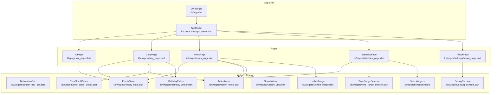
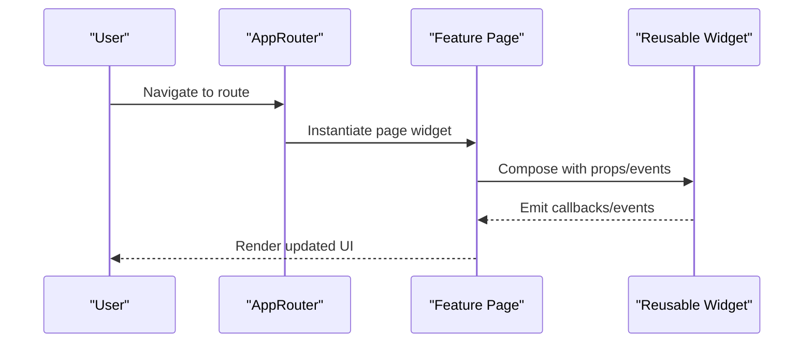
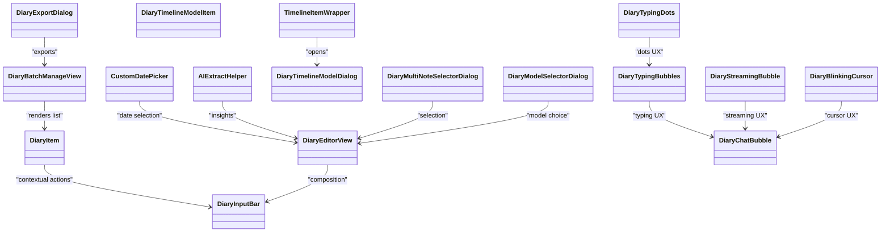
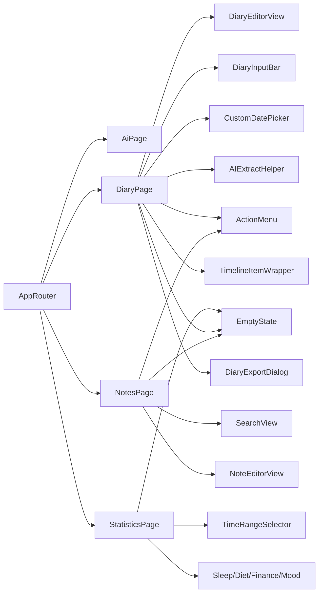

# Reusable UI Components

<cite>
**Referenced Files in This Document**
- [app.dart](file://lib/app.dart)
- [app_router.dart](file://lib/core/router/app_router.dart)
- [toast_utils.dart](file://lib/core/utils/toast_utils.dart)
- [widget_utils.dart](file://lib/core/utils/widget_utils.dart)
- [ai_page.dart](file://lib/pages/ai_page.dart)
- [diary_page.dart](file://lib/pages/diary_page.dart)
- [notes_page.dart](file://lib/pages/notes_page.dart)
- [about_page.dart](file://lib/pages/settings/about_page.dart)
- [fixed_events_page.dart](file://lib/pages/settings/fixed_events_page.dart)
- [user_profile_page.dart](file://lib/pages/settings/user_profile_page.dart)
- [statistics_page.dart](file://lib/pages/statistics_page.dart)
- [bottom_nav_bar.dart](file://lib/widgets/bottom_nav_bar.dart)
- [empty_state.dart](file://lib/widgets/empty_state.dart)
- [search_view.dart](file://lib/widgets/search_view.dart)
- [action_menu.dart](file://lib/widgets/action_menu.dart)
- [unified_image.dart](file://lib/widgets/unified_image.dart)
- [time_scroll_picker.dart](file://lib/widgets/time_scroll_picker.dart)
- [birthday_picker.dart](file://lib/widgets/birthday_picker.dart)
- [debug_console.dart](file://lib/widgets/debug_console.dart)
- [time_range_selector.dart](file://lib/widgets/time_range_selector.dart)
- [sleep_stats.dart](file://lib/widgets/statistics/sleep_stats.dart)
- [diet_stats.dart](file://lib/widgets/statistics/diet_stats.dart)
- [finance_stats.dart](file://lib/widgets/statistics/finance_stats.dart)
- [mood_stats.dart](file://lib/widgets/statistics/mood_stats.dart)
- [diary_editor_view.dart](file://lib/widgets/diary/diary_editor_view.dart)
- [diary_batch_manage_view.dart](file://lib/widgets/diary/diary_batch_manage_view.dart)
- [note_editor_view.dart](file://lib/widgets/notes/note_editor_view.dart)
- [diary_item.dart](file://lib/widgets/diary/diary_item.dart)
- [diary_input_bar.dart](file://lib/widgets/diary/diary_input_bar.dart)
- [custom_date_picker.dart](file://lib/widgets/diary/custom_date_picker.dart)
- [ai_extract_helper.dart](file://lib/widgets/diary/ai_extract_helper.dart)
- [diary_timeline_model_dialog.dart](file://lib/widgets/diary/diary_timeline_model_dialog.dart)
- [diary_timeline_model_item.dart](file://lib/widgets/diary/diary_timeline_model_item.dart)
- [timeline_item_wrapper.dart](file://lib/widgets/diary/timeline_item_wrapper.dart)
- [diary_multi_note_selector_dialog.dart](file://lib/widgets/diary/diary_multi_note_selector_dialog.dart)
- [diary_model_selector_dialog.dart](file://lib/widgets/diary/diary_model_selector_dialog.dart)
- [diary_export_dialog.dart](file://lib/widgets/diary/diary_export_dialog.dart)
- [diary_typing_bubbles.dart](file://lib/widgets/diary/diary_typing_bubbles.dart)
- [diary_chat_bubble.dart](file://lib/widgets/diary/diary_chat_bubble.dart)
- [diary_streaming_bubble.dart](file://lib/widgets/diary/diary_streaming_bubble.dart)
- [diary_blinking_cursor.dart](file://lib/widgets/diary/diary_blinking_cursor.dart)
- [diary_typing_dots.dart](file://lib/widgets/diary/diary_typing_dots.dart)
</cite>

## Table of Contents
1. [Introduction](#introduction)
2. [Project Structure](#project-structure)
3. [Core Components](#core-components)
4. [Architecture Overview](#architecture-overview)
5. [Detailed Component Analysis](#detailed-component-analysis)
6. [Dependency Analysis](#dependency-analysis)
7. [Performance Considerations](#performance-considerations)
8. [Accessibility and Responsive Design](#accessibility-and-responsive-design)
9. [Cross-Platform Compatibility](#cross-platform-compatibility)
10. [Extending and Creating New Components](#extending-and-creating-new-components)
11. [Styling Consistency and Theme Integration](#styling-consistency-and-theme-integration)
12. [Animation Patterns](#animation-patterns)
13. [User Interaction Handling](#user-interaction-handling)
14. [Troubleshooting Guide](#troubleshooting-guide)
15. [Conclusion](#conclusion)

## Introduction
This document describes QNote Flutter's reusable UI components and custom widgets. It covers button-like controls, inputs, cards, dialogs, and form components used across the application. It explains component props, events, customization options, theme integration, composition patterns, accessibility, responsiveness, cross-platform compatibility, and guidelines for extending and creating new widgets. The focus is on practical guidance derived from the actual codebase.

## Project Structure
The UI components are organized under the lib/widgets directory and integrated via page-level widgets and the router. Key areas include:
- Navigation and global layouts
- Feature-specific views (diary, notes, statistics)
- Utility and reusable widgets (inputs, pickers, dialogs, empty states)
- Statistics and charts
- AI chat and streaming UI

**Diagram sources**
- [app.dart](file://lib/app.dart)
- [app_router.dart](file://lib/core/router/app_router.dart)
- [ai_page.dart](file://lib/pages/ai_page.dart)
- [diary_page.dart](file://lib/pages/diary_page.dart)
- [notes_page.dart](file://lib/pages/notes_page.dart)
- [statistics_page.dart](file://lib/pages/statistics_page.dart)
- [about_page.dart](file://lib/pages/settings/about_page.dart)
- [bottom_nav_bar.dart](file://lib/widgets/bottom_nav_bar.dart)
- [empty_state.dart](file://lib/widgets/empty_state.dart)
- [search_view.dart](file://lib/widgets/search_view.dart)
- [action_menu.dart](file://lib/widgets/action_menu.dart)
- [unified_image.dart](file://lib/widgets/unified_image.dart)
- [time_scroll_picker.dart](file://lib/widgets/time_scroll_picker.dart)
- [birthday_picker.dart](file://lib/widgets/birthday_picker.dart)
- [debug_console.dart](file://lib/widgets/debug_console.dart)
- [time_range_selector.dart](file://lib/widgets/time_range_selector.dart)
- [sleep_stats.dart](file://lib/widgets/statistics/sleep_stats.dart)
- [diet_stats.dart](file://lib/widgets/statistics/diet_stats.dart)
- [finance_stats.dart](file://lib/widgets/statistics/finance_stats.dart)
- [mood_stats.dart](file://lib/widgets/statistics/mood_stats.dart)

**Section sources**
- [app.dart](file://lib/app.dart)
- [app_router.dart](file://lib/core/router/app_router.dart)

## Core Components
This section catalogs reusable UI components and their primary roles:

- EmptyState: Presents friendly messaging for empty lists or states.
- SearchView: Provides search input with optional actions.
- ActionMenu: Offers contextual actions for items.
- UnifiedImage: Cross-platform image loading and caching abstraction.
- TimeScrollPicker: Scroll-driven time selection.
- BirthdayPicker: Date-of-birth selection with validation.
- DebugConsole: Developer console for diagnostics.
- TimeRangeSelector: Date range selection for analytics.
- Stats widgets: Sleep, diet, finance, mood visualizations.
- BottomNavBar: Application navigation rail.
- Diary widgets: Editor, batch manage, item, input bar, date picker, AI extract helper, timeline dialogs/items, multi-note selector, model selector, export dialog, typing bubbles, chat bubbles, streaming bubble, blinking cursor, typing dots.

These components are imported and composed by page widgets to deliver feature-specific experiences.

**Section sources**
- [empty_state.dart](file://lib/widgets/empty_state.dart)
- [search_view.dart](file://lib/widgets/search_view.dart)
- [action_menu.dart](file://lib/widgets/action_menu.dart)
- [unified_image.dart](file://lib/widgets/unified_image.dart)
- [time_scroll_picker.dart](file://lib/widgets/time_scroll_picker.dart)
- [birthday_picker.dart](file://lib/widgets/birthday_picker.dart)
- [debug_console.dart](file://lib/widgets/debug_console.dart)
- [time_range_selector.dart](file://lib/widgets/time_range_selector.dart)
- [sleep_stats.dart](file://lib/widgets/statistics/sleep_stats.dart)
- [diet_stats.dart](file://lib/widgets/statistics/diet_stats.dart)
- [finance_stats.dart](file://lib/widgets/statistics/finance_stats.dart)
- [mood_stats.dart](file://lib/widgets/statistics/mood_stats.dart)
- [bottom_nav_bar.dart](file://lib/widgets/bottom_nav_bar.dart)
- [diary_editor_view.dart](file://lib/widgets/diary/diary_editor_view.dart)
- [diary_batch_manage_view.dart](file://lib/widgets/diary/diary_batch_manage_view.dart)
- [diary_item.dart](file://lib/widgets/diary/diary_item.dart)
- [diary_input_bar.dart](file://lib/widgets/diary/diary_input_bar.dart)
- [custom_date_picker.dart](file://lib/widgets/diary/custom_date_picker.dart)
- [ai_extract_helper.dart](file://lib/widgets/diary/ai_extract_helper.dart)
- [diary_timeline_model_dialog.dart](file://lib/widgets/diary/diary_timeline_model_dialog.dart)
- [diary_timeline_model_item.dart](file://lib/widgets/diary/diary_timeline_model_item.dart)
- [timeline_item_wrapper.dart](file://lib/widgets/diary/timeline_item_wrapper.dart)
- [diary_multi_note_selector_dialog.dart](file://lib/widgets/diary/diary_multi_note_selector_dialog.dart)
- [diary_model_selector_dialog.dart](file://lib/widgets/diary/diary_model_selector_dialog.dart)
- [diary_export_dialog.dart](file://lib/widgets/diary/diary_export_dialog.dart)
- [diary_typing_bubbles.dart](file://lib/widgets/diary/diary_typing_bubbles.dart)
- [diary_chat_bubble.dart](file://lib/widgets/diary/diary_chat_bubble.dart)
- [diary_streaming_bubble.dart](file://lib/widgets/diary/diary_streaming_bubble.dart)
- [diary_blinking_cursor.dart](file://lib/widgets/diary/diary_blinking_cursor.dart)
- [diary_typing_dots.dart](file://lib/widgets/diary/diary_typing_dots.dart)

## Architecture Overview
The UI architecture follows a layered pattern:
- App shell initializes the app and routing.
- Router maps routes to page widgets.
- Page widgets import and compose reusable widgets.
- Widgets encapsulate presentation and behavior, exposing props and callbacks.

**Diagram sources**
- [app_router.dart](file://lib/core/router/app_router.dart)
- [ai_page.dart](file://lib/pages/ai_page.dart)
- [diary_page.dart](file://lib/pages/diary_page.dart)
- [notes_page.dart](file://lib/pages/notes_page.dart)

## Detailed Component Analysis

### EmptyState
- Purpose: Friendly empty state presentation for lists and feature areas.
- Props: Title, subtitle, illustration, action button.
- Events: On-action callback.
- Composition: Used across Notes, Diary, and Statistics pages.

**Section sources**
- [empty_state.dart](file://lib/widgets/empty_state.dart)
- [notes_page.dart](file://lib/pages/notes_page.dart)
- [diary_page.dart](file://lib/pages/diary_page.dart)
- [statistics_page.dart](file://lib/pages/statistics_page.dart)

### SearchView
- Purpose: Search input with optional actions and clear button.
- Props: Initial value, placeholder, on-change handler, on-submit handler.
- Events: Text change, submit, clear.
- Composition: Integrated into Notes page toolbar.

**Section sources**
- [search_view.dart](file://lib/widgets/search_view.dart)
- [notes_page.dart](file://lib/pages/notes_page.dart)

### ActionMenu
- Purpose: Contextual actions for list items.
- Props: Menu items, alignment, positioning.
- Events: Item selected callback.
- Composition: Used in Notes and Diary item lists.

**Section sources**
- [action_menu.dart](file://lib/widgets/action_menu.dart)
- [notes_page.dart](file://lib/pages/notes_page.dart)
- [diary_page.dart](file://lib/pages/diary_page.dart)

### UnifiedImage
- Purpose: Cross-platform image loading with caching and fallbacks.
- Props: Image source, placeholder, error widget, fit, width/height.
- Behavior: Handles network and local assets consistently.

**Section sources**
- [unified_image.dart](file://lib/widgets/unified_image.dart)
- [notes_page.dart](file://lib/pages/notes_page.dart)

### TimeScrollPicker
- Purpose: Scroll-driven time selection (hours/minutes).
- Props: Initial time, on-change callback, interval.
- Events: Time changed.
- Composition: Used in fixed events configuration.

**Section sources**
- [time_scroll_picker.dart](file://lib/widgets/time_scroll_picker.dart)
- [fixed_events_page.dart](file://lib/pages/settings/fixed_events_page.dart)

### BirthdayPicker
- Purpose: Date-of-birth selection with validation.
- Props: Initial date, min/max dates, on-change callback.
- Events: Date selected.
- Composition: Used in user profile settings.

**Section sources**
- [birthday_picker.dart](file://lib/widgets/birthday_picker.dart)
- [user_profile_page.dart](file://lib/pages/settings/user_profile_page.dart)

### DebugConsole
- Purpose: Developer diagnostics panel.
- Props: Log entries, clear action, copy-to-clipboard.
- Events: Clear logs, copy log.
- Composition: Used in About page.

**Section sources**
- [debug_console.dart](file://lib/widgets/debug_console.dart)
- [about_page.dart](file://lib/pages/settings/about_page.dart)

### TimeRangeSelector
- Purpose: Select date range for analytics.
- Props: Start/end defaults, min/max dates, on-change callback.
- Events: Range updated.
- Composition: Used in Statistics page.

**Section sources**
- [time_range_selector.dart](file://lib/widgets/time_range_selector.dart)
- [statistics_page.dart](file://lib/pages/statistics_page.dart)

### Statistics Widgets (Sleep/Diet/Finance/Mood)
- Purpose: Visual summaries for health and finance metrics.
- Props: Data series, chart type, theme colors, labels.
- Events: Selection, tooltip, tap.
- Composition: Rendered in Statistics page.

**Section sources**
- [sleep_stats.dart](file://lib/widgets/statistics/sleep_stats.dart)
- [diet_stats.dart](file://lib/widgets/statistics/diet_stats.dart)
- [finance_stats.dart](file://lib/widgets/statistics/finance_stats.dart)
- [mood_stats.dart](file://lib/widgets/statistics/mood_stats.dart)
- [statistics_page.dart](file://lib/pages/statistics_page.dart)

### BottomNavBar
- Purpose: Primary navigation across main sections.
- Props: Items, current index, on-tap callback.
- Events: Tab switch.
- Composition: Wrapped by app shell.

**Section sources**
- [bottom_nav_bar.dart](file://lib/widgets/bottom_nav_bar.dart)
- [app.dart](file://lib/app.dart)

### Diary Widgets
- DiaryEditorView: Rich editor for diary entries.
- DiaryBatchManageView: Batch operations for entries.
- DiaryItem: Individual entry card with actions.
- DiaryInputBar: Input area with attachment and send actions.
- CustomDatePicker: Date selection for diary.
- AIExtractHelper: Extract insights from text.
- Timeline dialogs/items: Model-driven timeline UI.
- Multi-note selector dialog, model selector dialog, export dialog.
- Typing bubbles, chat bubbles, streaming bubble, blinking cursor, typing dots.

**Diagram sources**
- [diary_editor_view.dart](file://lib/widgets/diary/diary_editor_view.dart)
- [diary_batch_manage_view.dart](file://lib/widgets/diary/diary_batch_manage_view.dart)
- [diary_item.dart](file://lib/widgets/diary/diary_item.dart)
- [diary_input_bar.dart](file://lib/widgets/diary/diary_input_bar.dart)
- [custom_date_picker.dart](file://lib/widgets/diary/custom_date_picker.dart)
- [ai_extract_helper.dart](file://lib/widgets/diary/ai_extract_helper.dart)
- [timeline_item_wrapper.dart](file://lib/widgets/diary/timeline_item_wrapper.dart)
- [diary_timeline_model_dialog.dart](file://lib/widgets/diary/diary_timeline_model_dialog.dart)
- [diary_timeline_model_item.dart](file://lib/widgets/diary/diary_timeline_model_item.dart)
- [diary_multi_note_selector_dialog.dart](file://lib/widgets/diary/diary_multi_note_selector_dialog.dart)
- [diary_model_selector_dialog.dart](file://lib/widgets/diary/diary_model_selector_dialog.dart)
- [diary_export_dialog.dart](file://lib/widgets/diary/diary_export_dialog.dart)
- [diary_typing_bubbles.dart](file://lib/widgets/diary/diary_typing_bubbles.dart)
- [diary_chat_bubble.dart](file://lib/widgets/diary/diary_chat_bubble.dart)
- [diary_streaming_bubble.dart](file://lib/widgets/diary/diary_streaming_bubble.dart)
- [diary_blinking_cursor.dart](file://lib/widgets/diary/diary_blinking_cursor.dart)
- [diary_typing_dots.dart](file://lib/widgets/diary/diary_typing_dots.dart)

**Section sources**
- [diary_page.dart](file://lib/pages/diary_page.dart)
- [diary_editor_view.dart](file://lib/widgets/diary/diary_editor_view.dart)
- [diary_batch_manage_view.dart](file://lib/widgets/diary/diary_batch_manage_view.dart)
- [diary_item.dart](file://lib/widgets/diary/diary_item.dart)
- [diary_input_bar.dart](file://lib/widgets/diary/diary_input_bar.dart)
- [custom_date_picker.dart](file://lib/widgets/diary/custom_date_picker.dart)
- [ai_extract_helper.dart](file://lib/widgets/diary/ai_extract_helper.dart)
- [diary_timeline_model_dialog.dart](file://lib/widgets/diary/diary_timeline_model_dialog.dart)
- [diary_timeline_model_item.dart](file://lib/widgets/diary/diary_timeline_model_item.dart)
- [timeline_item_wrapper.dart](file://lib/widgets/diary/timeline_item_wrapper.dart)
- [diary_multi_note_selector_dialog.dart](file://lib/widgets/diary/diary_multi_note_selector_dialog.dart)
- [diary_model_selector_dialog.dart](file://lib/widgets/diary/diary_model_selector_dialog.dart)
- [diary_export_dialog.dart](file://lib/widgets/diary/diary_export_dialog.dart)
- [diary_typing_bubbles.dart](file://lib/widgets/diary/diary_typing_bubbles.dart)
- [diary_chat_bubble.dart](file://lib/widgets/diary/diary_chat_bubble.dart)
- [diary_streaming_bubble.dart](file://lib/widgets/diary/diary_streaming_bubble.dart)
- [diary_blinking_cursor.dart](file://lib/widgets/diary/diary_blinking_cursor.dart)
- [diary_typing_dots.dart](file://lib/widgets/diary/diary_typing_dots.dart)

### Notes Widgets
- NoteEditorView: Editor for note content.
- EmptyState: Fallback for empty notes.
- SearchView: Filter notes.
- ActionMenu: Actions per note.

**Section sources**
- [notes_page.dart](file://lib/pages/notes_page.dart)
- [note_editor_view.dart](file://lib/widgets/notes/note_editor_view.dart)
- [empty_state.dart](file://lib/widgets/empty_state.dart)
- [search_view.dart](file://lib/widgets/search_view.dart)
- [action_menu.dart](file://lib/widgets/action_menu.dart)

### AI Chat Widgets
- StreamingBubble: Real-time streaming UI.
- ChatBubble: Static message bubble.
- TypingBubbles/TimingDots/BlinkingCursor: Typing indicators.

**Section sources**
- [ai_page.dart](file://lib/pages/ai_page.dart)
- [diary_streaming_bubble.dart](file://lib/widgets/diary/diary_streaming_bubble.dart)
- [diary_chat_bubble.dart](file://lib/widgets/diary/diary_chat_bubble.dart)
- [diary_typing_bubbles.dart](file://lib/widgets/diary/diary_typing_bubbles.dart)
- [diary_typing_dots.dart](file://lib/widgets/diary/diary_typing_dots.dart)
- [diary_blinking_cursor.dart](file://lib/widgets/diary/diary_blinking_cursor.dart)

## Dependency Analysis
- Router depends on page widgets; pages depend on reusable widgets.
- Many pages import shared widgets (EmptyState, SearchView, ActionMenu).
- Diary and Notes share similar patterns: editor + list + actions.
- Statistics page composes multiple specialized widgets.

**Diagram sources**
- [app_router.dart](file://lib/core/router/app_router.dart)
- [notes_page.dart](file://lib/pages/notes_page.dart)
- [diary_page.dart](file://lib/pages/diary_page.dart)
- [statistics_page.dart](file://lib/pages/statistics_page.dart)
- [empty_state.dart](file://lib/widgets/empty_state.dart)
- [search_view.dart](file://lib/widgets/search_view.dart)
- [action_menu.dart](file://lib/widgets/action_menu.dart)
- [note_editor_view.dart](file://lib/widgets/notes/note_editor_view.dart)
- [diary_editor_view.dart](file://lib/widgets/diary/diary_editor_view.dart)
- [diary_input_bar.dart](file://lib/widgets/diary/diary_input_bar.dart)
- [custom_date_picker.dart](file://lib/widgets/diary/custom_date_picker.dart)
- [ai_extract_helper.dart](file://lib/widgets/diary/ai_extract_helper.dart)
- [timeline_item_wrapper.dart](file://lib/widgets/diary/timeline_item_wrapper.dart)
- [diary_export_dialog.dart](file://lib/widgets/diary/diary_export_dialog.dart)
- [time_range_selector.dart](file://lib/widgets/time_range_selector.dart)
- [sleep_stats.dart](file://lib/widgets/statistics/sleep_stats.dart)
- [diet_stats.dart](file://lib/widgets/statistics/diet_stats.dart)
- [finance_stats.dart](file://lib/widgets/statistics/finance_stats.dart)
- [mood_stats.dart](file://lib/widgets/statistics/mood_stats.dart)

**Section sources**
- [app_router.dart](file://lib/core/router/app_router.dart)
- [notes_page.dart](file://lib/pages/notes_page.dart)
- [diary_page.dart](file://lib/pages/diary_page.dart)
- [statistics_page.dart](file://lib/pages/statistics_page.dart)

## Performance Considerations
- Prefer lightweight StatelessWidgets for static UI where possible.
- Use keys and stable identifiers for list items to minimize rebuilds.
- Defer expensive operations off the UI thread (e.g., image decoding) using platform channels or async tasks.
- Cache frequently accessed data and avoid unnecessary widget tree growth.
- Use IndexedStack or similar for tabbed views to preserve state efficiently.
- Keep animations subtle and configurable to reduce CPU/GPU load.

## Accessibility and Responsive Design
- Accessibility:
  - Provide semantic labels for interactive elements.
  - Ensure sufficient color contrast against backgrounds.
  - Support dynamic text scaling and large text modes.
  - Add focus order and keyboard navigation where applicable.
- Responsive:
  - Use Flexible, Expanded, and LayoutBuilder for adaptive layouts.
  - Guard against overflow with SingleChildScrollView and clipping.
  - Test on various screen sizes and orientations.

## Cross-Platform Compatibility
- The app targets Android, iOS, Web, and Windows. Ensure:
  - Platform-specific assets and resources are handled gracefully.
  - Platform channels are used sparingly and defensively.
  - UI does not rely on platform-specific APIs unless wrapped.

## Extending and Creating New Components
Guidelines:
- Encapsulate behavior and presentation in a single widget.
- Expose props via constructor parameters; emit events via callbacks.
- Keep widgets small and focused; compose larger UI from smaller pieces.
- Use const constructors and immutable props where possible.
- Provide sensible defaults and allow easy overrides.
- Document props, events, and customization points.
- Test on multiple platforms and screen sizes.

## Styling Consistency and Theme Integration
- Centralize colors, typography, and spacing in theme or constants.
- Use Material/Adaptive widgets to inherit platform-appropriate styles.
- Apply consistent padding/margins and rounded corners.
- Respect dark/light mode by reading theme data.

## Animation Patterns
- Subtle entrance/exit transitions for dialogs and overlays.
- Indicators for loading and streaming (dots, pulse).
- Smooth scrolling and page transitions.
- Avoid excessive motion; provide reduced-motion alternatives.

## User Interaction Handling
- Debounce search inputs to reduce recomputation.
- Validate inputs incrementally; show inline feedback.
- Provide undo actions for destructive operations.
- Persist user preferences (e.g., last selected tab) across sessions.

## Troubleshooting Guide
Common issues and remedies:
- Widget not updating after state change:
  - Ensure parent rebuilds or use ChangeNotifier/Provider appropriately.
- Images not loading:
  - Verify asset paths and use UnifiedImage for consistent behavior.
- Dialogs not dismissing:
  - Confirm proper Navigator.pop() and context usage.
- Lists jumping or losing scroll position:
  - Wrap with AutomaticKeepAliveClientMixin or use keys.
- Performance regressions:
  - Profile with DevTools; isolate heavy computations.

**Section sources**
- [toast_utils.dart](file://lib/core/utils/toast_utils.dart)
- [widget_utils.dart](file://lib/core/utils/widget_utils.dart)

## Conclusion
QNote Flutter’s UI system emphasizes composability and reusability through small, focused widgets and consistent patterns across pages. By following the guidelines here—on props/events, theme integration, accessibility, responsiveness, cross-platform support, and maintainability—you can extend the existing components and introduce new ones that fit seamlessly into the design system.