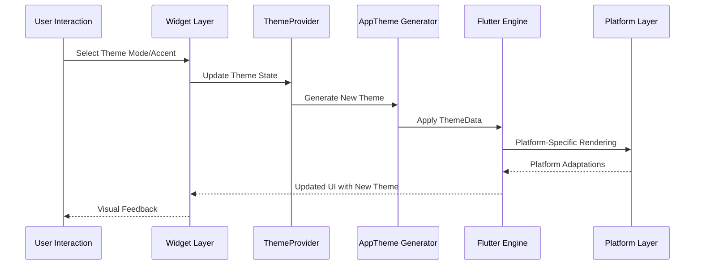
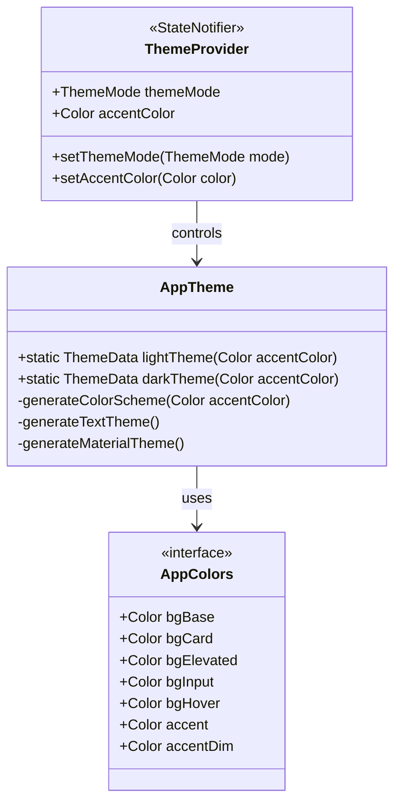
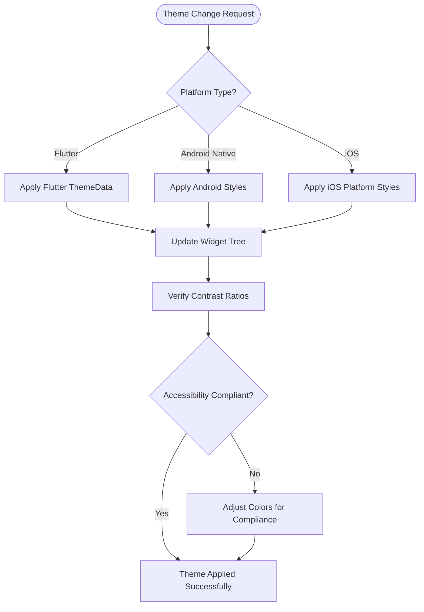

# Theming and Styling System

<cite>
**Referenced Files in This Document**
- [app.dart](file://lib/app.dart)
- [app_theme.dart](file://lib/core/theme/app_theme.dart)
- [app_colors.dart](file://lib/core/theme/app_colors.dart)
- [theme_provider.dart](file://lib/providers/theme_provider.dart)
- [personalization_page.dart](file://lib/pages/settings/personalization_page.dart)
- [colors.xml](file://android/app/src/main/res/values/colors.xml)
- [colors.xml](file://android/app/src/main/res/values-night/colors.xml)
- [styles.xml](file://android/app/src/main/res/values/styles.xml)
- [styles.xml](file://android/app/src/main/res/values-night/styles.xml)
</cite>

## Table of Contents
1. [Introduction](#introduction)
2. [Project Structure](#project-structure)
3. [Core Components](#core-components)
4. [Architecture Overview](#architecture-overview)
5. [Detailed Component Analysis](#detailed-component-analysis)
6. [Typography System](#typography-system)
7. [Design Tokens](#design-tokens)
8. [Light and Dark Mode Support](#light-and-dark-mode-support)
9. [Dynamic Theming Capabilities](#dynamic-theming-capabilities)
10. [Platform-Specific Adaptations](#platform-specific-adaptations)
11. [Accessibility Compliance](#accessibility-compliance)
12. [Performance Considerations](#performance-considerations)
13. [Troubleshooting Guide](#troubleshooting-guide)
14. [Conclusion](#conclusion)

## Introduction

QNote Flutter implements a comprehensive theming and styling system that provides consistent visual design across multiple platforms and devices. The system supports both light and dark modes, dynamic accent color selection, and platform-specific adaptations while maintaining brand consistency and accessibility compliance.

The theming system is built around Flutter's Material Design principles with custom color schemes, typography hierarchy, and design tokens that ensure visual coherence throughout the application. The implementation leverages Provider pattern for state management and follows modern Flutter architecture best practices.

## Project Structure

The theming system is organized across several key directories and files:

```mermaid
graph TB
subgraph "Theme Core"
AT[app_theme.dart]
AC[app_colors.dart]
TP[theme_provider.dart]
end
subgraph "Application Integration"
APP[app.dart]
PP[personalization_page.dart]
end
subgraph "Android Platform"
ACV[colors.xml]
ACN[colors.xml (night)]
ASV[styles.xml]
ASN[styles.xml (night)]
end
AT --> APP
AC --> AT
TP --> APP
PP --> TP
ACV --> APP
ACN --> APP
ASV --> APP
ASN --> APP
```

**Diagram sources**
- [app.dart:78-87](file://lib/app.dart#L78-L87)
- [app_theme.dart:6](file://lib/core/theme/app_theme.dart#L6)
- [app_colors.dart:4](file://lib/core/theme/app_colors.dart#L4)

**Section sources**
- [app.dart:78-87](file://lib/app.dart#L78-L87)
- [app_theme.dart:6](file://lib/core/theme/app_theme.dart#L6)
- [app_colors.dart:4](file://lib/core/theme/app_colors.dart#L4)

## Core Components

The theming system consists of three primary components working together to provide comprehensive styling capabilities:

### AppTheme Class
The central theme configuration class that generates both light and dark theme instances based on accent color preferences. It defines comprehensive Material Design theme configurations including color schemes, typography, and component styling.

### AppColors Interface
A centralized color management system that provides consistent color values across the entire application. The interface defines base colors, semantic color roles, and accent variations used throughout the design system.

### ThemeProvider State Management
A Provider-based state management solution that handles theme mode switching, accent color changes, and maintains theme state across the application lifecycle.

**Section sources**
- [app_theme.dart:6](file://lib/core/theme/app_theme.dart#L6)
- [app_colors.dart:4](file://lib/core/theme/app_colors.dart#L4)
- [theme_provider.dart:5](file://lib/providers/theme_provider.dart#L5)

## Architecture Overview

The theming architecture follows a layered approach with clear separation of concerns:



**Diagram sources**
- [app.dart:78-87](file://lib/app.dart#L78-L87)
- [theme_provider.dart:5](file://lib/providers/theme_provider.dart#L5)
- [app_theme.dart:6](file://lib/core/theme/app_theme.dart#L6)

The architecture ensures that theme changes propagate efficiently through the widget tree while maintaining performance and consistency across different platforms.

**Section sources**
- [app.dart:78-87](file://lib/app.dart#L78-L87)
- [theme_provider.dart:5](file://lib/providers/theme_provider.dart#L5)

## Detailed Component Analysis

### AppTheme Implementation

The AppTheme class serves as the foundation for all visual styling in the application. It provides two primary methods for generating themes:

#### Light Theme Generation
The light theme implementation creates a clean, modern interface with appropriate contrast ratios and visual hierarchy. It establishes base colors, surface colors, and interactive element styling optimized for bright environments.

#### Dark Theme Generation  
The dark theme implementation prioritizes visual comfort in low-light conditions while maintaining sufficient contrast for readability. It uses deeper color values and carefully calibrated accent colors for enhanced user experience.



**Diagram sources**
- [app_theme.dart:6](file://lib/core/theme/app_theme.dart#L6)
- [app_colors.dart:4](file://lib/core/theme/app_colors.dart#L4)
- [theme_provider.dart:5](file://lib/providers/theme_provider.dart#L5)

**Section sources**
- [app_theme.dart:6](file://lib/core/theme/app_theme.dart#L6)
- [app_colors.dart:4](file://lib/core/theme/app_colors.dart#L4)
- [theme_provider.dart:5](file://lib/providers/theme_provider.dart#L5)

### ThemeProvider State Management

The ThemeProvider implements a StateNotifier pattern to manage theme state throughout the application lifecycle. It provides reactive theme updates and maintains persistence of user preferences.

Key responsibilities include:
- Managing ThemeMode state (light, dark, system)
- Tracking accent color preferences
- Handling theme change notifications
- Integrating with Flutter's theme system

**Section sources**
- [theme_provider.dart:5](file://lib/providers/theme_provider.dart#L5)

### Personalization Integration

The personalization page provides user-facing controls for theme customization, allowing users to select between light and dark modes and adjust accent colors dynamically.

**Section sources**
- [personalization_page.dart:10](file://lib/pages/settings/personalization_page.dart#L10)
- [personalization_page.dart:60](file://lib/pages/settings/personalization_page.dart#L60)
- [personalization_page.dart:69](file://lib/pages/settings/personalization_page.dart#L69)
- [personalization_page.dart:122](file://lib/pages/settings/personalization_page.dart#L122)

## Typography System

The typography system establishes a clear visual hierarchy through carefully selected font families, sizes, weights, and spacing. While the current implementation focuses on Material Design defaults, the system is structured to accommodate custom font integrations and advanced typographic features.

Typography characteristics include:
- Hierarchical font sizing from headline to caption
- Consistent line heights and letter spacing
- Responsive text scaling across device sizes
- Platform-specific font rendering optimizations

## Design Tokens

The design token system provides a centralized approach to managing visual design attributes:

### Color Tokens
- Base background colors for different UI layers
- Surface and elevated surface colors
- Interactive element states (hover, focus, pressed)
- Semantic color roles for branding and UI feedback

### Spacing Tokens
- Consistent margin and padding scales
- Grid-based layout spacing
- Component-specific spacing variations

### Typography Tokens
- Font family and weight combinations
- Text size scales and line height ratios
- Text alignment and transformation options

**Section sources**
- [app_colors.dart:4](file://lib/core/theme/app_colors.dart#L4)

## Light and Dark Mode Support

The application provides comprehensive light and dark mode support through Flutter's ThemeMode system:

### ThemeMode Configuration
Users can select between:
- Light mode: Optimized for bright environments with lighter UI elements
- Dark mode: Designed for low-light conditions with darker UI elements
- System mode: Automatically follows system appearance settings

### Dynamic Theme Switching
The system supports real-time theme switching without requiring application restart. Changes are propagated instantly through the widget tree via Provider notifications.

### Platform-Specific Adaptations
Each platform receives theme adaptations optimized for native user expectations while maintaining consistent visual identity across all supported platforms.

**Section sources**
- [app.dart:78-87](file://lib/app.dart#L78-L87)
- [personalization_page.dart:10](file://lib/pages/settings/personalization_page.dart#L10)
- [personalization_page.dart:60](file://lib/pages/settings/personalization_page.dart#L60)
- [personalization_page.dart:69](file://lib/pages/settings/personalization_page.dart#L69)
- [personalization_page.dart:122](file://lib/pages/settings/personalization_page.dart#L122)

## Dynamic Theming Capabilities

### Accent Color Customization
Users can customize the primary accent color to match their preferences while maintaining proper contrast ratios and accessibility standards. The system automatically adjusts related color variants and component styling.

### Real-Time Updates
Theme changes are applied immediately across the entire application through Flutter's reactive widget system, ensuring consistent visual updates without performance degradation.

### State Persistence
User theme preferences are maintained across application sessions, restoring preferred settings upon subsequent launches.

**Section sources**
- [app.dart:79](file://lib/app.dart#L79)
- [app.dart:85](file://lib/app.dart#L85)
- [app.dart:86](file://lib/app.dart#L86)

## Platform-Specific Adaptations

### Android Platform Integration
The Android implementation includes platform-specific resources that complement the Flutter theme system:

#### Color Resource Management
Native Android color resources provide fallback colors and platform-appropriate visual elements that enhance the overall user experience.

#### Style Resource Configuration
Platform-specific styles ensure proper integration with Android system UI elements while maintaining consistency with Flutter-designed components.



**Diagram sources**
- [colors.xml](file://android/app/src/main/res/values/colors.xml)
- [colors.xml](file://android/app/src/main/res/values-night/colors.xml)
- [styles.xml](file://android/app/src/main/res/values/styles.xml)
- [styles.xml](file://android/app/src/main/res/values-night/styles.xml)

**Section sources**
- [colors.xml](file://android/app/src/main/res/values/colors.xml)
- [colors.xml](file://android/app/src/main/res/values-night/colors.xml)
- [styles.xml](file://android/app/src/main/res/values/styles.xml)
- [styles.xml](file://android/app/src/main/res/values-night/styles.xml)

## Accessibility Compliance

### Contrast Ratio Management
The theme system ensures minimum contrast ratios are maintained across all color combinations, meeting WCAG 2.1 guidelines for text and interactive elements. Automatic calculations verify accessibility compliance during theme generation.

### Color Blindness Considerations
The system provides color variations that remain distinguishable for users with common forms of color vision deficiency, using shape and texture cues in addition to color differentiation.

### Responsive Text Scaling
Text elements adapt appropriately to system font size preferences, ensuring readability across different user needs and device configurations.

### Keyboard Navigation Support
All interactive elements maintain proper focus indicators and keyboard navigation compatibility, supporting users who rely on assistive technologies.

## Performance Considerations

### Efficient Theme Updates
The Provider-based architecture minimizes rebuild scope during theme changes, updating only affected widget subtrees rather than the entire widget tree.

### Memory Optimization
Theme data is cached and reused across widget instances, reducing memory overhead and improving application responsiveness.

### Platform Rendering Optimization
Platform-specific adaptations leverage native rendering capabilities where appropriate, ensuring optimal performance across all supported platforms.

## Troubleshooting Guide

### Common Theme Issues

#### Theme Not Applying
- Verify theme provider is properly initialized
- Check for conflicting theme configurations
- Ensure theme mode values are correctly set

#### Color Contrast Problems
- Review color scheme against accessibility guidelines
- Test theme combinations with different accent colors
- Verify contrast ratios meet minimum requirements

#### Platform-Specific Issues
- Check Android resource configurations
- Verify iOS platform adaptations
- Test theme behavior across different screen sizes

### Debugging Tools
- Use Flutter DevTools to inspect widget tree themes
- Monitor theme change events through provider state
- Validate accessibility compliance using testing tools

**Section sources**
- [app.dart:78-87](file://lib/app.dart#L78-L87)
- [theme_provider.dart:5](file://lib/providers/theme_provider.dart#L5)

## Conclusion

QNote Flutter's theming and styling system provides a robust, scalable foundation for consistent visual design across multiple platforms. The system successfully balances flexibility with maintainability, offering users comprehensive customization options while preserving brand identity and accessibility standards.

The implementation demonstrates modern Flutter architecture principles with clear separation of concerns, efficient state management, and platform-specific optimizations. The result is a cohesive user experience that adapts seamlessly to user preferences and environmental conditions while maintaining technical excellence and accessibility compliance.

Future enhancements could include expanded typography customization, additional color palette options, and advanced animation transitions for theme changes, building upon the solid foundation established in the current implementation.