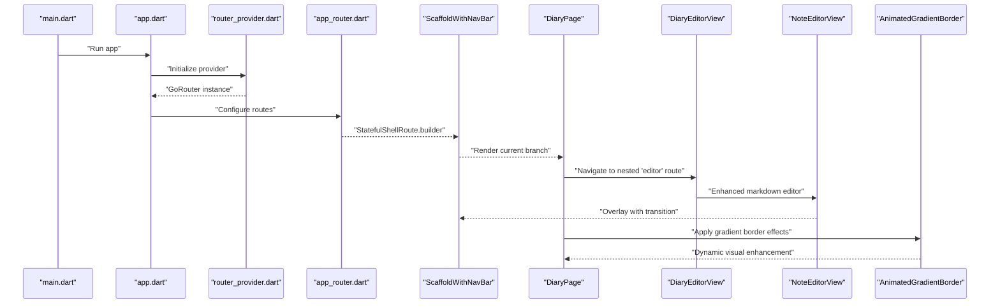
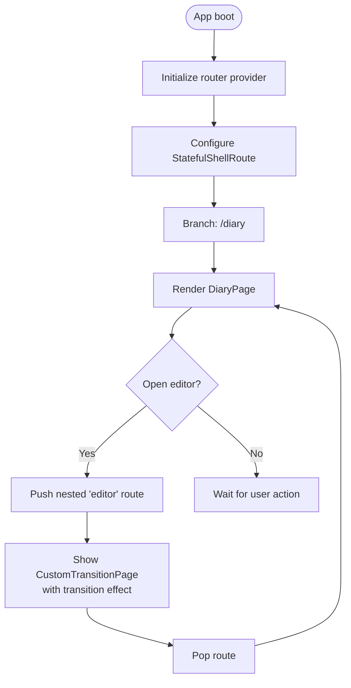
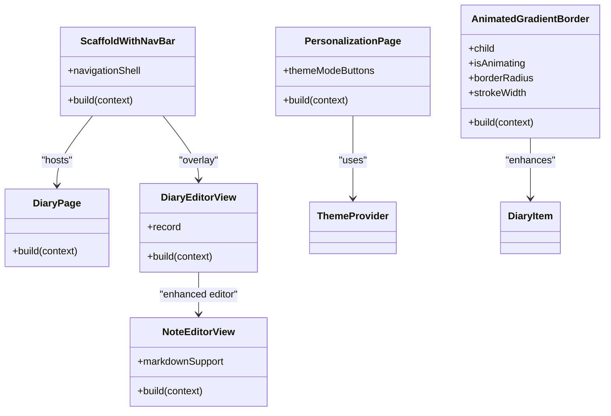
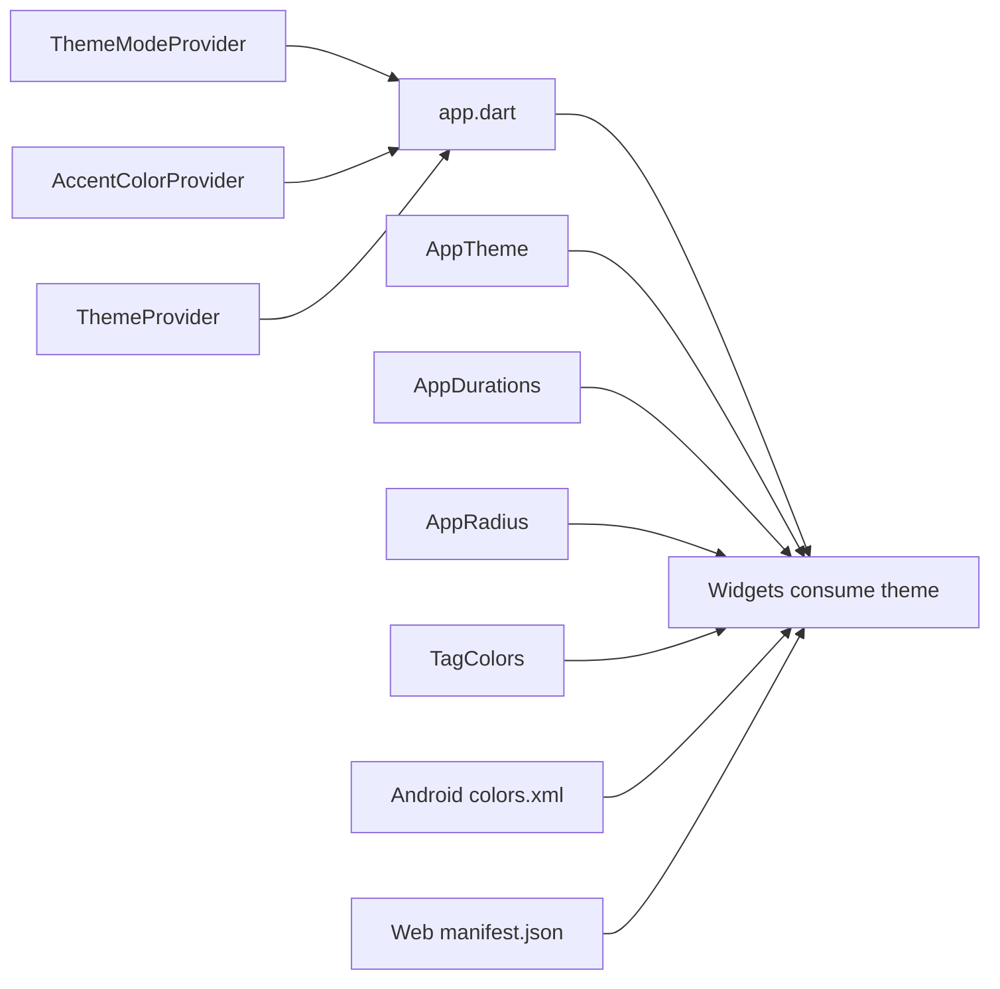
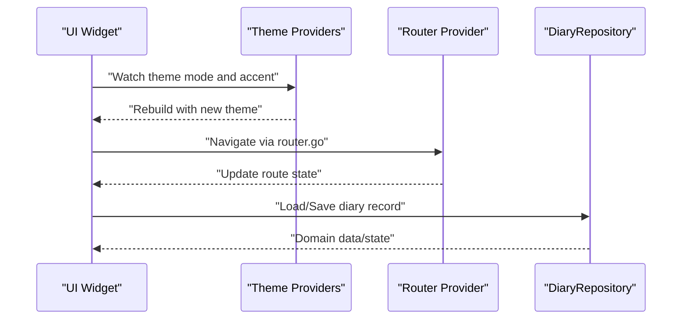
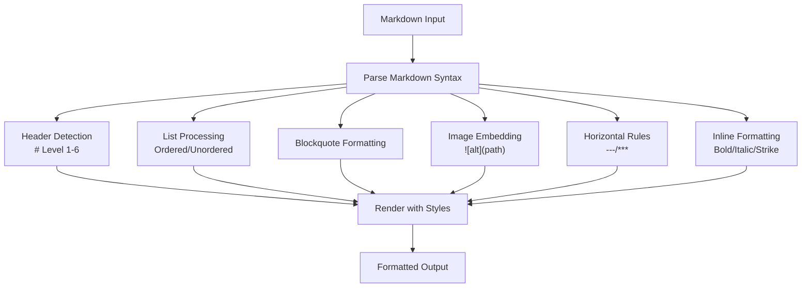
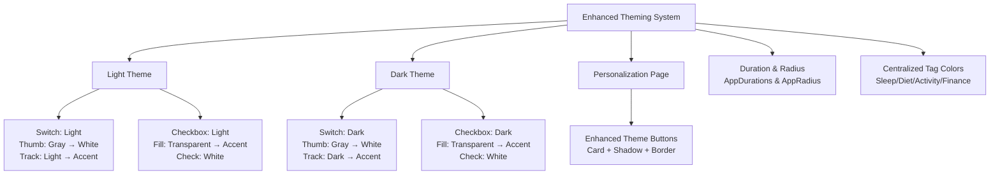
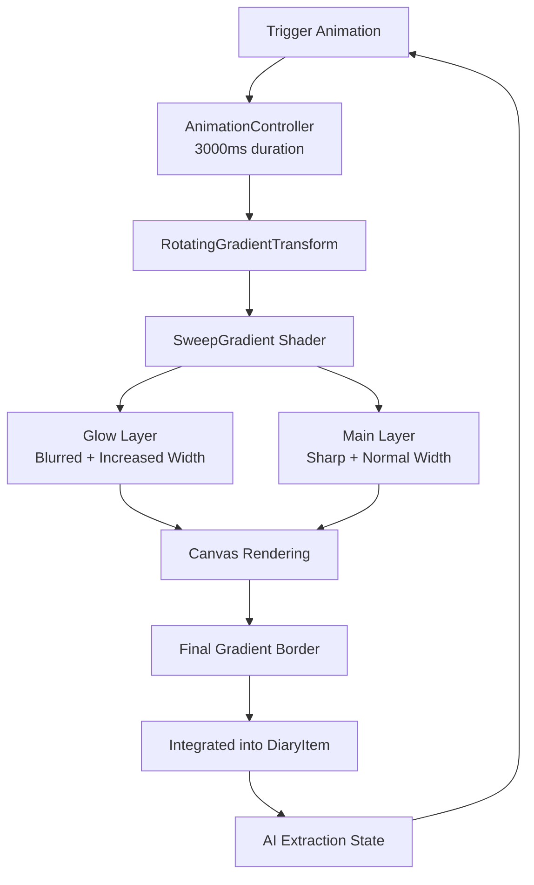
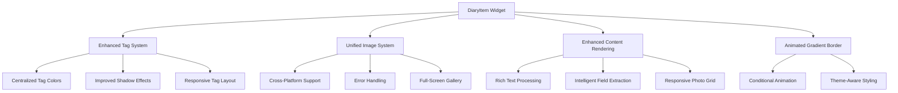
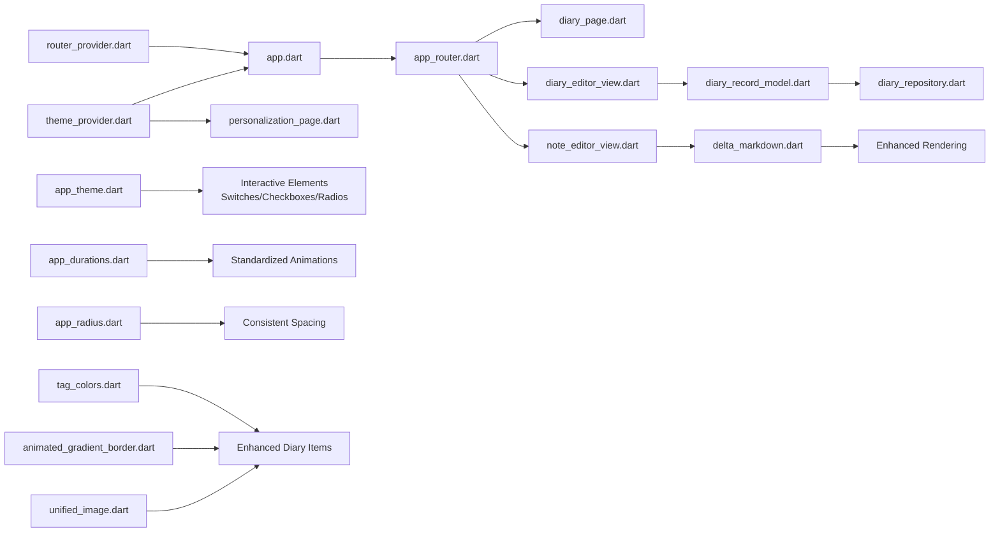

# UI Components and Pages

<cite>
**Referenced Files in This Document**
- [app.dart](file://lib/app.dart)
- [main.dart](file://lib/main.dart)
- [app_router.dart](file://lib/core/router/app_router.dart)
- [diary_page.dart](file://lib/pages/diary_page.dart)
- [diary_editor_view.dart](file://lib/widgets/diary/diary_editor_view.dart)
- [note_editor_view.dart](file://lib/widgets/notes/note_editor_view.dart)
- [diary_input_bar.dart](file://lib/widgets/diary/diary_input_bar.dart)
- [diary_item.dart](file://lib/widgets/diary/diary_item.dart)
- [animated_gradient_border.dart](file://lib/widgets/animated_gradient_border.dart)
- [unified_image.dart](file://lib/widgets/unified_image.dart)
- [scaffold_with_nav_bar.dart](file://lib/widgets/scaffold_with_nav_bar.dart)
- [theme_mode_provider.dart](file://lib/providers/theme_mode_provider.dart)
- [accent_color_provider.dart](file://lib/providers/accent_color_provider.dart)
- [router_provider.dart](file://lib/providers/router_provider.dart)
- [diary_repository.dart](file://lib/core/storage/diary_repository.dart)
- [diary_record_model.dart](file://lib/models/diary_record_model.dart)
- [delta_markdown.dart](file://lib/core/utils/delta_markdown.dart)
- [app_theme.dart](file://lib/core/theme/app_theme.dart)
- [app_durations.dart](file://lib/core/theme/app_durations.dart)
- [app_radius.dart](file://lib/core/theme/app_radius.dart)
- [tag_colors.dart](file://lib/core/theme/tag_colors.dart)
- [theme_provider.dart](file://lib/providers/theme_provider.dart)
- [personalization_page.dart](file://lib/pages/settings/personalization_page.dart)
- [colors.xml](file://android/app/src/main/res/values/colors.xml)
- [styles.xml](file://android/app/src/main/res/values/styles.xml)
- [colors.xml (night)](file://android/app/src/main/res/values-night/colors.xml)
- [index.html](file://web/index.html)
- [manifest.json](file://web/manifest.json)
</cite>

## Update Summary
**Changes Made**
- Added AnimatedGradientBorder widget for enhanced UI animations and visual effects
- Enhanced diary item presentation with improved tag styling, shadow effects, and gradient border integration
- Integrated UnifiedImage widget for improved image handling and gallery functionality
- Updated tag styling system with better visual hierarchy and shadow effects
- Enhanced visual feedback for interactive elements with gradient border animations

## Table of Contents
1. [Introduction](#introduction)
2. [Project Structure](#project-structure)
3. [Core Components](#core-components)
4. [Architecture Overview](#architecture-overview)
5. [Detailed Component Analysis](#detailed-component-analysis)
6. [Enhanced Editor Features](#enhanced-editor-features)
7. [Enhanced Theming System](#enhanced-theming-system)
8. [New Animated Gradient Border System](#new-animated-gradient-border-system)
9. [Enhanced Diary Item Presentation](#enhanced-diary-item-presentation)
10. [Dependency Analysis](#dependency-analysis)
11. [Performance Considerations](#performance-considerations)
12. [Troubleshooting Guide](#troubleshooting-guide)
13. [Conclusion](#conclusion)
14. [Appendices](#appendices)

## Introduction
This document describes the UI components and page architecture of QNote Flutter. It focuses on the page-based navigation system powered by GoRouter, the organization of screens, reusable UI components, theming and styling, responsive design patterns, accessibility compliance, component composition, integration with state management, cross-platform considerations, and guidelines for building consistent UI elements.

**Updated** Enhanced with new AnimatedGradientBorder widget for dynamic visual effects, improved diary item presentation with better tag styling and shadow effects, enhanced image handling with UnifiedImage widget, and significantly improved theming system with enhanced interactive element styling and accessibility features.

## Project Structure
QNote Flutter organizes UI-related code under lib/, with distinct layers for application bootstrap, routing, pages, widgets, providers, models, and configuration. The navigation system centers around a provider-managed GoRouter instance configured via a dedicated router module. Pages and views are separated to promote composability and testability, while reusable UI components live in a dedicated widgets directory. Providers manage global state such as theme mode and accent color, enabling reactive UI updates. The theming system now includes comprehensive styling for interactive elements like switches, checkboxes, and radios with enhanced visual feedback.

```mermaid
graph TB
subgraph "App Bootstrap"
MAIN["main.dart"]
APP["app.dart"]
end
subgraph "Routing"
ROUTER["core/router/app_router.dart"]
ROUTER_PROVIDER["providers/router_provider.dart"]
end
subgraph "Pages & Views"
DIARY_PAGE["pages/diary_page.dart"]
DIARY_EDITOR["widgets/diary/diary_editor_view.dart"]
NOTE_EDITOR["widgets/notes/note_editor_view.dart"]
DIARY_INPUT_BAR["widgets/diary/diary_input_bar.dart"]
DIARY_ITEM["widgets/diary/diary_item.dart"]
ANIMATED_BORDER["widgets/animated_gradient_border.dart"]
UNIFIED_IMAGE["widgets/unified_image.dart"]
PERSONALIZATION["pages/settings/personalization_page.dart"]
END
subgraph "Widgets"
SNA["widgets/scaffold_with_nav_bar.dart"]
END
subgraph "State Management"
THEME_MODE["providers/theme_mode_provider.dart"]
ACCENT_COLOR["providers/accent_color_provider.dart"]
THEME_PROVIDER["providers/theme_provider.dart"]
END
subgraph "Theming System"
APP_THEME["core/theme/app_theme.dart"]
APP_DURATIONS["core/theme/app_durations.dart"]
APP_RADIUS["core/theme/app_radius.dart"]
TAG_COLORS["core/theme/tag_colors.dart"]
END
subgraph "Models & Repositories"
MODEL["models/diary_record_model.dart"]
REPO["core/storage/diary_repository.dart"]
DELTA_MD["core/utils/delta_markdown.dart"]
END
MAIN --> APP
APP --> ROUTER_PROVIDER
ROUTER_PROVIDER --> ROUTER
ROUTER --> DIARY_PAGE
ROUTER --> DIARY_EDITOR
ROUTER --> NOTE_EDITOR
DIARY_PAGE --> SNA
DIARY_EDITOR --> SNA
NOTE_EDITOR --> DIARY_INPUT_BAR
DIARY_ITEM --> ANIMATED_BORDER
DIARY_ITEM --> UNIFIED_IMAGE
DIARY_ITEM --> TAG_COLORS
DIARY_ITEM --> DELTA_MD
PERSONALIZATION --> THEME_PROVIDER
APP_THEME --> THEME_PROVIDER
```

**Diagram sources**
- [main.dart](file://lib/main.dart)
- [app.dart](file://lib/app.dart)
- [app_router.dart](file://lib/core/router/app_router.dart)
- [diary_page.dart](file://lib/pages/diary_page.dart)
- [diary_editor_view.dart](file://lib/widgets/diary/diary_editor_view.dart)
- [note_editor_view.dart](file://lib/widgets/notes/note_editor_view.dart)
- [diary_input_bar.dart](file://lib/widgets/diary/diary_input_bar.dart)
- [diary_item.dart](file://lib/widgets/diary/diary_item.dart)
- [animated_gradient_border.dart](file://lib/widgets/animated_gradient_border.dart)
- [unified_image.dart](file://lib/widgets/unified_image.dart)
- [scaffold_with_nav_bar.dart](file://lib/widgets/scaffold_with_nav_bar.dart)
- [theme_mode_provider.dart](file://lib/providers/theme_mode_provider.dart)
- [accent_color_provider.dart](file://lib/providers/accent_color_provider.dart)
- [router_provider.dart](file://lib/providers/router_provider.dart)
- [diary_repository.dart](file://lib/core/storage/diary_repository.dart)
- [diary_record_model.dart](file://lib/models/diary_record_model.dart)
- [delta_markdown.dart](file://lib/core/utils/delta_markdown.dart)
- [app_theme.dart](file://lib/core/theme/app_theme.dart)
- [app_durations.dart](file://lib/core/theme/app_durations.dart)
- [app_radius.dart](file://lib/core/theme/app_radius.dart)
- [tag_colors.dart](file://lib/core/theme/tag_colors.dart)
- [theme_provider.dart](file://lib/providers/theme_provider.dart)
- [personalization_page.dart](file://lib/pages/settings/personalization_page.dart)

**Section sources**
- [main.dart](file://lib/main.dart)
- [app.dart](file://lib/app.dart)
- [app_router.dart](file://lib/core/router/app_router.dart)

## Core Components
- Application entry and shell: The app initializes the router provider and sets up navigation listeners for interop-driven navigation. It also wires theme providers to reactively update the UI theme and accent color.
- Navigation system: A provider-based GoRouter manages stateful shell routes with nested routes for editor overlays. Transitions are customized per route.
- Page and view separation: Pages represent top-level screens; views encapsulate editor/editorial UI and are presented as overlays or embedded content.
- Reusable widgets: A scaffold wrapper integrates bottom navigation and shell-aware layouts.
- State management: Theme mode and accent color are managed via providers, enabling runtime theme switching with persistent storage.
- **Enhanced theming system**: Comprehensive styling for interactive elements including switches, checkboxes, and radio buttons with enhanced visual feedback and accessibility.
- **Enhanced editor components**: Specialized editors with markdown support and rich formatting capabilities.
- **New animated gradient border system**: Dynamic gradient border effects with customizable animation and visual styling.
- **Enhanced image handling**: Unified image widget with cross-platform support and gallery functionality.

**Section sources**
- [app.dart](file://lib/app.dart)
- [app_router.dart](file://lib/core/router/app_router.dart)
- [scaffold_with_nav_bar.dart](file://lib/widgets/scaffold_with_nav_bar.dart)
- [theme_mode_provider.dart](file://lib/providers/theme_mode_provider.dart)
- [accent_color_provider.dart](file://lib/providers/accent_color_provider.dart)
- [theme_provider.dart](file://lib/providers/theme_provider.dart)

## Architecture Overview
The UI architecture follows a layered pattern:
- Entry point initializes providers and the router.
- Routing defines a stateful shell with tab-like branches and nested routes for editors.
- Pages and views are composed with reusable widgets and state providers.
- Models and repositories provide domain data and persistence.
- **Enhanced theming system**: AppTheme provides comprehensive Material 3 theming with specialized styling for interactive elements.
- **Enhanced markdown processing**: Delta to markdown conversion utilities enable sophisticated text formatting.
- **New animated gradient system**: AnimatedGradientBorder widget provides dynamic visual effects with customizable animation parameters.
- **Enhanced image system**: UnifiedImage widget handles cross-platform image loading with error handling and gallery support.



**Diagram sources**
- [main.dart](file://lib/main.dart)
- [app.dart](file://lib/app.dart)
- [app_router.dart](file://lib/core/router/app_router.dart)
- [scaffold_with_nav_bar.dart](file://lib/widgets/scaffold_with_nav_bar.dart)
- [diary_page.dart](file://lib/pages/diary_page.dart)
- [diary_editor_view.dart](file://lib/widgets/diary/diary_editor_view.dart)
- [note_editor_view.dart](file://lib/widgets/notes/note_editor_view.dart)
- [animated_gradient_border.dart](file://lib/widgets/animated_gradient_border.dart)

## Detailed Component Analysis

### Navigation and Routing System
- Stateful shell route: The router uses a stateful shell to host multiple branches, rendering a shared navigation shell via a custom scaffold wrapper.
- Branches: One branch corresponds to the diary screen, with nested routes for editor overlays.
- Nested routes: The editor route is presented as a modal overlay with a custom transition page builder, allowing animated transitions and passing extra data (e.g., a diary record).
- Transition customization: Transitions vary by route; for example, a fade or shared axis transition is applied for the editor overlay.
- Global navigation: The app listens for external navigation events and triggers router.go to navigate programmatically.



**Diagram sources**
- [app_router.dart](file://lib/core/router/app_router.dart)
- [app.dart](file://lib/app.dart)

**Section sources**
- [app_router.dart](file://lib/core/router/app_router.dart)
- [app.dart](file://lib/app.dart)

### Page Composition Patterns
- Page-level screens: The diary page serves as the primary screen for the diary branch.
- View-level editors: The editor view encapsulates editing UI and is presented as an overlay via nested routing.
- Shell integration: The scaffold wrapper coordinates bottom navigation and shell-aware rendering for the active branch.
- **Personalization integration**: Settings pages utilize the enhanced theming system for consistent UI styling.
- **Enhanced component integration**: New AnimatedGradientBorder widget seamlessly integrates with existing UI components.



**Diagram sources**
- [scaffold_with_nav_bar.dart](file://lib/widgets/scaffold_with_nav_bar.dart)
- [diary_page.dart](file://lib/pages/diary_page.dart)
- [diary_editor_view.dart](file://lib/widgets/diary/diary_editor_view.dart)
- [note_editor_view.dart](file://lib/widgets/notes/note_editor_view.dart)
- [personalization_page.dart](file://lib/pages/settings/personalization_page.dart)
- [animated_gradient_border.dart](file://lib/widgets/animated_gradient_border.dart)

**Section sources**
- [diary_page.dart](file://lib/pages/diary_page.dart)
- [diary_editor_view.dart](file://lib/widgets/diary/diary_editor_view.dart)
- [scaffold_with_nav_bar.dart](file://lib/widgets/scaffold_with_nav_bar.dart)
- [personalization_page.dart](file://lib/pages/settings/personalization_page.dart)

### Theming and Styling System
- Runtime theme switching: Theme mode and accent color are provided via dedicated providers, allowing dynamic updates without rebuilding the entire tree.
- Platform-specific resources: Android defines colors and styles for day/night modes; web provides HTML and manifest configurations for PWA behavior.
- Color management: Colors are centralized in platform resources and consumed by widgets and pages.
- **Enhanced interactive elements**: Comprehensive styling for switches, checkboxes, and radio buttons with widget state properties for visual feedback.
- **Enhanced tag system**: Centralized tag color management with consistent color schemes across the application.
- **Consistent spacing and timing**: AppDurations and AppRadius provide standardized animation durations and corner radii.



**Diagram sources**
- [theme_mode_provider.dart](file://lib/providers/theme_mode_provider.dart)
- [accent_color_provider.dart](file://lib/providers/accent_color_provider.dart)
- [theme_provider.dart](file://lib/providers/theme_provider.dart)
- [app.dart](file://lib/app.dart)
- [app_theme.dart](file://lib/core/theme/app_theme.dart)
- [app_durations.dart](file://lib/core/theme/app_durations.dart)
- [app_radius.dart](file://lib/core/theme/app_radius.dart)
- [tag_colors.dart](file://lib/core/theme/tag_colors.dart)
- [colors.xml](file://android/app/src/main/res/values/colors.xml)
- [styles.xml](file://android/app/src/main/res/values/styles.xml)
- [colors.xml (night)](file://android/app/src/main/res/values-night/colors.xml)
- [manifest.json](file://web/manifest.json)

**Section sources**
- [theme_mode_provider.dart](file://lib/providers/theme_mode_provider.dart)
- [accent_color_provider.dart](file://lib/providers/accent_color_provider.dart)
- [theme_provider.dart](file://lib/providers/theme_provider.dart)
- [app.dart](file://lib/app.dart)
- [app_theme.dart](file://lib/core/theme/app_theme.dart)
- [app_durations.dart](file://lib/core/theme/app_durations.dart)
- [app_radius.dart](file://lib/core/theme/app_radius.dart)
- [tag_colors.dart](file://lib/core/theme/tag_colors.dart)
- [colors.xml](file://android/app/src/main/res/values/colors.xml)
- [styles.xml](file://android/app/src/main/res/values/styles.xml)
- [colors.xml (night)](file://android/app/src/main/res/values-night/colors.xml)
- [manifest.json](file://web/manifest.json)

### State Management Integration
- Provider-based state: Theme mode and accent color are exposed via providers and watched by the app shell to rebuild UI accordingly.
- Router lifecycle: The router provider supplies a single GoRouter instance to the app, ensuring consistent navigation state across the app.
- Domain state: The diary editor view consumes a diary record model and interacts with a repository for persistence.
- **Persistent theme preferences**: Theme mode and accent color are stored in SharedPreferences for persistence across app sessions.



**Diagram sources**
- [app.dart](file://lib/app.dart)
- [router_provider.dart](file://lib/providers/router_provider.dart)
- [diary_repository.dart](file://lib/core/storage/diary_repository.dart)
- [diary_record_model.dart](file://lib/models/diary_record_model.dart)

**Section sources**
- [app.dart](file://lib/app.dart)
- [router_provider.dart](file://lib/providers/router_provider.dart)
- [diary_repository.dart](file://lib/core/storage/diary_repository.dart)
- [diary_record_model.dart](file://lib/models/diary_record_model.dart)

### Cross-Platform UI Considerations
- Android platform: Uses native resources for colors and styles, supporting day/night variants. Widgets and activities define platform-specific layouts and drawables.
- Web platform: Provides PWA metadata and HTML entry for web deployment.
- Flutter framework: Responsive layouts adapt to screen sizes; platform channels enable native interop for navigation.

```mermaid
graph TB
subgraph "Android"
AND_RES["values/colors.xml"]
AND_NIGHT["values-night/colors.xml"]
AND_STYLES["values/styles.xml"]
END
subgraph "Web"
WEB_HTML["web/index.html"]
WEB_MAN["web/manifest.json"]
END
subgraph "Flutter UI"
FLUTTER_UI["Widgets/Pages"]
END
AND_RES --> FLUTTER_UI
AND_NIGHT --> FLUTTER_UI
AND_STYLES --> FLUTTER_UI
WEB_HTML --> FLUTTER_UI
WEB_MAN --> FLUTTER_UI
```

**Diagram sources**
- [colors.xml](file://android/app/src/main/res/values/colors.xml)
- [colors.xml (night)](file://android/app/src/main/res/values-night/colors.xml)
- [styles.xml](file://android/app/src/main/res/values/styles.xml)
- [index.html](file://web/index.html)
- [manifest.json](file://web/manifest.json)

**Section sources**
- [colors.xml](file://android/app/src/main/res/values/colors.xml)
- [colors.xml (night)](file://android/app/src/main/res/values-night/colors.xml)
- [styles.xml](file://android/app/src/main/res/values/styles.xml)
- [index.html](file://web/index.html)
- [manifest.json](file://web/manifest.json)

## Enhanced Editor Features

### Markdown Formatting Support
The note editor now provides comprehensive markdown formatting capabilities with enhanced text processing:

- **Header support**: Automatic detection and rendering of markdown headers (# to ######)
- **List formatting**: Both ordered and unordered lists with proper bullet points
- **Blockquote rendering**: Quoted text blocks with visual distinction
- **Image embedding**:  syntax with visual image placeholders
- **Horizontal rules**: --- and *** syntax for section separators
- **Inline formatting**: Bold, italic, and strikethrough text support



**Diagram sources**
- [note_editor_view.dart](file://lib/widgets/notes/note_editor_view.dart)
- [delta_markdown.dart](file://lib/core/utils/delta_markdown.dart)

### Enhanced Emoji Support
The diary input bar has been redesigned with expanded emoji support:

- **Emoji picker integration**: Contextual emoji selection within the input bar
- **Real-time preview**: Live emoji rendering in the input field
- **Custom emoji categories**: Organized emoji groups for easy access
- **Quick emoji insertion**: Direct keyboard shortcuts for frequent emojis

### Improved Diary Item Rendering
Diary items now feature enhanced rendering capabilities:

- **Rich text display**: Proper markdown rendering in diary entries
- **Media support**: Image thumbnails and media previews with UnifiedImage widget
- **Interactive elements**: Clickable links and formatted content
- **Performance optimization**: Efficient rendering of complex markdown content
- **Enhanced visual hierarchy**: Better tag styling with improved shadow effects

**Section sources**
- [note_editor_view.dart](file://lib/widgets/notes/note_editor_view.dart)
- [diary_input_bar.dart](file://lib/widgets/diary/diary_input_bar.dart)
- [diary_item.dart](file://lib/widgets/diary/diary_item.dart)
- [unified_image.dart](file://lib/widgets/unified_image.dart)
- [delta_markdown.dart](file://lib/core/utils/delta_markdown.dart)

## Enhanced Theming System

### Interactive Element Styling
The enhanced theming system provides comprehensive styling for interactive elements with improved visual feedback:

#### Switch Controls
- **Thumb styling**: White thumb for selected state, light gray for unselected state
- **Track styling**: Accent color for selected state, light background for unselected state
- **Outline transparency**: Transparent track outlines for clean appearance
- **Widget state properties**: Dynamic color changes based on selection state

#### Checkbox Styling
- **Fill color**: Accent color for selected state, transparent for unselected state
- **Check mark**: White check marks for high contrast
- **Shape**: Small rounded corners (4px radius) for modern appearance
- **Widget state properties**: Dynamic fill color changes

#### Radio Button Styling
- **Fill color**: Accent color for selected state, secondary color for unselected state
- **Widget state properties**: Dynamic fill color changes for consistent behavior

#### Enhanced Visual Feedback
- **Consistent color schemes**: Light and dark themes with appropriate color variations
- **Accessibility compliance**: Sufficient contrast ratios and state differentiation
- **Smooth transitions**: Consistent animation durations for interactive feedback

### Theme Mode Buttons
The personalization page features improved theme mode buttons with enhanced visual feedback:

- **Modern card design**: Rounded corners with subtle shadows
- **Border styling**: Outline borders with alpha transparency
- **Icon integration**: Clear visual indicators for each theme mode
- **Selection highlighting**: Dynamic state changes for selected/unselected states
- **Responsive layout**: Flexible row-based arrangement for different screen sizes

### Duration and Radius Constants
The theming system includes standardized constants for consistent UI behavior:

- **AppDurations**: Fast (150ms), normal (200ms), medium (300ms), slow (450ms) animations
- **AppRadius**: Small (8px), medium (12px), large (20px) corner radii
- **Consistent timing**: Standardized animation durations across interactive elements
- **Scalable spacing**: Proportional corner radii for consistent visual hierarchy



**Diagram sources**
- [app_theme.dart](file://lib/core/theme/app_theme.dart)
- [personalization_page.dart](file://lib/pages/settings/personalization_page.dart)
- [app_durations.dart](file://lib/core/theme/app_durations.dart)
- [app_radius.dart](file://lib/core/theme/app_radius.dart)
- [tag_colors.dart](file://lib/core/theme/tag_colors.dart)

**Section sources**
- [app_theme.dart](file://lib/core/theme/app_theme.dart)
- [personalization_page.dart](file://lib/pages/settings/personalization_page.dart)
- [app_durations.dart](file://lib/core/theme/app_durations.dart)
- [app_radius.dart](file://lib/core/theme/app_radius.dart)
- [tag_colors.dart](file://lib/core/theme/tag_colors.dart)

## New Animated Gradient Border System

### AnimatedGradientBorder Widget
A new widget has been introduced to provide dynamic gradient border effects with customizable animation parameters:

- **Dynamic gradient animation**: Smooth rotating gradient effect with customizable animation duration
- **Glow effect integration**: Dual-layer border system with blurred glow underneath and sharp main border on top
- **Customizable parameters**: Configurable border radius, stroke width, and animation control
- **Theme-aware styling**: Automatically adapts to current theme colors and alpha values
- **Performance optimized**: Efficient CustomPainter implementation with proper repaint detection

### Gradient Effects and Transformations
The widget utilizes advanced gradient techniques for visual appeal:

- **Rotating gradient transform**: Matrix-based rotation transformation for seamless animation
- **Sweep gradient shader**: Radial gradient effect with carefully crafted color stops
- **Dual-layer rendering**: Glow layer with increased stroke width plus main border for depth
- **Mask filter integration**: Blur effect for soft glow appearance
- **Custom paint optimization**: Efficient repainting only when parameters change

### Integration with Diary Items
The AnimatedGradientBorder widget is seamlessly integrated into the diary item system:

- **Conditional animation**: Only animates during AI extraction processes
- **Theme integration**: Uses current theme's primary color and outline variant for consistent styling
- **Visual enhancement**: Provides subtle animation feedback without distracting from content
- **Performance conscious**: Animation controlled by isAnimating parameter to prevent unnecessary CPU usage



**Diagram sources**
- [animated_gradient_border.dart](file://lib/widgets/animated_gradient_border.dart)
- [diary_item.dart](file://lib/widgets/diary/diary_item.dart)

**Section sources**
- [animated_gradient_border.dart](file://lib/widgets/animated_gradient_border.dart)
- [diary_item.dart](file://lib/widgets/diary/diary_item.dart)

## Enhanced Diary Item Presentation

### Improved Tag Styling System
The diary item presentation has been significantly enhanced with better tag styling and visual hierarchy:

- **Centralized tag colors**: Dedicated TagColors class with consistent color mapping for all tag types
- **Enhanced shadow effects**: Improved BoxShadow implementations with better depth perception
- **Better visual hierarchy**: Clear distinction between filled tags and outlined field tags
- **Responsive tag layout**: Horizontal scrolling tags with proper spacing and overflow handling
- **Icon integration**: Consistent icon usage with tags for better visual recognition

### Unified Image Integration
Enhanced image handling with the new UnifiedImage widget:

- **Cross-platform support**: Handles local files, web URLs, and asset paths seamlessly
- **Error handling**: Graceful fallbacks for missing or corrupted images
- **Performance optimization**: Intelligent caching and downscaling for mobile devices
- **Gallery functionality**: Full-screen image viewer with pinch-to-zoom and swipe navigation
- **Loading states**: Proper loading indicators and skeleton screens for better UX

### Enhanced Content Rendering
Improved content presentation with better formatting and organization:

- **Rich text processing**: Advanced markdown parsing with intelligent field extraction
- **Remark handling**: Proper separation and styling of remark text sections
- **Field normalization**: Consistent formatting of extracted field-value pairs
- **Multi-tag support**: Enhanced presentation for records with multiple tag entries
- **Photo grid layout**: Responsive image grid with adaptive sizing and spacing



**Diagram sources**
- [diary_item.dart](file://lib/widgets/diary/diary_item.dart)
- [tag_colors.dart](file://lib/core/theme/tag_colors.dart)
- [unified_image.dart](file://lib/widgets/unified_image.dart)
- [animated_gradient_border.dart](file://lib/widgets/animated_gradient_border.dart)

**Section sources**
- [diary_item.dart](file://lib/widgets/diary/diary_item.dart)
- [tag_colors.dart](file://lib/core/theme/tag_colors.dart)
- [unified_image.dart](file://lib/widgets/unified_image.dart)
- [animated_gradient_border.dart](file://lib/widgets/animated_gradient_border.dart)

## Dependency Analysis
The UI layer depends on:
- Routing: Router provider supplies a GoRouter instance to the app shell.
- State: Theme providers influence widget appearance; router provider ensures navigation consistency.
- Domain: Editor views depend on models and repositories for data operations.
- **Enhanced formatting**: Delta to markdown conversion utilities for sophisticated text processing.
- **Enhanced theming**: AppTheme provides comprehensive styling for interactive elements.
- **Enhanced tag system**: Centralized tag color management for consistent visual identity.
- **New animated system**: AnimatedGradientBorder widget for dynamic visual effects.
- **Enhanced image system**: UnifiedImage widget for robust image handling across platforms.
- **Persistent preferences**: Theme providers store user preferences in SharedPreferences.



**Diagram sources**
- [router_provider.dart](file://lib/providers/router_provider.dart)
- [app.dart](file://lib/app.dart)
- [app_router.dart](file://lib/core/router/app_router.dart)
- [diary_page.dart](file://lib/pages/diary_page.dart)
- [diary_editor_view.dart](file://lib/widgets/diary/diary_editor_view.dart)
- [note_editor_view.dart](file://lib/widgets/notes/note_editor_view.dart)
- [diary_record_model.dart](file://lib/models/diary_record_model.dart)
- [diary_repository.dart](file://lib/core/storage/diary_repository.dart)
- [delta_markdown.dart](file://lib/core/utils/delta_markdown.dart)
- [app_theme.dart](file://lib/core/theme/app_theme.dart)
- [app_durations.dart](file://lib/core/theme/app_durations.dart)
- [app_radius.dart](file://lib/core/theme/app_radius.dart)
- [tag_colors.dart](file://lib/core/theme/tag_colors.dart)
- [theme_provider.dart](file://lib/providers/theme_provider.dart)
- [personalization_page.dart](file://lib/pages/settings/personalization_page.dart)
- [animated_gradient_border.dart](file://lib/widgets/animated_gradient_border.dart)
- [unified_image.dart](file://lib/widgets/unified_image.dart)

**Section sources**
- [router_provider.dart](file://lib/providers/router_provider.dart)
- [app.dart](file://lib/app.dart)
- [app_router.dart](file://lib/core/router/app_router.dart)
- [diary_page.dart](file://lib/pages/diary_page.dart)
- [diary_editor_view.dart](file://lib/widgets/diary/diary_editor_view.dart)
- [note_editor_view.dart](file://lib/widgets/notes/note_editor_view.dart)
- [diary_record_model.dart](file://lib/models/diary_record_model.dart)
- [diary_repository.dart](file://lib/core/storage/diary_repository.dart)
- [delta_markdown.dart](file://lib/core/utils/delta_markdown.dart)
- [app_theme.dart](file://lib/core/theme/app_theme.dart)
- [app_durations.dart](file://lib/core/theme/app_durations.dart)
- [app_radius.dart](file://lib/core/theme/app_radius.dart)
- [theme_provider.dart](file://lib/providers/theme_provider.dart)
- [tag_colors.dart](file://lib/core/theme/tag_colors.dart)
- [animated_gradient_border.dart](file://lib/widgets/animated_gradient_border.dart)
- [unified_image.dart](file://lib/widgets/unified_image.dart)

## Performance Considerations
- Route transitions: Prefer lightweight transitions for nested routes to minimize jank during navigation.
- Provider scope: Keep theme and router providers at the app root to avoid unnecessary rebuilds.
- Model hydration: Load and cache domain models efficiently in views to reduce latency during navigation.
- Platform resources: Optimize Android drawables and web assets to improve startup and render performance.
- **Enhanced rendering**: Implement efficient markdown parsing algorithms to prevent UI blocking during text processing.
- **Memory management**: Cache frequently used markdown renderers and emoji data to reduce memory allocation overhead.
- **Animation optimization**: Use standardized durations from AppDurations for consistent performance across interactive elements.
- **State management**: WidgetStateProperty.resolveWith ensures efficient state-based styling updates.
- **New performance considerations**: AnimatedGradientBorder uses efficient CustomPainter implementation; consider animation throttling for low-end devices.
- **Image optimization**: UnifiedImage widget includes intelligent caching and downscaling to prevent memory spikes on mobile devices.

## Troubleshooting Guide
- Navigation failures: Verify the router provider is initialized and the GoRouter instance is accessible before calling navigation methods.
- Theme not updating: Ensure theme providers are watched at the app shell level and that theme-dependent widgets rebuild on state changes.
- Editor overlay issues: Confirm nested route configuration and transition builders are correctly set for the editor overlay.
- Platform-specific problems: Validate Android color resources and web manifest entries; ensure platform channels are properly wired for interop-driven navigation.
- **Markdown rendering issues**: Check delta to markdown conversion utility for proper syntax handling and fallback rendering.
- **Emoji display problems**: Verify emoji font availability and proper encoding for cross-platform compatibility.
- **Performance degradation**: Monitor markdown parsing performance and consider implementing lazy loading for complex content.
- **Interactive element styling**: Verify WidgetStateProperty usage for proper state-based styling in switches, checkboxes, and radio buttons.
- **Theme persistence**: Check SharedPreferences storage for theme mode and accent color preferences if theme changes don't persist.
- **New troubleshooting**: AnimatedGradientBorder animation issues: Verify AnimationController lifecycle and ensure proper cleanup in dispose method.
- **Image loading problems**: Check UnifiedImage widget error handling and verify file paths are accessible across platforms.
- **Tag color inconsistencies**: Ensure TagColors class is properly imported and centralized color management is functioning correctly.

**Section sources**
- [app.dart](file://lib/app.dart)
- [app_router.dart](file://lib/core/router/app_router.dart)
- [theme_mode_provider.dart](file://lib/providers/theme_mode_provider.dart)
- [accent_color_provider.dart](file://lib/providers/accent_color_provider.dart)
- [theme_provider.dart](file://lib/providers/theme_provider.dart)

## Conclusion
QNote Flutter's UI architecture emphasizes a clean separation of concerns: routing via a provider-managed GoRouter, composable pages and views, reusable widgets, and reactive state management for theming. The system supports nested navigation, customizable transitions, and cross-platform deployment with platform-specific resources.

**Updated** The enhanced editor features provide comprehensive markdown support, expanded emoji capabilities, and improved rendering performance, making the application more powerful for content creation and management. The significantly enhanced theming system now includes comprehensive styling for interactive elements with improved visual feedback, accessibility features, and consistent animation patterns. The new AnimatedGradientBorder widget adds dynamic visual effects with customizable animation parameters, while the enhanced diary item presentation improves tag styling, shadow effects, and overall visual hierarchy. The UnifiedImage widget provides robust cross-platform image handling with error management and gallery functionality. Following the outlined patterns ensures consistency and maintainability as the application evolves.

## Appendices

### Guidelines for Creating New UI Components
- Separate pages and views: Place top-level screens under pages and editorial overlays under views.
- Use reusable widgets: Encapsulate common UI patterns in widgets and compose them within pages and views.
- Leverage providers: Expose theme and navigation state via providers for reactive updates.
- Keep transitions minimal: Favor subtle transitions for nested routes to preserve responsiveness.
- Test cross-platform: Validate themes and layouts across Android and web environments.
- **Implement enhanced theming**: Utilize AppTheme for consistent styling and WidgetStateProperty for interactive element states.
- **Follow accessibility guidelines**: Ensure sufficient contrast ratios and proper state differentiation for interactive elements.
- **Use standardized durations**: Employ AppDurations for consistent animation timing across components.
- **Apply consistent spacing**: Use AppRadius for proportional corner radii in UI elements.
- **Consider animation performance**: When adding animated components, ensure efficient animation controllers and proper cleanup.
- **Handle cross-platform differences**: Account for platform-specific behaviors in image loading, navigation, and UI rendering.

### Common UI Patterns and Interaction Handling
- Bottom navigation with shell: Use a shell scaffold to host multiple branches and coordinate navigation.
- Modal overlays: Present editors and forms as nested routes with custom transitions.
- Dynamic theming: Watch theme providers at the app shell and propagate theme changes to descendant widgets.
- Interop-driven navigation: Listen for platform channel messages and trigger router.go to navigate programmatically.
- **Enhanced text editing**: Implement markdown parsing and rendering for rich text experiences.
- **Emoji integration**: Provide contextual emoji selection and real-time preview functionality.
- **Interactive element styling**: Implement proper state-based styling for switches, checkboxes, and radio buttons.
- **Persistent theme preferences**: Store user theme choices in SharedPreferences for session continuity.
- **New animation patterns**: Consider AnimatedGradientBorder for visual feedback during loading or processing states.
- **Image handling best practices**: Use UnifiedImage widget for consistent cross-platform image loading and error handling.

### Accessibility Compliance Checklist
- Contrast ratios: Ensure sufficient contrast between foreground and background colors in both day and night themes.
- Focus management: Provide visible focus indicators for interactive elements.
- Text scaling: Support dynamic text scaling and avoid fixed-size text where possible.
- Touch targets: Ensure touch targets meet minimum size requirements.
- Semantic labeling: Use semantic properties for interactive elements to aid assistive technologies.
- **Content readability**: Ensure markdown-rendered content maintains accessibility standards.
- **Emoji alternatives**: Provide text alternatives for emoji content where appropriate.
- **Screen reader support**: Verify proper announcement of formatted content and interactive elements.
- **State indication**: Ensure interactive elements clearly indicate their state (selected/unselected) for accessibility.
- **Animation accessibility**: Consider reduced motion preferences and provide alternatives for users sensitive to animations.

### Enhanced Editor Implementation Guidelines
- **Markdown syntax support**: Implement comprehensive markdown parsing for headers, lists, blockquotes, and inline formatting.
- **Emoji picker integration**: Design intuitive emoji selection with category organization and quick access.
- **Performance optimization**: Implement efficient rendering algorithms to handle complex markdown content without UI blocking.
- **Cross-platform compatibility**: Ensure emoji and markdown rendering work consistently across iOS, Android, and web platforms.
- **Accessibility considerations**: Provide proper semantic markup for rendered content and support screen readers.
- **Interactive element styling**: Follow the enhanced theming system guidelines for consistent styling of form controls.
- **New animation integration**: Consider AnimatedGradientBorder for visual feedback during AI processing or content extraction.

### Theming System Guidelines
- **Comprehensive interactive styling**: Follow the enhanced switch, checkbox, and radio button styling patterns.
- **Widget state management**: Use WidgetStateProperty.resolveWith for dynamic state-based styling.
- **Consistent animation timing**: Utilize AppDurations for standardized animation durations.
- **Proportional spacing**: Apply AppRadius for consistent corner radii across UI elements.
- **Accessibility compliance**: Ensure all interactive elements meet accessibility standards with proper contrast and state indication.
- **Theme persistence**: Implement SharedPreferences storage for user theme preferences.
- **Cross-theme consistency**: Maintain consistent styling patterns across light and dark themes.
- **Centralized color management**: Use TagColors class for consistent color schemes across the application.

### New Component Development Guidelines
- **AnimatedGradientBorder usage**: Integrate with existing components for visual feedback during processing states.
- **Tag system integration**: Utilize centralized TagColors for consistent visual identity.
- **Image handling best practices**: Implement UnifiedImage widget for robust cross-platform image support.
- **Performance optimization**: Ensure new components don't introduce performance regressions in existing functionality.
- **Testing across platforms**: Validate new components on Android, iOS, and web platforms.
- **Documentation updates**: Update documentation to reflect new component capabilities and usage patterns.