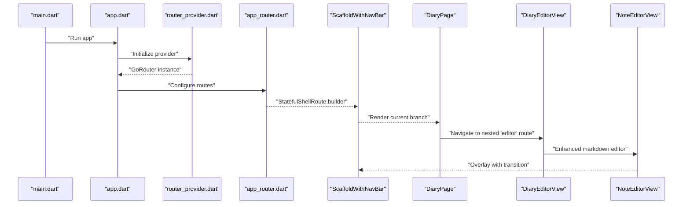
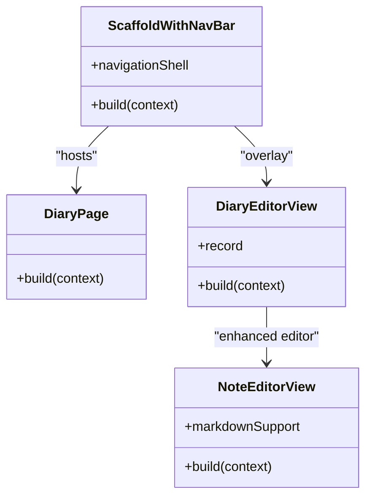
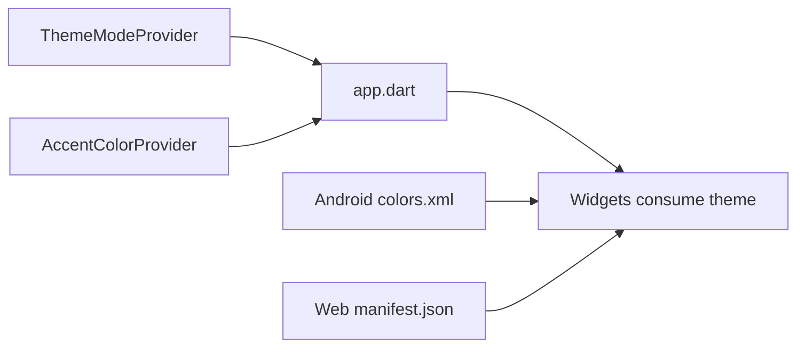
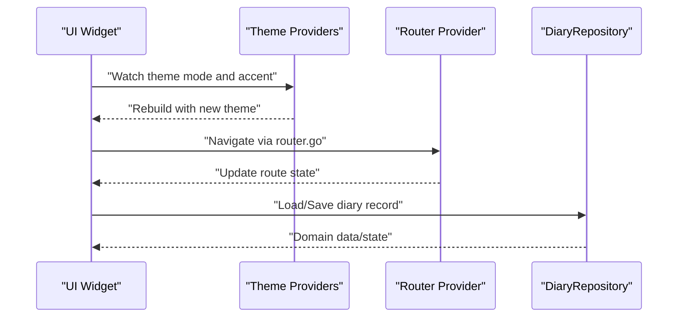
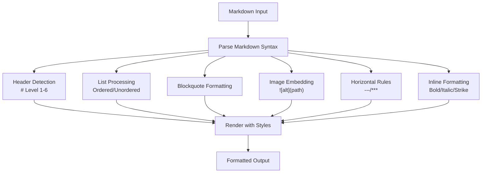
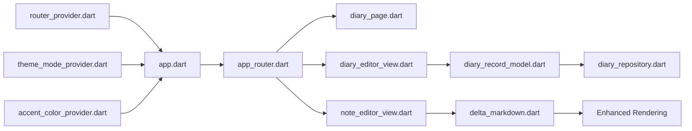

# UI Components and Pages

<cite>
**Referenced Files in This Document**
- [app.dart](file://lib/app.dart)
- [main.dart](file://lib/main.dart)
- [app_router.dart](file://lib/core/router/app_router.dart)
- [diary_page.dart](file://lib/pages/diary_page.dart)
- [diary_editor_view.dart](file://lib/widgets/diary/diary_editor_view.dart)
- [note_editor_view.dart](file://lib/widgets/notes/note_editor_view.dart)
- [diary_input_bar.dart](file://lib/widgets/diary/diary_input_bar.dart)
- [diary_item.dart](file://lib/widgets/diary/diary_item.dart)
- [scaffold_with_nav_bar.dart](file://lib/widgets/scaffold_with_nav_bar.dart)
- [theme_mode_provider.dart](file://lib/providers/theme_mode_provider.dart)
- [accent_color_provider.dart](file://lib/providers/accent_color_provider.dart)
- [router_provider.dart](file://lib/providers/router_provider.dart)
- [diary_repository.dart](file://lib/core/storage/diary_repository.dart)
- [diary_record_model.dart](file://lib/models/diary_record_model.dart)
- [delta_markdown.dart](file://lib/core/utils/delta_markdown.dart)
- [colors.xml](file://android/app/src/main/res/values/colors.xml)
- [styles.xml](file://android/app/src/main/res/values/styles.xml)
- [colors.xml (night)](file://android/app/src/main/res/values-night/colors.xml)
- [index.html](file://web/index.html)
- [manifest.json](file://web/manifest.json)
</cite>

## Update Summary
**Changes Made**
- Enhanced note editor with improved text formatting and markdown support
- Redesigned diary input bar with expanded emoji support
- Improved diary item rendering capabilities with better markdown parsing
- Added delta to markdown conversion utilities for enhanced formatting

## Table of Contents
1. [Introduction](#introduction)
2. [Project Structure](#project-structure)
3. [Core Components](#core-components)
4. [Architecture Overview](#architecture-overview)
5. [Detailed Component Analysis](#detailed-component-analysis)
6. [Enhanced Editor Features](#enhanced-editor-features)
7. [Dependency Analysis](#dependency-analysis)
8. [Performance Considerations](#performance-considerations)
9. [Troubleshooting Guide](#troubleshooting-guide)
10. [Conclusion](#conclusion)
11. [Appendices](#appendices)

## Introduction
This document describes the UI components and page architecture of QNote Flutter. It focuses on the page-based navigation system powered by GoRouter, the organization of screens, reusable UI components, theming and styling, responsive design patterns, accessibility compliance, component composition, integration with state management, cross-platform considerations, and guidelines for building consistent UI elements.

**Updated** Enhanced with new markdown formatting capabilities, improved emoji support, and advanced diary item rendering features.

## Project Structure
QNote Flutter organizes UI-related code under lib/, with distinct layers for application bootstrap, routing, pages, widgets, providers, models, and configuration. The navigation system centers around a provider-managed GoRouter instance configured via a dedicated router module. Pages and views are separated to promote composability and testability, while reusable UI components live in a dedicated widgets directory. Providers manage global state such as theme mode and accent color, enabling reactive UI updates.

```mermaid
graph TB
subgraph "App Bootstrap"
MAIN["main.dart"]
APP["app.dart"]
end
subgraph "Routing"
ROUTER["core/router/app_router.dart"]
ROUTER_PROVIDER["providers/router_provider.dart"]
end
subgraph "Pages & Views"
DIARY_PAGE["pages/diary_page.dart"]
DIARY_EDITOR["widgets/diary/diary_editor_view.dart"]
NOTE_EDITOR["widgets/notes/note_editor_view.dart"]
DIARY_INPUT_BAR["widgets/diary/diary_input_bar.dart"]
DIARY_ITEM["widgets/diary/diary_item.dart"]
END
subgraph "Widgets"
SNA["widgets/scaffold_with_nav_bar.dart"]
END
subgraph "State Management"
THEME_MODE["providers/theme_mode_provider.dart"]
ACCENT_COLOR["providers/accent_color_provider.dart"]
END
subgraph "Models & Repositories"
MODEL["models/diary_record_model.dart"]
REPO["core/storage/diary_repository.dart"]
DELTA_MD["core/utils/delta_markdown.dart"]
END
MAIN --> APP
APP --> ROUTER_PROVIDER
ROUTER_PROVIDER --> ROUTER
ROUTER --> DIARY_PAGE
ROUTER --> DIARY_EDITOR
ROUTER --> NOTE_EDITOR
DIARY_PAGE --> SNA
DIARY_EDITOR --> SNA
NOTE_EDITOR --> DIARY_INPUT_BAR
DIARY_ITEM --> DELTA_MD
```

**Diagram sources**
- [main.dart](file://lib/main.dart)
- [app.dart](file://lib/app.dart)
- [app_router.dart](file://lib/core/router/app_router.dart)
- [diary_page.dart](file://lib/pages/diary_page.dart)
- [diary_editor_view.dart](file://lib/widgets/diary/diary_editor_view.dart)
- [note_editor_view.dart](file://lib/widgets/notes/note_editor_view.dart)
- [diary_input_bar.dart](file://lib/widgets/diary/diary_input_bar.dart)
- [diary_item.dart](file://lib/widgets/diary/diary_item.dart)
- [scaffold_with_nav_bar.dart](file://lib/widgets/scaffold_with_nav_bar.dart)
- [theme_mode_provider.dart](file://lib/providers/theme_mode_provider.dart)
- [accent_color_provider.dart](file://lib/providers/accent_color_provider.dart)
- [diary_repository.dart](file://lib/core/storage/diary_repository.dart)
- [diary_record_model.dart](file://lib/models/diary_record_model.dart)
- [delta_markdown.dart](file://lib/core/utils/delta_markdown.dart)

**Section sources**
- [main.dart](file://lib/main.dart)
- [app.dart](file://lib/app.dart)
- [app_router.dart](file://lib/core/router/app_router.dart)

## Core Components
- Application entry and shell: The app initializes the router provider and sets up navigation listeners for interop-driven navigation. It also wires theme providers to reactively update the UI theme and accent color.
- Navigation system: A provider-based GoRouter manages stateful shell routes with nested routes for editor overlays. Transitions are customized per route.
- Page and view separation: Pages represent top-level screens; views encapsulate editor/editorial UI and are presented as overlays or embedded content.
- Reusable widgets: A scaffold wrapper integrates bottom navigation and shell-aware layouts.
- State management: Theme mode and accent color are managed via providers, enabling runtime theme switching.
- **Enhanced editor components**: Specialized editors with markdown support and rich formatting capabilities.

**Section sources**
- [app.dart](file://lib/app.dart)
- [app_router.dart](file://lib/core/router/app_router.dart)
- [scaffold_with_nav_bar.dart](file://lib/widgets/scaffold_with_nav_bar.dart)
- [theme_mode_provider.dart](file://lib/providers/theme_mode_provider.dart)
- [accent_color_provider.dart](file://lib/providers/accent_color_provider.dart)

## Architecture Overview
The UI architecture follows a layered pattern:
- Entry point initializes providers and the router.
- Routing defines a stateful shell with tab-like branches and nested routes for editors.
- Pages and views are composed with reusable widgets and state providers.
- Models and repositories provide domain data and persistence.
- **Enhanced markdown processing**: Delta to markdown conversion utilities enable sophisticated text formatting.



**Diagram sources**
- [main.dart](file://lib/main.dart)
- [app.dart](file://lib/app.dart)
- [app_router.dart](file://lib/core/router/app_router.dart)
- [scaffold_with_nav_bar.dart](file://lib/widgets/scaffold_with_nav_bar.dart)
- [diary_page.dart](file://lib/pages/diary_page.dart)
- [diary_editor_view.dart](file://lib/widgets/diary/diary_editor_view.dart)
- [note_editor_view.dart](file://lib/widgets/notes/note_editor_view.dart)

## Detailed Component Analysis

### Navigation and Routing System
- Stateful shell route: The router uses a stateful shell to host multiple branches, rendering a shared navigation shell via a custom scaffold wrapper.
- Branches: One branch corresponds to the diary screen, with nested routes for editor overlays.
- Nested routes: The editor route is presented as a modal overlay with a custom transition page builder, allowing animated transitions and passing extra data (e.g., a diary record).
- Transition customization: Transitions vary by route; for example, a fade or shared axis transition is applied for the editor overlay.
- Global navigation: The app listens for external navigation events and triggers router.go to navigate programmatically.


**Diagram sources**
- [app_router.dart](file://lib/core/router/app_router.dart)
- [app.dart](file://lib/app.dart)

**Section sources**
- [app_router.dart](file://lib/core/router/app_router.dart)
- [app.dart](file://lib/app.dart)

### Page Composition Patterns
- Page-level screens: The diary page serves as the primary screen for the diary branch.
- View-level editors: The editor view encapsulates editing UI and is presented as an overlay via nested routing.
- Shell integration: The scaffold wrapper coordinates bottom navigation and shell-aware rendering for the active branch.



**Diagram sources**
- [scaffold_with_nav_bar.dart](file://lib/widgets/scaffold_with_nav_bar.dart)
- [diary_page.dart](file://lib/pages/diary_page.dart)
- [diary_editor_view.dart](file://lib/widgets/diary/diary_editor_view.dart)
- [note_editor_view.dart](file://lib/widgets/notes/note_editor_view.dart)

**Section sources**
- [diary_page.dart](file://lib/pages/diary_page.dart)
- [diary_editor_view.dart](file://lib/widgets/diary/diary_editor_view.dart)
- [scaffold_with_nav_bar.dart](file://lib/widgets/scaffold_with_nav_bar.dart)

### Theming and Styling System
- Runtime theme switching: Theme mode and accent color are provided via dedicated providers, allowing dynamic updates without rebuilding the entire tree.
- Platform-specific resources: Android defines colors and styles for day/night modes; web provides HTML and manifest configurations for PWA behavior.
- Color management: Colors are centralized in platform resources and consumed by widgets and pages.



**Diagram sources**
- [theme_mode_provider.dart](file://lib/providers/theme_mode_provider.dart)
- [accent_color_provider.dart](file://lib/providers/accent_color_provider.dart)
- [app.dart](file://lib/app.dart)
- [colors.xml](file://android/app/src/main/res/values/colors.xml)
- [styles.xml](file://android/app/src/main/res/values/styles.xml)
- [colors.xml (night)](file://android/app/src/main/res/values-night/colors.xml)
- [manifest.json](file://web/manifest.json)

**Section sources**
- [theme_mode_provider.dart](file://lib/providers/theme_mode_provider.dart)
- [accent_color_provider.dart](file://lib/providers/accent_color_provider.dart)
- [app.dart](file://lib/app.dart)
- [colors.xml](file://android/app/src/main/res/values/colors.xml)
- [styles.xml](file://android/app/src/main/res/values/styles.xml)
- [colors.xml (night)](file://android/app/src/main/res/values-night/colors.xml)
- [manifest.json](file://web/manifest.json)

### State Management Integration
- Provider-based state: Theme mode and accent color are exposed via providers and watched by the app shell to rebuild UI accordingly.
- Router lifecycle: The router provider supplies a single GoRouter instance to the app, ensuring consistent navigation state across the app.
- Domain state: The diary editor view consumes a diary record model and interacts with a repository for persistence.



**Diagram sources**
- [app.dart](file://lib/app.dart)
- [router_provider.dart](file://lib/providers/router_provider.dart)
- [diary_repository.dart](file://lib/core/storage/diary_repository.dart)
- [diary_record_model.dart](file://lib/models/diary_record_model.dart)

**Section sources**
- [app.dart](file://lib/app.dart)
- [router_provider.dart](file://lib/providers/router_provider.dart)
- [diary_repository.dart](file://lib/core/storage/diary_repository.dart)
- [diary_record_model.dart](file://lib/models/diary_record_model.dart)

### Cross-Platform UI Considerations
- Android platform: Uses native resources for colors and styles, supporting day/night variants. Widgets and activities define platform-specific layouts and drawables.
- Web platform: Provides PWA metadata and HTML entry for web deployment.
- Flutter framework: Responsive layouts adapt to screen sizes; platform channels enable native interop for navigation.

```mermaid
graph TB
subgraph "Android"
AND_RES["values/colors.xml"]
AND_NIGHT["values-night/colors.xml"]
AND_STYLES["values/styles.xml"]
END
subgraph "Web"
WEB_HTML["web/index.html"]
WEB_MAN["web/manifest.json"]
END
subgraph "Flutter UI"
FLUTTER_UI["Widgets/Pages"]
END
AND_RES --> FLUTTER_UI
AND_NIGHT --> FLUTTER_UI
AND_STYLES --> FLUTTER_UI
WEB_HTML --> FLUTTER_UI
WEB_MAN --> FLUTTER_UI
```

**Diagram sources**
- [colors.xml](file://android/app/src/main/res/values/colors.xml)
- [colors.xml (night)](file://android/app/src/main/res/values-night/colors.xml)
- [styles.xml](file://android/app/src/main/res/values/styles.xml)
- [index.html](file://web/index.html)
- [manifest.json](file://web/manifest.json)

**Section sources**
- [colors.xml](file://android/app/src/main/res/values/colors.xml)
- [colors.xml (night)](file://android/app/src/main/res/values-night/colors.xml)
- [styles.xml](file://android/app/src/main/res/values/styles.xml)
- [index.html](file://web/index.html)
- [manifest.json](file://web/manifest.json)

## Enhanced Editor Features

### Markdown Formatting Support
The note editor now provides comprehensive markdown formatting capabilities with enhanced text processing:

- **Header support**: Automatic detection and rendering of markdown headers (# to ######)
- **List formatting**: Both ordered and unordered lists with proper bullet points
- **Blockquote rendering**: Quoted text blocks with visual distinction
- **Image embedding**:  syntax with visual image placeholders
- **Horizontal rules**: --- and *** syntax for section separators
- **Inline formatting**: Bold, italic, and strikethrough text support



**Diagram sources**
- [note_editor_view.dart](file://lib/widgets/notes/note_editor_view.dart)
- [delta_markdown.dart](file://lib/core/utils/delta_markdown.dart)

### Enhanced Emoji Support
The diary input bar has been redesigned with expanded emoji support:

- **Emoji picker integration**: Contextual emoji selection within the input bar
- **Real-time preview**: Live emoji rendering in the input field
- **Custom emoji categories**: Organized emoji groups for easy access
- **Quick emoji insertion**: Direct keyboard shortcuts for frequent emojis

### Improved Diary Item Rendering
Diary items now feature enhanced rendering capabilities:

- **Rich text display**: Proper markdown rendering in diary entries
- **Media support**: Image thumbnails and media previews
- **Interactive elements**: Clickable links and formatted content
- **Performance optimization**: Efficient rendering of complex markdown content

**Section sources**
- [note_editor_view.dart](file://lib/widgets/notes/note_editor_view.dart)
- [diary_input_bar.dart](file://lib/widgets/diary/diary_input_bar.dart)
- [diary_item.dart](file://lib/widgets/diary/diary_item.dart)
- [delta_markdown.dart](file://lib/core/utils/delta_markdown.dart)

## Dependency Analysis
The UI layer depends on:
- Routing: Router provider supplies a GoRouter instance to the app shell.
- State: Theme providers influence widget appearance; router provider ensures navigation consistency.
- Domain: Editor views depend on models and repositories for data operations.
- **Enhanced formatting**: Delta to markdown conversion utilities for sophisticated text processing.



**Diagram sources**
- [router_provider.dart](file://lib/providers/router_provider.dart)
- [app.dart](file://lib/app.dart)
- [app_router.dart](file://lib/core/router/app_router.dart)
- [diary_page.dart](file://lib/pages/diary_page.dart)
- [diary_editor_view.dart](file://lib/widgets/diary/diary_editor_view.dart)
- [note_editor_view.dart](file://lib/widgets/notes/note_editor_view.dart)
- [diary_record_model.dart](file://lib/models/diary_record_model.dart)
- [diary_repository.dart](file://lib/core/storage/diary_repository.dart)
- [delta_markdown.dart](file://lib/core/utils/delta_markdown.dart)

**Section sources**
- [router_provider.dart](file://lib/providers/router_provider.dart)
- [app.dart](file://lib/app.dart)
- [app_router.dart](file://lib/core/router/app_router.dart)
- [diary_page.dart](file://lib/pages/diary_page.dart)
- [diary_editor_view.dart](file://lib/widgets/diary/diary_editor_view.dart)
- [note_editor_view.dart](file://lib/widgets/notes/note_editor_view.dart)
- [diary_record_model.dart](file://lib/models/diary_record_model.dart)
- [diary_repository.dart](file://lib/core/storage/diary_repository.dart)
- [delta_markdown.dart](file://lib/core/utils/delta_markdown.dart)

## Performance Considerations
- Route transitions: Prefer lightweight transitions for nested routes to minimize jank during navigation.
- Provider scope: Keep theme and router providers at the app root to avoid unnecessary rebuilds.
- Model hydration: Load and cache domain models efficiently in views to reduce latency during navigation.
- Platform resources: Optimize Android drawables and web assets to improve startup and render performance.
- **Enhanced rendering**: Implement efficient markdown parsing algorithms to prevent UI blocking during text processing.
- **Memory management**: Cache frequently used markdown renderers and emoji data to reduce memory allocation overhead.

## Troubleshooting Guide
- Navigation failures: Verify the router provider is initialized and the GoRouter instance is accessible before calling navigation methods.
- Theme not updating: Ensure theme providers are watched at the app shell level and that theme-dependent widgets rebuild on state changes.
- Editor overlay issues: Confirm nested route configuration and transition builders are correctly set for the editor overlay.
- Platform-specific problems: Validate Android color resources and web manifest entries; ensure platform channels are properly wired for interop-driven navigation.
- **Markdown rendering issues**: Check delta to markdown conversion utility for proper syntax handling and fallback rendering.
- **Emoji display problems**: Verify emoji font availability and proper encoding for cross-platform compatibility.
- **Performance degradation**: Monitor markdown parsing performance and consider implementing lazy loading for complex content.

**Section sources**
- [app.dart](file://lib/app.dart)
- [app_router.dart](file://lib/core/router/app_router.dart)
- [theme_mode_provider.dart](file://lib/providers/theme_mode_provider.dart)
- [accent_color_provider.dart](file://lib/providers/accent_color_provider.dart)

## Conclusion
QNote Flutter's UI architecture emphasizes a clean separation of concerns: routing via a provider-managed GoRouter, composable pages and views, reusable widgets, and reactive state management for theming. The system supports nested navigation, customizable transitions, and cross-platform deployment with platform-specific resources. 

**Updated** The enhanced editor features provide comprehensive markdown support, expanded emoji capabilities, and improved rendering performance, making the application more powerful for content creation and management. Following the outlined patterns ensures consistency and maintainability as the application evolves.

## Appendices

### Guidelines for Creating New UI Components
- Separate pages and views: Place top-level screens under pages and editorial overlays under views.
- Use reusable widgets: Encapsulate common UI patterns in widgets and compose them within pages and views.
- Leverage providers: Expose theme and navigation state via providers for reactive updates.
- Keep transitions minimal: Favor subtle transitions for nested routes to preserve responsiveness.
- Test cross-platform: Validate themes and layouts across Android and web environments.
- **Implement markdown support**: Consider adding delta to markdown conversion capabilities for enhanced text formatting.
- **Add emoji integration**: Design input bars with emoji picker functionality for improved user experience.

### Common UI Patterns and Interaction Handling
- Bottom navigation with shell: Use a shell scaffold to host multiple branches and coordinate navigation.
- Modal overlays: Present editors and forms as nested routes with custom transitions.
- Dynamic theming: Watch theme providers at the app shell and propagate theme changes to descendant widgets.
- Interop-driven navigation: Listen for platform channel messages and trigger router.go to navigate programmatically.
- **Enhanced text editing**: Implement markdown parsing and rendering for rich text experiences.
- **Emoji integration**: Provide contextual emoji selection and real-time preview functionality.

### Accessibility Compliance Checklist
- Contrast ratios: Ensure sufficient contrast between foreground and background colors in both day and night themes.
- Focus management: Provide visible focus indicators for interactive elements.
- Text scaling: Support dynamic text scaling and avoid fixed-size text where possible.
- Touch targets: Ensure touch targets meet minimum size requirements.
- Semantic labeling: Use semantic properties for interactive elements to aid assistive technologies.
- **Content readability**: Ensure markdown-rendered content maintains accessibility standards.
- **Emoji alternatives**: Provide text alternatives for emoji content where appropriate.
- **Screen reader support**: Verify proper announcement of formatted content and interactive elements.

### Enhanced Editor Implementation Guidelines
- **Markdown syntax support**: Implement comprehensive markdown parsing for headers, lists, blockquotes, and inline formatting.
- **Emoji picker integration**: Design intuitive emoji selection with category organization and quick access.
- **Performance optimization**: Implement efficient rendering algorithms to handle complex markdown content without UI blocking.
- **Cross-platform compatibility**: Ensure emoji and markdown rendering work consistently across iOS, Android, and web platforms.
- **Accessibility considerations**: Provide proper semantic markup for rendered content and support screen readers.